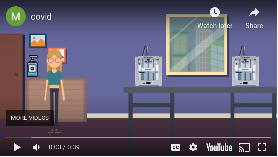

## FabLab Safety

Using FabLab Singapore Polytechnic during this period

 

&nbsp;

### Safety Issues

FabLab @ Singapore Polytechnic has a large number of tools, equipment and machinery which you can use to fabricate your project.  In the course of the module, you will be taught the operation of some of these tools and equipment, however before that, we need to ensure your safety in the lab.

The **Safety Assessment** is mandatory for all users of FabLab@SP.  The documentation and notes for the course is common throughout all courses and is available on the [E-learning Site at SP](https://esp.sp.edu.sg).  You are encouraged to go through the material before taking the Safety Assessment.

To access the Safety information on the SP E-learning site:

1.  Open your browser to [E-learning Site at SP](https://esp.sp.edu.sg)
2.  Select **My Community** from the top Ribbon bar
3.  Click on  **FABLAB@SP**
4.  Select **Fab Lab Safety Program** on the left hand menu

&nbsp;

### Safety Assessment

We require that the Safety Assessment be done physically at the lab, and as such will be conducted at the start of the next laboratory session.This will be the first task you undertake upon entering the lab.

You need to score at least 90% before you can pass this assessment.  This score will be added to your overall marks for this module.

&nbsp;

Links:

- Singapore [Workplace Safety & Health](https://www.mom.gov.sg/workplace-safety-and-health)
- ESP FabLabSP [Safety Notes](https://esp.sp.edu.sg/webapps/blackboard/content/listContent.jsp?course_id=_51997_1&content_id=_1539071_1)
- ESP FabLabSP [Safety Assessment](https://esp.sp.edu.sg/webapps/assessment/take/launchAssessment.jsp?course_id=_51997_1&content_id=_1539122_1&mode=view)

&nbsp;

### Assignment

The assignment for this **class** is [Assignment 1 Safety](assignments/01_safety.md).  You will be required to

- Read the Safety information and documents
- Install Software for use in future classes.

[Assignment 1 Safety](assignments/01_safety.md) is graded and will be combined into CA1.

&nbsp;

 [Home](index.md)   
October 2020
