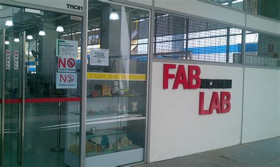

# Documentation Techniques

The important function of documentation is to provide a "timely" source of
information, so that

* You group members are kept up to date with the progress
* It is a log of the progress (success/failures) that you can refer to
* Provide a reference to future projects.

Hence a documentation tool should:

* Be easy to learn and use.
* Available
* Easily accessible

Good and popular solutions to this problem is to use a **text editor** and create Internet website that can be hosted on the **World-Wide-Web**.

### Text Editors

A good text editor should be simple to use and available on a variety of platforms.  The choice is arbitary, however, the following criterion are often used to make a choice:

* Produces pure text files
* WSIWYG - What-You-See-Is-What-You-Get
* Simple to use, yet powerful editing features
* Syntax highlighting to show tags/keywords
* Recommendations:
    - [Sublime Text](https://www.sublimetext.com/3) a popular choice among programmers, not free but has unlimited use time.
        + Cory Schafer [Sublime Text Tutorials](https://www.youtube.com/playlist?list=PL-osiE80TeTtHH8BZngXEsLPGotQxZa6z)
        + LearnWebCode [Sublime Text Tutorials](https://www.youtube.com/playlist?list=PLpcSpRrAaOaqQMDlCzE_Y6IUUzaSfYocK)
        + LevelUpTuts [Sublime Text Tutorials](https://www.youtube.com/playlist?list=PLLnpHn493BHEYF4EX3sAhVG2rTqCvLnsP)
    - [Atom](https://atom.io/) an open-source github project, fast becoming very popular for new users, giving the same functionality as SublimeText.
        + LevelUpTuts [Atom Editor Tutorials](https://youtu.be/WWwBQQOGllo)
    - [Brackets](http://brackets.io/) an editor tailored for HTML and web production.
        + Web Craftie [Getting Started with a Code Editor: Brackets](https://youtu.be/GN0txxeT46A)
        + Kris DeBruine Media [Brackets: Setup Your Code Editor](https://youtu.be/lUf8WrBr_aM)
    - [Visual Studio Code]() a free Microsoft product which is also used for developing Source code.
        + Codevluation [Visual Studio Code Tutorial](https://www.youtube.com/channel/UC80PWRj_ZU8Zu0HSMNVwKWw)
        + Academin [Visual Studio Code Tutorial for Beginners](https://youtu.be/VqCgcpAypFQ)

### HTML - the language of the web

All websites are developed using [HTML](https://en.wikipedia.org/wiki/HTML) (**H**yper**T**ext **M**arkup **L**anguage). The language describes how the information is to be displayed in a web browser.  Watch: [How a web browser builds and displays a web page](https://youtu.be/DuSURHrZG6I)

In order make available information on the www, you need the following
* A web Server or Service (e.g. github.com)
* A web page written in HTML (e.g. [this page](documentation_tchniques.md))
* A web browser at the client (e.g. [Google Chrome](https://www.google.com/chrome/index.html))

Although we are **NOT** going to make you Web Professionals, you need a certain amount of knowledge on developing a web page as it is the most convenient method of dispensing information.  It is common for a modern-day technologist to be familiar with the following technologies:

* [HTML](https://en.wikipedia.org/wiki/HTML) to create and present information
* [CSS](https://www.w3.org/Style/CSS/Overview.en.html) (Cascading Style Sheets) to format the information into a uniform, consistent and pleasing nature
* Scripting (e.g. [Javascript](https://www.javascript.com/)) to add dynamic content to the information.

For most of our work, in presenting information, we need only a working knowledge of HTML and CSS.  The following sites and tutorials give a basic introduction of HTML:

* Youtube Videos
    * Jake Wright
        * [Learn HTML in 12 Minutes](https://youtu.be/bWPMSSsVdPk)
        * [Learn More HTML in 12 Minutes](https://youtu.be/KJ13lX20FqU)
        * [Learn CSS in 12 minutes](https://youtu.be/0afZj1G0BIE) an excellent presentation that looks at the development of a workable website from start (paper planning) to delivery on the web.
    * Traversy Media [HTML Crash Course for Absolute Beginners](https://youtu.be/UB1O30fR-EE)
    * Clever Programmer [HTML Crash Course for Absolute Beginners 2020](https://youtu.be/FNGoExJlLQY) which may appeal to younger viewers!
* HTML Tutorials & References
    * [w3schools](https://www.w3schools.com/html/default.asp) MTML tutorial, which should be used as a *Reference Site* than a tutorial.
    * [Learn HTML online](https://www.learn-html.org/)
    * [HTML for beginners](https://html.com/)

This is the [basic outline of a HTML file](https://www.w3schools.com/html/html_basic.asp) that displays a

* Title - "My First Webpage"
* Body
    - the main content of the page, and within it
    - Headings which highlight titles, sections or headings
    - Paragraphs of text
    - Un-ordered list of items
    - an image (resized) which is loaded together with the page
    - and links to other sites

```
<!DOCTYPE html>
<html>
<head>
    <title>My First Web Page</title>
</head>
<body>
    <h1>Welcome to my first web page!</h1>
    <p>This is a paragraph.  It is just some text written without regard
    to the use of whitespace, as HTML ignores spaces, tabs and newlines.</p>
    <p>Sometimes we would want to have un-ordered lists of items, also known as,
    bullet points.  Some of the list items are links to other sites..</p>
    <ul>
        <li>Web Servers and hosting services</li>
        <li><a href="atom.io">Atom Text Editor</a></li>
        <li><a href="www.google.com">Google Search</a></li>
    </ul>

    <h2>About us</h2>
    <p>You can also imbed images in a web-page, here is a nice pictures
    of the Fablab in SP</p>

    

    <p>I hope you enjoy the facilities here!</p>
</body>
</html>
```

### Assignment 2

In this assignment, you will learn about HTML, develop a web page and try publishing it on your web browser.  Along the way you need to do some reading, watching YouTube videos and do some basic research.  I have provided approximate timings for you so that you do **NOT** spend all your time (doing something you like and neglecting other modules!)

| Time   | Task |
|--------|:------------------------------------------------|
|30 min  | Watch at least one video on HTML to give you a fast introduction to HTML |
|45 min  | Complete one online tutorial on HTML to give you confidence in developing a webpage. |
|60 min  | Use a text editor to create a simple webpage with the specifications below. |

Here is a quick guide:

1. Use your *favorite* text editor and create a new file "mypage.html".
2. Create a basic webpage structure and save the file.
3. Open your web-browser, drag-and-drop your file on the browser, it should be renderend (displayed) on the screen.
4. Continue making changes in your text editor, saving it and previewing it on the broswer, until you get it right.

**Specifications**

Your webpage must, at a miniumum, have the following:

* Headings using h1 and h2
* Paragraphs of text, introducting your website and what you are doing in this module
* A table of 2 colums, where
    - the left column shows a "selfie" and sized properly
    - the right column shows your name, course and location (don't be specific) and a little bit "about" you, introducing yourself.
* A section showing a list of websites (with links) of your favorite locations on the Internet.

Sample: [mypage](mypage.html)

**Questions**

You must be able to answer the following questions:

1.  Why must you use a *text* editor to write your HTML files?  Why can't you use Microsoft Word?
2.  You have named your page "mypage.html".  Internet sites require you to name your root file "index.html", why is that so?
3.  What are HTML links and anchors?  How do you use them?

You will be required to present your work to the class as the next session.


**April 2020**
