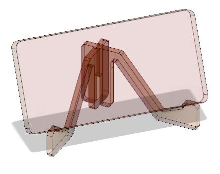

## FabLab Tools

The FabLab@SP is a fully operational workshop with manual and computer controlled/Computer Numerical Control machines which are able to create or cut material to form the final object.

FabLab@SP is currently operating in the following locations:

- T1442 EA Fablab
- T11C FabLab Central, and
- MakerSpace@Library (currently under construction/upgrading)

The tools that are available in the FabLab include

- [Simple manual hand-tools](https://duckduckgo.com/?q=images%3A+hand+tool+sets&t=canonical&iax=images&ia=images)
- [Powered hand-tools](https://duckduckgo.com/?q=images%3A+powered+tool+sets&t=canonical&iax=images&ia=images)
- 3D Printers
    - [Ultimaker 2+](https://ultimaker.com/3d-printers/ultimaker-2-plus)
    - [FlashForge Creator 4](https://www.flashforge.com/product-detail/1)
- Laser cutting and engraving systems
    - [Epilog Fusion M2](https://www.epiloglaser.com/laser-machines/fusion-laser-series.htm)
    - [Universal Laser V660](https://www.innotech-laser.com/equipment/universal-laser/vls660/)
    - [iLaser Nova 10](https://www.aeonlaser.net/nova-series-nova10.html)
- Large flatbed cutter
    - [JWei Flatbed cutter](https://avs.com.sg/technologies/product/cb03ii/)
- Large flatbed 2D milling router
    - [EAS Versatil 2500](http://panamech.com.my/im/versatile2500.htm)
- 3-axis milling router
    - [Roland MDX 540](https://www.pdi3d.com/Roland_MDX_540_MDX_540S_MDX_540A_MDX_540SA_p/mdx-540.htm)
- [Vacuum former](https://duckduckgo.com/?q=vacuum+former&t=canonical&iax=images&ia=images)
- [Mold making and casting](https://duckduckgo.com/?q=mold+making&t=canonical&iar=images&iax=images&ia=images)
- Hotwire Foam cutter
    - [Manix HCM-2S](https://huphong.com.sg/product/foam-cutting-machine/hcm-2s/)
- Plastic Bending Machine
    - [Manix ABM-500S](https://huphong.com.sg/product/bending-machine/plastic-bending-machine/abm-500s/)
- Embedded programming & modules
- [Electronics workbench equipment - soldering & testing](https://duckduckgo.com/?q=electronics+workbench+equipment&t=canonical&iax=images&ia=images)
- Surface Mount Printed circuit board manufacture - [StepCraft 420](https://sgtooling.com/collections/stepcraft-cnc-router/products/stepcraft-420-cnc-construction-kit-1)
- Digital Embroidery machines
    -  [Brother NV800e](https://www.brother.com.sg/en/products/all-sewing-machines/sewing-machines/innov-isnv800e), 
    -  [Brother PR-1050X](https://www.brother.com.sg/en/products/all-sewing-machines/sewing-machines/pr-1050x)
- Paper and Vinyl cutting
    -- [Roland CAMM-1 GS-24](https://global.rolanddg.com/products/vinyl-cutters/camm-1-gs-24-desktop-vinyl-cutter)
    -  [Silhouette Cameo 4](https://www.silhouetteamerica.com/featured-product/cameo)
- Dye-Sub & Heat Press T-shirt, Mug-printing, Badge making
    - [EPson Dye Sub Printer F570](https://epson.com/For-Work/Printers/Large-Format/SureColor-F570-Dye-Sublimation-Printer/p/SCF570SE)
    - [Heat Press Machines](https://duckduckgo.com/?q=heat+press+machine&t=canonical&iar=images&iax=images&ia=images)
    - [Heat Press Mug Making Machine](https://duckduckgo.com/?q=heat+press+mug+making+machine&t=canonical&iar=images&iax=images&ia=images)
    - [Badge Making](https://duckduckgo.com/?q=badge+making&t=canonical&iax=images&ia=images)

Most of the tools are available for use and training and in-house certification is provided, as the FabLab believes that you should be the one working on the practical side of the project to gain experience and know-how.  Of course, there will be staff-on-hand and trained personnel to help you along the way.

As a start, consider the following hand-phone holder/stand.

How would you construct the above project using

- only hand-tools (manual or powered)
- which tools would you consider essential to a maker?
- discuss within a group, a sample toolbox for makers.

Here is a quick tutorial (courtesy of FabLabSP Staff: Louis, Mark & Walter): [Prototyping using Corrugated Cardboard](worksheets/Lab02_Introduction_to_cardboard_prototyping.pdf)

### Assignment

The assignment for this **class** is [Assignment 2 Prototyping](assignments/as02_prototyping.md).  You will be required to

- Select and object you would like to "make"
- Create a real-sized prototype of the object using corrugated cardboard
- Document your work with photos, images and text

[Assignment 2 Prototyping](assignments/as02_prototyping.md) is not graded.

&nbsp;

 [Home](index.md) 
October 2020
