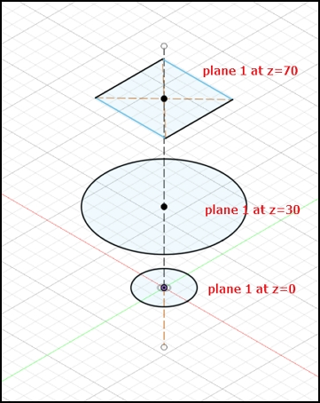
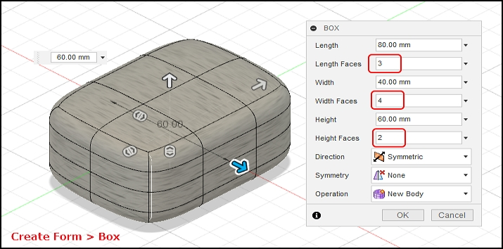
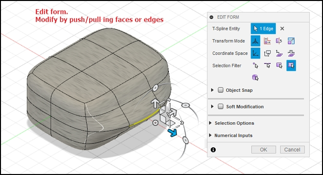

## 3D Modelling

### Recap of Fusion 360

By now, you should be familiar with the following in Fusion 360

[](images/0601_f260interface.jpg)

[Fusion 360 interface](https://productdesignonline.com/fusion-360-tutorials/learn-the-fusion-360-user-interface/)

1. Application Bar
2. Data Panel
    * Houses all your design files, Allows creation of new preojects.
3. Profile & Help
    * Allows settings of Preferences
    * Ensure that you have the Z-axis pointing up
    * All measurements to be done in mm
4. Toolbar
    * Essential command set in each area that you are working on
5. Browser
    * Lists objects in your design
    * Creation of object: Object - Component - Sketch
    * Controls visibility
6. ViewCube
    * Home view
    * Orientation of object
7. Canvas & Marking menu
8. Navigation Bar & Display Settings
9. Timeline
    * Shows order of operations
    * Allows editing and manipulation of features

### Workflow

In the creation of any new design, a good workflow plan would be:

1.  Sketch, on paper, how your overall design would look like
    * decide on profiles
    * 2D and 3D layouts
2.  Obtain any dimensions that you may need to draw your object accurately
    * Measure and estimate
    * Obtain a canvas, to map the drawing
3.  Create the object
    * Create the component, components help to break down the object
    * Create sketch of the profile of the object
    * From sketch, create a 3D model
4.  Inpect and make corrections, adjustments.

&nbsp;

### Tips & Tricks

* [Origin, workplanes](https://youtu.be/Nlvy3rPCRwA) Start your sketch from the origin, it anchors the rest of your sketch to a specific point.  Start watching at 6:00 (he rambles on a lot!)
* [Constraints](https://youtu.be/_MpL9fPAUG4) - fix your sketchs so that they don't change accidentally
* [5 tips for getting started](https://youtu.be/ezKZIvzVGRM) - gets you started the proper way


### Creating 3D Models

1.  **Extrusion**
    * Extrusion is the easiest method of creating a 3D model
        * Create a 2D closed profile in one of the planes (e.g. XY)
        * Extrude the profile in the third axis (e.g. Z)
    + 3-types of extrusion are provided:
        * New Body - creates a new body
        * Join - joins extruded body with the existing body
        * Cut - uses the extrusion to remove unwanted parts
    + Can use Extrude or Press-Pull in Fusion 360
        * Desktop Makes: [Press Pull vs Extrusion in Fusion 360](https://youtu.be/elQ648fVpwA)
    * Only good if you have a profile(s) to work with.

    

2.  **Revolution**
    * [3D Objects using Revolution](worksheets/3D_Objects_using_Revolution.pdf)
    * Creates a 3D model based on a profile and an axis to revolve upon.
        - Draw a 2D closed profile on one of the planes (e.g. XY)
        - Revolve the object about the third axis (e.g. Z)
        - Revolution can be
            + Partial, based on angle, or limits
            + Full 360
        - Lars Christensen: [How to Model Anything Round](https://youtu.be/zYMf6qncgwc)
    * Good for creating globes, sectors, cylinders, profiles.

    
    

&nbsp;

3.  Lofting
    * Create closed profiles in the plane outlining your shape
    * Need to understand - Planes and Offset planes
    * Use loft to create the 3D object by extrapolating the outlines from one profile to another.  The extrapolation can be
        - regular, formed from the contours of the profiles
            + Mufasa CAD [Fusion 360 How To Loft Object, Point And Rails](https://youtu.be/-Z9ioh2NfwY)
        - center-line rail, formed by a line/arc perpendicular to the profiles
            + [Example from AutoDesk](https://forums.autodesk.com/t5/fusion-360-design-validate/introduction-to-loft-using-rail-curves-in-fusion/td-p/7296238)
        - Good for creating ducts, continous 3D models

    |Loft|     |     |
    |:--------:|:----:|:----:|
    |[](images/0604a_loft.jpg)|[](images/0604b_loft.jpg)|[](images/0604c_loft.jpg)|
    |Create the profiles on different planes|Loft > Select the profiles| Results|

    &nbsp;

4.  Sculpting
    * Creating an object using a basic 3D shape, breaking up the shape into sections and then manipulating the shape to what you want.
    * Like playing with plastercine, ideal for the creative-minded.
    * Good tutorials on sculpting
        - Product Design Online: [How to Sculpt an Earbud in Fusion 360](https://youtu.be/dbJcnxWHneo)
        - Product Design Online: Sculpting for Plastic Parts in Fusion 360
            + [Part 1](https://youtu.be/Vrg6h5h_vWs)
            + [Part 2](https://youtu.be/FIbmiTTEo_8)
    * Good for creating objects without fixed profiles or need to be shaped
        - Can be very time-consuming
        - Has great effects

    |Sculpt|     |
    |:--------:|:----:|
    |[](images/0605a_sculpt.jpg)|[](images/0605b_sculpt.jpg)|

    &nbsp;

### Preparation for 3D printing

Once we have an object that we have modelled (digitally) we can then send the object for 3D Printing, which is our next topic in our module.  3D printing offers a great way of prototyping your design fast (in terms of hours).  Once with the prototype, you can then view and make changes to the final design before sending for manufacture.

The digital 3D model, can be used to create molds, or to instruct NC (Numerically Controlled) machines to create the object.  3D printing was never intended for large-scale manufacturing mainly because of the time taken to create the object using additive-manufacturing techniques.

&nbsp;

### Assignment 6

In this assignment, you will complete 2 designs for 3D objects using the techniques (or combination of) in this topic. The objects created will later be used for 3D printing in the practicals.

I have provided approximate timings for you so that you do **NOT** spend all your time (doing something you like and neglecting other modules!)

| Time   | Task |
|--------|:------------------------------------------------|
|45 min  | Go through the video Tutorials listed above. |
|30 min  | Design an object using revolution, loft, sculpting  |
|60 min  | Design a knight piece and display it on your webpage |

Here is a quick guide:

1.  These are the video tutorials you should watch:
    * Desktop Makes: [Press Pull vs Extrusion in Fusion 360](https://youtu.be/elQ648fVpwA)
    * Lars Christensen: [How to Model Anything Round](https://youtu.be/zYMf6qncgwc)
    * Mufasa CAD [Fusion 360 How To Loft Object, Point And Rails](https://youtu.be/-Z9ioh2NfwY)
    * Fusion Essentials [Using the Loft Tool](https://youtu.be/TcbhyPq65dk)
    * Product Design Online: Sculpting for Plastic Parts in Fusion 360
        + [Part 1](https://youtu.be/Vrg6h5h_vWs)
        + [Part 2](https://youtu.be/FIbmiTTEo_8)
2.  Here are a few examples in which you can make for your object of revolution:
    * a bowl, vase, bottle.
    * Specifications (Max):
        - Width: 50 mm
        - Thickness: 3 mm
        - Height: 50 mm
    + If you made a simple bowl of those dimensions, it would take you roughly XX hours to create on a 3D printer!
3.  This is an example of a chess piece (Rook, Knight) - [Images by Google Search](https://duckduckgo.com/?q=image%3A+knight+chess+piece&t=canonical&iar=images&iax=images&ia=images)
    * Select one
    * Model it using Fusion 360
    * Specifications (Max):
        - Height: 50 mm
        - Base width: 30 mm
        - Thickness: 4 mm

**Instruction Sheets**

1. [3D Objects using Revolution](worksheets/3D_Objects_using_Revolution.pdf)

**Specifications**

* Document your work as you go, remember to attach
    * short notes on how you created the design
    * the exported Fusion 360 design file (.f3d)
    * screen shots of your finished product. 
    * highlight any tips that you would want your classmates to know if they were to complete the same projects.
+ Update your blog with the work done.
* **Extra Credit**
    - Model your 3D image in your webpage.  There are a number of Javascipt codes that allow you to model a 3D image (usually STL file) on a webpage
    - See [Thingiverse](https://www.thingiverse.com/) for examples

&nbsp;

### How to embed a Fusion 360 file in your web page

Reference: Fusion 360 [How to embed a viewer of a Fusion 360 design into a website](https://knowledge.autodesk.com/support/fusion-360/troubleshooting/caas/sfdcarticles/sfdcarticles/How-to-embed-a-viewer-of-a-Fusion-360-design-into-a-website.html)

*Example*

<iframe src="https://myhub.autodesk360.com/ue2dff438/shares/public/SH56a43QTfd62c1cd968a8254af243cf0912?mode=embed" width="800" height="600" allowfullscreen="true" webkitallowfullscreen="true" mozallowfullscreen="true"  frameborder="0"></iframe>

&nbsp;

### How-to display a 3D Model (.STL) in a HTML file

Reference: Javascript plugin [JSC3D](https://code.google.com/archive/p/jsc3d/)

1.  Read the reference documents and examples from the Site above.
2.  Download the repository, extract the following `.jsc3d` files and place in a location with your HTML files (e.g. folder `jsc3d`)
    * jsc3d.js
    * jsc3d.webgl.js
    * jsc3d.touch.js    
    You need to load these files in with your HTML.
3.  Load the JavaScript plugin code in the header area

    ```html
    <head>
        <script type="text/javascript" src="jsc3d/jsc3d.js"></script>
        <script type="text/javascript" src="jsc3d/jsc3d.webgl.js"></script>
        <script type="text/javascript" src="jsc3d/jsc3d.touch.js"></script>
    </head>
    ```

4.  Use the following code to load the STL file and display it:

    ```html
    <canvas id="cv" width=640 height=480>
        It seems you are using an outdated browser that does not support canvas :-(
    </canvas>
    <script type="text/javascript">
        var canvas = document.getElementById('cv');
        var viewer = new JSC3D.Viewer(canvas);
        viewer.setParameter('SceneUrl','knight.stl');
        viewer.setParameter('ModelColor','#CAA618');
        viewer.setParameter('BackgroundColor1','#E5D7BA');
        viewer.setParameter('BackgroundColor2','#383840');
        viewer.setParameter('RenderMode','flat');
        viewer.setParameter('MipMapping','on');
        viewer.setParameter('Definition','high');
        viewer.setParameter('Renderer','webgl');
        viewer.init();
        viewer.update();
    </script>
    ```

5.  Change this line to point to your .STL file

    ```html

     viewer.setParameter('SceneUrl','knight.stl');

    ```

Example: [3D model of a Knight Chess Piece](06_STLmodel.html)


&nbsp;

**May 2020**
