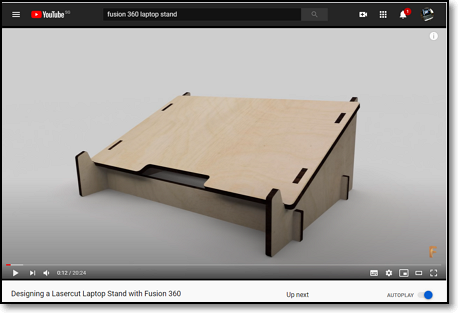
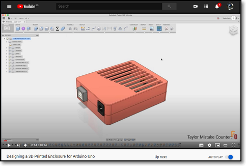
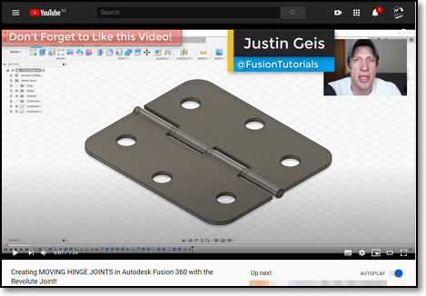
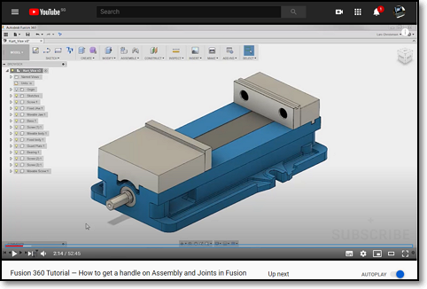
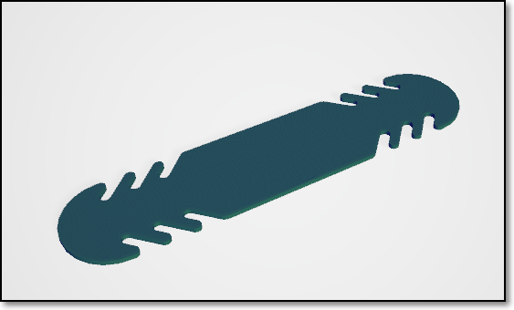
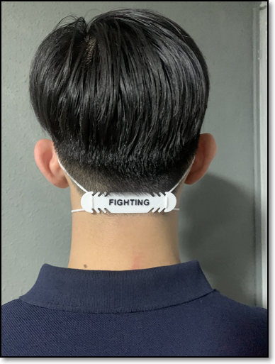

## Fusion 360 Features

In this session, we will look at some features of Fusion 360 which allow us to build complex models.  Most of these features are well documented in Video tutorials on Youtube and are essential to our work in developing actual models for fabrication.

### Creating 3D models

In our previous session, we used Extruction, Revolution, Loft and Sculpting to create 3D models.  If our model is geometric (made up of a certain shape) we can directly create the object using Create> Box, Cylinder, Sphere, Torus, Coil and Pipe.  These models can be mathematically defined, hence, easy to create using Fusion 360.

We could use these and duplicate them to our purpose.  Fusion 360 provides commands for this action under

*   Create
    -   [Pattern](https://youtu.be/JaXVzWkVL_c)
        +   Circular - creating objects around an axis
        +   Rectangualar - creating objects following a rectangular rule
    -   Mirror
        +   [Sketch](https://youtu.be/WUHB_JXOHwU) mirrors lines in 2D sketchs
        +   [Create](https://youtu.be/kk3M9ew2Qg0) mirrors bodies and features for symmetrical objects
    -   [Thicken](https://youtu.be/EnCkQHMhemY) - Add thickness to object, creating models from surfaces
    -   [Boundary Fill](https://youtu.be/pYQLkqJVc4c) - fills in bound areas
    -   [Rib, Web](https://youtu.be/od8JAorsYCU) used to re-encforce objects

Note that these actions can apply to Faces, Bodies, Components or **Features** as well.

Once the object is created, we can then apply the **Modification** commands to change the composition of faces, bodies or components.

*   Modify
    -   [Press Pull](https://youtu.be/elQ648fVpwA) - very similar to the **Extrude** however, can apply to a single face or faces, producing different results
    -   [Fillet](https://youtu.be/kJ-IlkN7kZw) - smoothing out an edge, similar to filing or sanding down an edge
    -   [Chamfer](https://youtu.be/kJ-IlkN7kZw) - smoothing down a surface using a bevel 
    -   [Shell](https://youtu.be/NNPPcCx2Jqc) - hollowing out a body, leaving one of the sides intact
    -   [Draft](https://youtu.be/spQcAmSo05o) - tilting or shifting a face to a slanted position
    -   [Scale](https://youtu.be/4DBFj2kHCyY) - reduces/expands an object based on a ratio
    -   [Combine](https://youtu.be/N5parKTLVbY) - allows you to combine 2 components in different ways either by merging, cutting or removing.
        +   [Bodies vs Components](https://youtu.be/l9dcWtefQ7E) a good understanding is needed when you are creating a complex design.  What better than to listen to the CAD Guru - Lars Christensen!
    -   [Split](https://youtu.be/bNi7mpDbO2w) bodies and faces
    -   [Silhouette Split](https://youtu.be/uv7sHo1h0Ek) to split a body using a shape
    -   [Move/Copy](https://youtu.be/Sgu0t4xoH5Y) - move a 3D object
    -   [Align](https://youtu.be/1XwJHK8jpjw) move bodies to line up 
        +   [Align items in sketchs](https://youtu.be/ZKHkKp7QbaM)
    -   [Change paramters](https://youtu.be/Uel_NmlwdoA) - allowing parametric modelling which allows you to change the dimensions using variables.

* [Parametric Modelling](https://youtu.be/gMNGQUAtC9o)   
    Fusion 360 uses parametric modelling.  This allows you to define your drawings/sketches using variables.  These variables are defined in the Modify > "Change Parameters" option.
    *  The workflow is as follows:
        -  Draw your sketch
        -  Use Modify > Change Parameters to define variables for the dimensions
        -  Apply the variables to the dimensions
        -  Should you change your paramters, the sketch/object changes.
    *  In the parameters box you define:
        -  the name of the parameter
        -  the type of the parameter e.g. mm
        -  a value (which can be changed)
        -  a comment to identify the parameter created
    *  We will use parametric modelling in **most** of our designs

* [Assembly Modelling](https://youtu.be/SesuUThyZsU)    
    You can combine bodies or components to form a new object.  This allows you to create smaller parts (components) and then assemble them to form another object or component for further assemblies.  Assembly modelling allows you to check your model before manufacture right on your pc.  This is the power of Fusion 360 and digital fabrication.
    * [Joints](https://youtu.be/Bw08O6XsfDI) allow you to constrain your components through a degree of freedon.  After specifying a joint you can check the model with the combination of components.
        - [How to start with joints](https://youtu.be/WRhM0815g4M)
            + Only components
            + Ground one of the components, others move with-respect-to this anchor point
            + One joint to rule them all, then select the movement

&nbsp;

## Essential Tutorial

The tutorial covers:

*  Parametric design
*  Sketching tips and exercises
*  Moving, copying, duplicating bodies and components
*  Modifying and combining components
*  Sketch planes, offset planes and sketching on a plane
*  Combining and modelling components to form a model
*  Preparing your work for laser cutting manufacture

I recommend this tutorial to **ALL** students.  It is a very well explained tutorial to design a Laptop Stand.  You must watch & follow: Taylor Stein - Autodesk Fusion 360 [Designing a Lasercut Laptop Stand with Fusion 360](https://youtu.be/7riGolu7BpA)

Animate your Fusion 360 Design - Justin Geis: The Fusion Essentials [Creating an EXPLODED VIEW ANIMATION in Fusion 360](https://youtu.be/0mW8Lpr6Ph8).  After watching this tutorial, try animating the Laptop Stand you designed earlier.

Sometimes you might want a mechanical drawing of your design so that others may see the dimensions you have used.  This is a good and simple video tutorial - Mechanical Advantage ([Fusion 360 - Getting Started with Drawings](https://youtu.be/kb39wIIMH2U))

**Optional Topics**

* Another good tutorial: Taylor Stein - Autodesk Fusion 360 [Designing a 3D Printed Enclosure for Arduino Uno](https://youtu.be/E0bhdr84FNU) - only watch if you have time.

* Assemblies and Joints: Justin Geis - The Fusion Essentials [Creating MOVING HINGE JOINTS in Autodesk Fusion 360 with the Revolute Joint](https://youtu.be/gGgmA1WZESs) - a simple tutorial to make and simulate a door hinge.

* [How to get a handle on Assembly and Joints in Fusion](https://youtu.be/KQNgIfjMr84) if you get a little crazy over assembly and joints.  All parts are provided, all you have to do is to assemble them.  Follow Lars Christensen on an afternoon of fun and amazement!
* The parts are downloaded from the following locations:
    - Vise <http://a360.co/2e3GCBJ>
    - Chuck <http://a360.co/2e3I333>
    - Table Assembly <http://a360.co/2e3Jheu>
    - Table <http://a360.co/2e3Hnea>
    - Clamping set <http://a360.co/2e3GTV5>

&nbsp;

### Assignment 7

In this assignment, you will complete a Laptop Stand design using the techniques (or combination of) in this topic. The object created will later be used for 2D cutting in the practicals.

I have provided approximate timings for you so that you do **NOT** spend all your time (doing something you like and neglecting other modules!)

| Time   | Task |
|--------|:------------------------------------------------|
|45 min  | Go through some/all of the video Tutorials listed for each topic |
|60 min  | Follow the tutorial for the Laptop design and implement it  |
|120 min  | Design an object in 3D space showing your skills |

This is a longer assignment, since you have the Raya holidays next week!

Here is a quick guide:

**Laptop Stand**

1.  Watch and follow the video tutorial by Taylor Stein - Autodesk Fusion 360 [Designing a 3D Printed Enclosure for Arduino Uno](https://youtu.be/E0bhdr84FNU)
2.  You need to create your own Fusion 360 design from scratch following the instructions in the tutorial.  Make the following changes to the design:
    *  Use a thickness of 3mm for the wood (which should be parametric)
    *  Put your name on the base or side, you should be able to engrave or create a 3D printed logo for the stand.
    *  Measure your laptop and fit the stand to your laptop.
    *  Draw and model your laptop to show how it fits **in relation** to the stand.  A simple design of the laptop would do (unless you want to show off!)
    *  Select the material (wood) and color to make your design realistic
3.  When you have completed the design, animate your work and create a small movie which you can post to YouTube and attached to your drawing. (GitHub has only a limited amount of space!)
4.  Remember to
    *   Document your work e.g. workflow so that you can re-create the design if necessary.
    *   Export and attached your completed Fusion 360 file
    *   Create an animation of the design and export the video to YouTube and link it here
    *   Have a hero shot of your design

**3D Object**

In this period of COVID-19, digital fabricators (like you) can help in the design and development of Personal Protective Equipment.  You would have probably seen designs for face shield holders and mask holders.  Here is a photo submitted by one of our graduates (Lester Zester).  Can you model it on Fusion 360?

||Click on image to enlarge|
|:----------------------:|:-----------------------:|
|||

Some points to note:

1.  The design should be parametric, so that you can adjust for
    *  thickness of material
    *  width and length (depending on the wearer's head/neck)
    *  size of teeth, so that the bands can fit
2.  You might want to "make" a quick prototype out of cardboard to see how it fits.
3.  How about fitting some text (also parametric) which can be embossed.
4.  The item is to be 3D printed

After creating your design, don't forget to

*  Attach your exported Fusion 360 file
*  Have a couple of hero shots
    * of the completed design
    * your prototype (if you made one!)
*  Documented your design and explained how you did it.

&nbsp;

**May 2020**