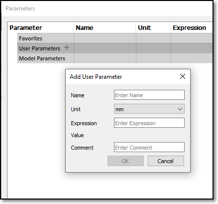
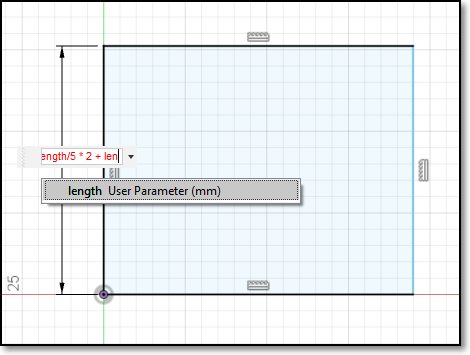
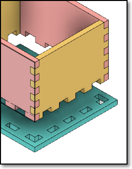
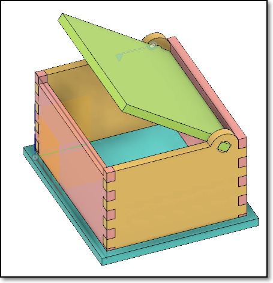

## Parametric Design

In this session, we will look at how to use parameters in Fusion 360.  Parameters allow your design to be flexible, allowing changes and modifications to dimensions without changing any part of the design.  Almost every part of Fusion 360 can be defined as a function or parameter.  As an example, we will design an all-purpose box which can be then laser-cut.

### Esential Tips and Tricks

Here are some essential tips and tricks that you should be aware of:

1.  Set the Z-axis pointing upwards, this is done in the preferences section.
2.  Create, name and save your file at the beginning.  Fusion 360 will save your file every 5/10 minutes after that and it provides a backup.  Also if you 
conciously save your file, you can add a comment which allows for versioning.
3.  Start all sketches from the origin.  Reference all other sketches from this point.  It provides an anchor point for your work.
4.  Constraint your sketches (tools are in the ribbon bar).  This locks your sketches down and prevents errors which you cannot see.
5.  Dimension your lines.  This is similar to constraining your sketches.  It prevents you from errornously.

### Parametric Design

* Fusion 360 allows the definition of parameters.  The parameters act as variables and allow change after assignment.  For example, if you initially designed an object with 3mm wood/acrylic and decide to change it to 5mm, you won't have to redraw your work, if you had defined your design using a parameter for thickness.
* Most of Fusion 360 dimensioning can be replaced with a function.  A function can be:
    -  a value (fixed), you can change it in the sketch, but you have to chave every instance of it.
    -  user parameter/variable.  You define it in the Modify > Change Parameters menu.  You need to define:
        + Name - identifies the variable/parameter
        + Unit - No units, or a form of measurement (e.g. mm, in, ft)
        + Expression - how it is calculated, a value or function
        + Comment - some text which explains its use.
    -  another dimension - you can click on another dimension to make the parameter take on the same value.
    -  a function - you can write a function using constants, variables and mathematical operators

    | | |
    |:-------------------------:|:--------------------------:|
    | |  |
    |Parameters | Functions |

*  Always check that your parameters or items which are dimensioned with parameters are locked on a fixed position or point, otherwise your drawing would look strange if you change one of the parameters.

### Notable Examples

Here are some examples which show you the use of parameters in Fusion 360

* Product Design Online [Sliding Dovetail Lid for 3D Printed Box | Fusion 360 Tutorial] (https://youtu.be/HMtLqm5TkGE)
* Lars Christensen [A Simple Wooden Box & Some Parameters](https://youtu.be/wdI86Q3ukFc)
* Chaos Core Tech [Parametric Designs - Using Variables in Fusion 360](https://youtu.be/Uel_NmlwdoA)
* Taylor Stein -Autodesk Fusion 360 [Fusion 360: Patterns & User Parameters](https://youtu.be/apkUQKNwHIo)
* Hobbyist Maker has some excellent parameter controlled boxes (a little excessive), watch them in this order:
    - [Fusion360: Automatically sized finger-joints](https://youtu.be/9U2JPfkQpsE)
    - [Fusion360: A few changes to the consistent-width finger-jointed box](https://youtu.be/PmXiOijHbl0)
    - [Fusion360: New and Improved Finger-jointed Tray](https://youtu.be/XoDbBkgv33U)
    - [Fusion360: Adding length dividers to the finger-jointed tray](https://youtu.be/E0s4XvlmEFE)

&nbsp;

### Assignment 8

In this assignment, you will complete a simple parametric box with/without a cover.  You will also demonstrate the effects of using parameters in a design by showing a change in the parameters, changes the design without redrawing the object.

I have provided approximate timings for you so that you do **NOT** spend all your time (doing something you like and neglecting other modules!)

| Time   | Task |
|--------|:------------------------------------------------|
|30 min  | Watch a tutorial on a parametric box design |
|60 min  | Design a simple box following the video tutorial  |
|60 min  | Create your own box design with parameters |

This is a longer assignment, since you have the Raya holidays next week!

Here is a quick guide:

1.  Watch and follow the parametric box video tutorial that I have prepared for you - [Fusion 360 Parametric Box for Laser Cutting](https://youtu.be/sHCU5l3nqhc)
2.  Try designing your own box with **ONE** (or more) the following changes:
    - Change the type of base from slot-joint at the sides to slot-joints on the base.
    - Add handles/label holders so that you can carry your box
    - Add a cover that fits exactly (see: [How To Design A Laser Cut Finger Joint Box Accurately](https://youtu.be/FBSQGHBpBWg) start at 6:51.  Note that he is not using Fusion 360
    - How about a hinged cover, here is an example

    |  |  |
    |:--------------------------:|:--------------------------:|
    |  |  |
    | Inset slot in base | Simple box lid |

3. After you have created your box, demonstrate that the parameters work with the design by showing the finished box with
    -  wood thickness of 3mm and 5mm
    -  original box vs one which length, width and height are changed.
4.  Document your work with the following points in mind.
    -  Write a how-to "make a box" in point form, summarizing your work
    -  Show images of the differencs when parameters are changed
    -  Export and attach your Fusion 360 file in your work.

&nbsp;

**May 2020**