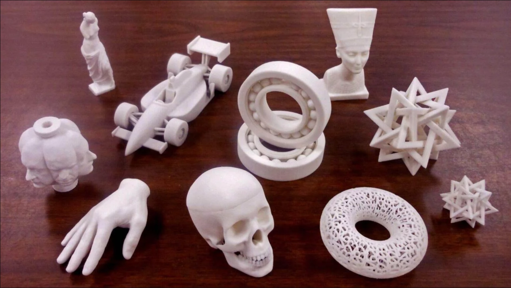
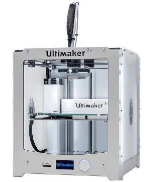
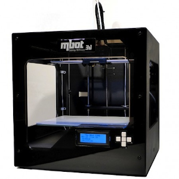
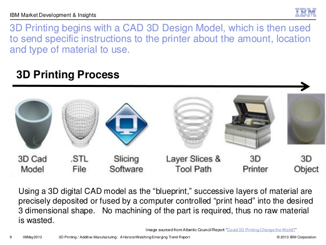

## 3D Printing

3D printing is touted as the new revolution in manufacturing and will soon surpass all methods of product development.  Unfortunately, this is not true.  It is revolutionary, in the fact that it allows manufacturing to be placed in the hands of the common people, however, it will not surpass the manufacturing techniques in place.

3D printing, however, has the following advantages:

* it puts manufacturing in the hands of the public
* you are able to create almost anything with 3D printng
* it is ideal for rapid prototyping

For all its advantages, you must be aware of its disadvantages

* the process is very slow compared to manufacturing (at least 100 times slower)
* prototypes do not have the strength of actual products

The foremost advantage of 3D printing is the creation of prototypes.  In any design process, the most critical is to produce an actual prototype in which you could test the product (although not for strength).  Using digital fabrication and 3D printing we are able to create a prototype within hours which can show the direction in which we should take towards manufacturing. (Usually a prototype created using conventional methods would take days or weeks)

References:

1)  [DFab Notes on 3D Printing](https://skeatz.github.io/DigitalFab-PrototypingFundamentals/files/05-3dprint.html) on <github.com>
2)  [Fablab Teaching Notes](https://esp.sp.edu.sg/webapps/blackboard/content/listContentEditable.jsp?content_id=_1826847_1&course_id=_51997_1) for 3D Printing can be found at ESP: [My Community > Fablab@SP > Fab Lab Skill-set Training > 3D printers](https://esp.sp.edu.sg/webapps/blackboard/content/listContentEditable.jsp?content_id=_1826847_1&course_id=_51997_1)

## A Brief Look at 3D Printing

### What can be 3D Printed

* Almost anything or an object that you can imaging:
    - If you can draw it or model it, you can most surely 3D print it (so that's why we learnt Fusion 360!).
    - Also, items that are not normally created using using [subtractive manufacturing](https://en.wikipedia.org/wiki/Machining), can be 3D printed (more about this later)

### 3D Printers at Fablab@SP

* The Fablab@SP currently has the following 3D printers which are available for use by qualified students, staff and members.  Here is a simple comparison of their sizes and qualitites:

|Printer| Ultimaker 2+ | Cubicon Style 3DP-2105 |MBot 3D Grid 4 |
|:------|:-------------|:-----------------------|:--------------------------|
|       |    |     | |
|Object Size |210x210x205 mm |150x150x150 mm |235x210x190 mm|
|Filament Diameter| 2.85mm | 1.75mm | 1.75mm |
|Type |Open filament | Open Filament | Open Filament |
* Although the 3D printers can handle a variety of filaments (PLA, ABS etc) the Fablab@SP uses only PLA based filament for easy printing and access.  Please remember this in your preparation for 3D printing.
* All three printers can use a common slicer for the preparation of 3D printing jobs - [Ultimaker Cura](https://ultimaker.com/software/ultimaker-cura)
* A common question asked by all, is which printer should I purchase, if I would want one, here are my personal choices:
    - [Prusa Mk3](https://www.prusa3d.com/original-prusa-i3-mk3/) (if you had the money)
    - [Creality 3D Ender 3 Pro](https://creality3d.shop/collections/ender-series-3d-printer/products/creality3d-ender-3-pro-high-precision-3d-printer) (if you don't)

### The 3D Printing Process

* The 3D printing process can be broken down as follows:
    - Creating a usable 3D design
    - Converting the design into a 3D representable file (.STL)
    - Slicing the 3D representable file into layers
    - Converting the layers into instructions for the 3D printer (gcode)
    - The 3D printer creates the 3D object.
* There are many types of 3D printers, the list below shows the more common types that you will encounter:
    - FFF (Fused Filament Fabrication) where a filament is heated/fused and deposited a layer at a time.
    - [SLA (Stereolithography)](https://en.wikipedia.org/wiki/Stereolithography) uses a photochemical process which places a chemical/resin and uses a light source to harden each layer.
    - [SLS (Selective Layer Sintering)](https://en.wikipedia.org/wiki/Selective_laser_sintering) is a technique that uses a laser as a power source to sinter/fuse powdered material at points to create a solid structure.
* As we are mainly using FFF, you will encounter two types of FFF printers
    - Cartesian (using X-Y-Z), and
    - Delta (using polar-Z)
    - In both cases, the printer head is in the Z-axis

s

* The following diagram shows the different parts of a FFF 3D Printer.  The printers may come in different shapes and sizes, however, the parts and principles remain the same.

|3D Printed Parts  | |
|:-------------------------:|:------:|
|  | &nbsp; |

* The important parts for you to note are:*
    - the **Hot End** of the extruder.  Temperatures at the hot-end can reach in excess of 180 degC, you could easily burn your fingers
    - the **print bed** of our printers are heated to 60 degC in order for the fused filament to adhere.  You have to be extra careful with the bed, not because it can burn your fingers.  If there is slight mis-alignment of the print bed, the print job will fail.  It is essential that the print bed is as level as possible.
    - the **filament** is kept in a spool at the side/back of the printer, ensure that the feed is constant and free of obstruction.

### The 3D Printing Process

* The 3D Printing Process is a **Digital Fabrication** process.  We start with a digital design and convert it to a format which the 3D printer can implement.
* The digital process begins with a design of a 3D model, which can be obtained by
    - Designing with CAD software (e.g. Fusion 360, SketchUp, Rhino)
    - Curated from archives (e.g. [Thingiverse](https://www.thingiverse.com/), [My Minifactory](https://www.thingiverse.com/) or other libraries)
* In using CAD, we develop a 3D model in the application of choice, we need to find a common technique of representing this model.  The two common methods are
    - STL (Standard Tesselaltion Language)
    - OBJ 
    - Other methods (Ref: All3DP: [3D File Formats](https://all3dp.com/3d-file-format-3d-files-3d-printer-3d-cad-vrml-stl-obj/))
* Since we are using Fusion 360, how do we convert our 3D model into a STL file ?
    - Complete & save the Fusion 360 file
    - 

