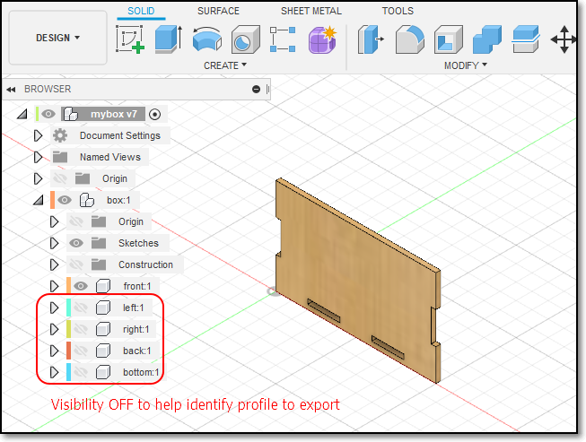
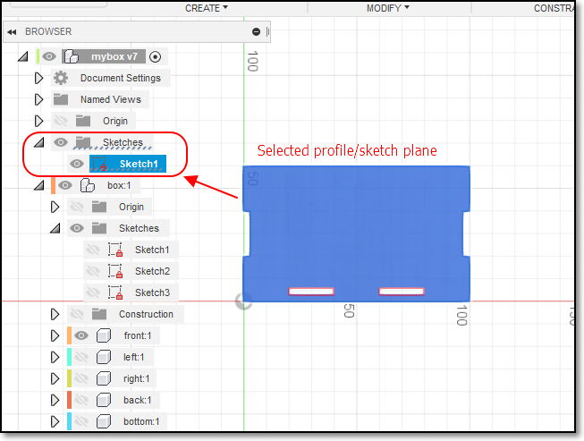
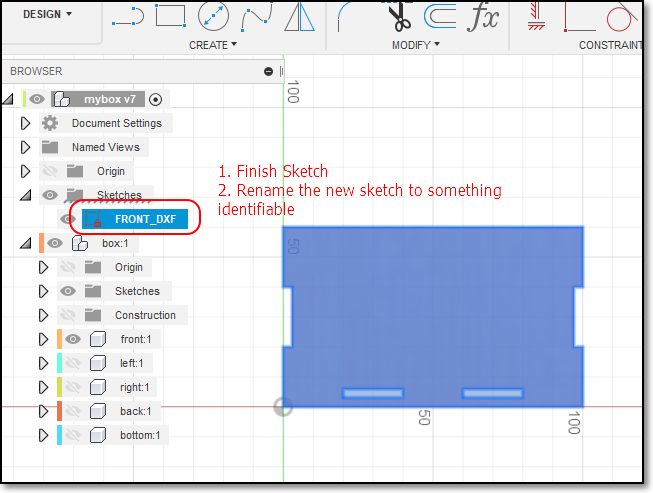
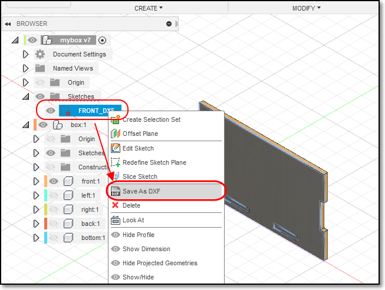
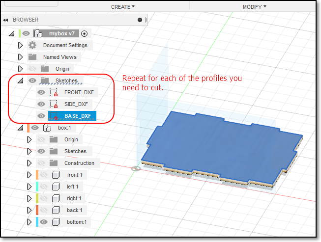
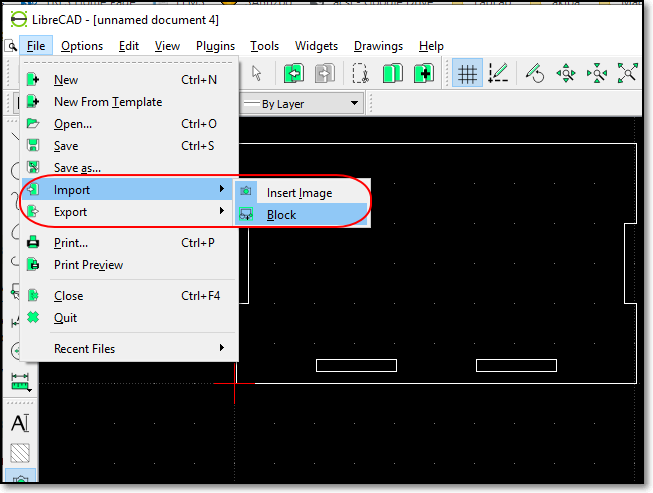
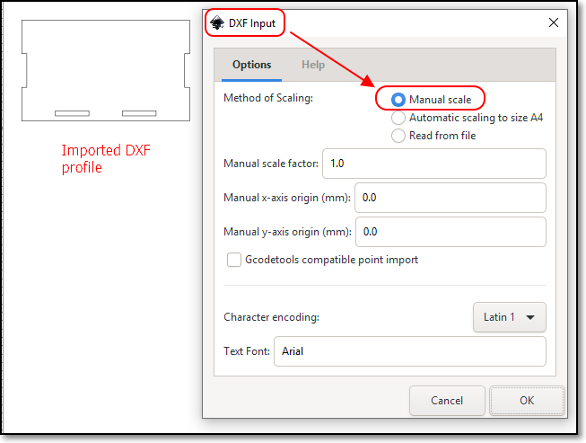
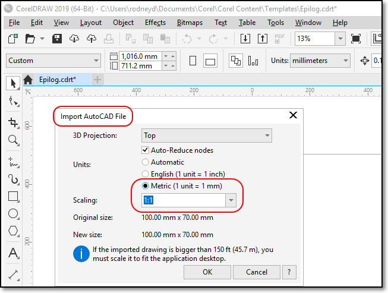
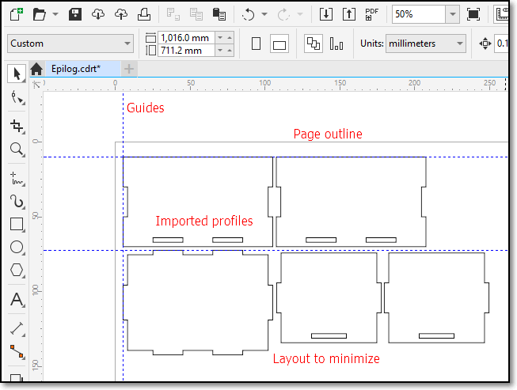

## Preparing for laser cutting

In this session, we will look at how to prepare our designs for laser cutting.  CAD helps use visualise our work in a 3D model, however, in order to laser cut our design, we need to lay out the design in a 2D form.  We also have to make certain considerations to our design before we laser cut.

### Laser cutting

*  Laser cutting is a process where material is placed in the X-Y plane and a [LASER (Light Amplification by Stimulated Emission of Radiation)](https://en.wikipedia.org/wiki/Laser) is moved across the profile to be cut out.  
*  A laser can be focused to a tight spot, which allows the beam to "cut" at the position.
*  The high intensity of the beam causes the material to be vaporised (cut away).  
*  Since the light can be focused, a very thin cut is made.  Electronics and machine control make the cut precise and repeatable.
*  The laser can be programmed to have a continous wave or pulsed repeatedly to produce the cut.
*  The process of laser cutting is controlled by
    *  The speed of the movement of the laser 
        * Slow speeds allow the laser more time over the material and cuts deeper and more intensely.
        * Slow speeds also cause charring of the material.
    *  The intensity of the laser
        *  Higher intensities of the laser can cut deeper
        *  Higher intensities are sometimes required as the material is more dense than others
    *  The number of pulses per second.
        *  Most lasers are pulsed.  The higher the number of pulses per second give higher intensities and prolonged exposure to the laser.
        *  Higher pulsing reates are required for dense material
    *  Most lasers settings come with recommendations from the manufacturer or the Technicians and are dependent upon
        -  The material (e.g. wood, acrylic, paper)
        -  The thickness of the material
        -  The color/coloration of the material.
    *  Please consult the Technician-in-charge before you cut your objects.  They have valuable advice and experience to share with you.
*  We will discuss more into Laser cutting at a later lesson.

### Preparing your Fusion 360 models for laser cutting

* When designing in Fusion 360, we have the ability
    * of modelling an object in 3 dimensions
    * to check for joints and obstructions
    * to check the aesthetics of the model.
+ However, when we decide to laser cut the object we need to obtain the profile of the object and export it in a format that the cutting software recognises.
+ This applies to other design software as well e.g. Illustrator, Rhino
+ The preferred file formats required for laser cutting are:
    * [AutoCAD DXF (Data eXchange Format)](https://en.wikipedia.org/wiki/AutoCAD_DXF)
    * [PDF (Portable Document Format)](https://en.wikipedia.org/wiki/PDF)
    * [SVG (Scalable Vector Graphics)](https://en.wikipedia.org/wiki/Scalable_Vector_Graphics)
+ For our laser cutters, the software used to check and finalise your cuts is the [CorelDraw](https://www.coreldraw.com/en/) Graphics Suite which is able to handle both Vector and Raster images suitable for cutting and engraving.  This is traditionally the recommended software though it is fast being replaced by Inkscape, RDWorks (for China Lasers) because of its costs.
+ The workflow is as follows:
    * Obtain the 2D profile of the object face
    * Export the profile as DXF
    * Import the DXF file into CorelDraw
    * Make necessary changes and adjustments
    * Send/print the profile to the lasercutter
* This workflow applies to all Lasercutters in the FabLab.

### Obtaining DXF profiles from Fusion 360

For this example, we will use the box profile in which I need to extract the side, front and base of the box.  We assume that the box has been designed as in the [Parametric Modelling](08_ParametricDesign.md) session.

| |  |
|:-------------------|:--------------------|
| |Open your design in Fusion 360. In the **Object Browser**, expand and show the bodies/component list. If you have multiple components, make sure that the **root** or **top-most** object is selected |
| |Open your design in Fusion 360. In the **Object Browser**, expand and show the bodies/component list. If you have multiple components, make sure that the **root** or **top-mose** object is selected |
| | Select the body which you want to extract the profile. To help you, you can turn off the bodies which are not of interest In this case only the FRONT component is selected Click onto the body surface to select the sketch plane. |
| | Make a new sketch on this FRONT plane: 1.  Create \> Create Sketch 2.  Select(L-Click) the body surface to select the sketch plane. 3.  **Important** Click again on the profile (it should turn BLUE), showing you the sketch profile. 5.  Click FINISH SKETCH 6.  Your sketch should be located in the Object Browser > Sketches 7.  Select "Finish Sketch" 8.  Rename the sketch to identify it (e.g. FRONT_DXF) |
| | Export the profile as DXF: 1. Right-click on the Sketch FRONT_DXF 2. Select the **Save As DXF** Option 3. Enter an appropriate name for the file e.g. FRONT 4. enote of the Folder where the document is to be saved. |
| | Repeat the above steps for each of the profiles that you want to cut FRONT, SIDE, BASE The Front and Sides are mirrored, and are similar, so only one profile need to be saved. |

&nbsp;

### Checking your work and preparing for Laser Cutting

It is important that you check your DXF profiles before you come down to the Laser cutter to cut your work, because
*  Sometimes the profiles are not exported correctly
*  You will need time to layout your profiles to save space on the material to be cut
*  Laser cutter time is expensive (approx $70/hr).  You don't want to spend that time
    -  correcting your layout
    -  realising that the profiles have errors
*  The software used on most Laser cutters is CorelDraw (which is a licensed product) that comes as the default.  However, CorelDraw accepts a large number of Vector/Raster formats which allow you to import.  The more common formats are
    -  AutoCAD DXF (from most CAD software systems)
    -  PDF (Adobe Illustrator)
    -  SVG
*  You can use the following **Open Source** software to import, check and layout your DXF files before doing a final import to CorelDraw:
    -  [LibreCAD](https://librecad.org/) or [Portable Version](https://portableapps.com/apps/graphics_pictures/librecad-portable)
    -  [InkScape](https://inkscape.org/) or [Portable Version](https://portableapps.com/apps/graphics_pictures/inkscape_portable)
* The following sections show how you can import your DXF into the open source software for checking and layout.

| |  |
|:-------------------|:--------------------|
| | **LibreCAD** LibreCAD is an open source CAD drawing program.  You can use it to create 2D profiles and save it to DXF files.  It's default file format is .DXF 1.  In LibreCAD, open a new drawing **File > New** 2.  Use **File > Import > Block** and select your .DXF file. 3.  Keep adding the profiles.  You can layout your laser cut profile using this software. 4.  Remember that any **line/graphic** drawn will be cut out by the laser cutter. 5.  Check your profiles, save your work as another DXF file e.g. layout.dxf 6.  You can do a single import into CorelDraw. |
| | **Inkscape** 1.  Open Inkscape, select a file size that you can work on (e.g. A4 or A3) 2.  use File > Import > Select your DXF file 3.  Choose "Manual Scale" when importing the DXF. 4.  Layout the imported item on the page, import and place others 5.  Check your work and export as DXF, PDF or SVG format. &nbsp; **Tip** Use guides to help you layout your profiles. |

&nbsp;

### CorelDraw

If you have your DXF files or files created from the Open Source Software, transfer them to a thumbdrive and bring them to the Fablab where the Laser cutters are located.  Each laser cutter has a local PC interface with CorelDraw pre-installed as this is the default software supplied with the machine.  The most common lasercutter that you will use is the [Epilog Fusion M2](https://www.epiloglaser.com/laser-machines/fusion-laser-series.htm) or the [Universal Laser Systems](https://www.ulsinc.com/).

**You do not have much time allocated to the physical interaction with the laser cutter, so layout your profiles before you come.**

Transfer your DXF layout to CorelDraw as follows:

| |  |
|:-------------------|:--------------------|
| | **CorelDraw Import DXF** 1. Create a new CorelDraw file (the default template of 40x28 inch or 1017x711 mm, the size of the laser cutter, is available). 2. File > Import > Select DXF file 3. In the "Import AutoCAD File" popup. ensure that the units are Metric and the Scaling is 1:1 4. Place the layout on the drawing. &nbsp; You can also import SVG, DXF and other file formats. |
| |  Profiles are laid out to minimize material waste. You can also arrange your profiles to speed up the cutting process (How?) Check that the profiles are correct before cutting To cut clink "Print" |

### Kerf

Laser cutting is very precise, giving you accuracies and repeatability in terms of tenth's of a millimeter.  However, sometimes you would like to create "[Press-Fit]https://www.merriam-webster.com/dictionary/press%20fit" objects that are assembled without glue or any other materials.

When a laser cuts through material, some material is removed in the process. The material that is removed is called the **[Kerf](https://www.merriam-webster.com/dictionary/kerf)**.
*  The kerf in laser cutters is very small (approx. 0.3 ~ 0.8 mm) depending on the material and how it is cut.
*  If we can calculate the Kerf (through experimentation) we can make adjustments to ensure that the cuts are press-fit.
*  Adjusments are usually made by
    -  decreasing the size of the "holes"
    -  increasing the size of the "tabs"
*  Can be done **parametrically** by adding an adjustment value to compensate for the kerf.

| |  |
|:-------------------|:--------------------|
| | Kerf is the material removed when lasercutting. Assume a profile 20x20mm is cut. After cutting the cut piece is measured (still 20x20mm) and the hole is measured (20.8x20.8mm). The hole is larger because material has to be removed in the cut.  The amount of material removed is called the Kerf. In this case, Kerf = (20.8 - 20)/2 = 0.4mm Hence to make tight joints, you have to compensate for this kerf. |

&nbsp;

### References:

1.  Autodesk Fusion 360: [Laser cutting - How to save as DXF in Fusion 360](https://youtu.be/U4s2p2epaeg)
2.  BasementMaker: [Glowforge Laser Kerf & Snug Fitting Boxes](https://youtu.be/Q9CwhyDT41Y)

&nbsp;

### Assignment 9

In this assignment, you will attempt to export your box/3d object for lasercutting.  You will also attempt to create a **parameteric** press-fit construction kit by adjusting the kerf.

I have provided approximate timings for you so that you do **NOT** spend all your time (doing something you like and neglecting other modules!)

| Time   | Task |
|--------|:------------------------------------------------|
|30 min  | Watch a tutorial on LaserCutting & Kerf |
|30 min  | Export and layout your 3D model for laser cutting  |
|60 min  | Create a parametric press-fit construction kit |

This is a short assignment, since you have Mid-semester tests & assignments, but should keep you occupied during the holidays.  Try to complete all layouts in DXF so that we can commence cutting when school re-opens in July.

Here is a quick guide:

1.  Watch both of the videos above to get an idea of how laser cutting works and the definition of kerf.
2.  Select your parametrically designed box and prepare a layout for lasercutting.  Use the following parameters:
    * thickness of wood 3mm
    * size of entire layout, no larger than A3 (optimal A4) size
    * minimize the wastage of material
    * save as a single DXF file ready for lasercutting.
3.  Examine the following references:
    * Instructables: [Press-fit Construction Kit](https://www.instructables.com/id/Press-fit-Construction-Kit/) Spheres
    * Instructables: [Press-fit Construction Fit Wooden Cat](https://www.instructables.com/id/PRESS-FIT-CONSTRUCTION-FIT-WOODEN-CAT/)
    * Google Search: [Press fit construction kit laser cutting](https://duckduckgo.com/?q=Press-fit+construction+kit+laser+cutting&t=canonical&ia=web)
4.  Design a simple press-fit kit for yourself, taking into considerstion:
    * the wood thickness
    * the kerf (to be calculated from lab experiments)
    * about 2~5 pieces which can be reused.
    * FabWiki: [Inkscape how to make a pressfit design](http://wiki.fablab.is/wiki/Inkscape_how_to_make_a_pressfit_design)
5.  Layout your pieces (can be multiple) ready for laser cutting.

Remember to document your work and include 
*  screen-shots and how-tos, appropriately written
*  original Fusion 360 and DXF files
*  a **hero-shot** of your work (which can be added later) after lasercutting

**Note**

You will be given an oppurtunity to lasercut your layouts, so please try to complete this assignment before 27th June.

&nbsp;

**June 2020**

v1.0 kerf

