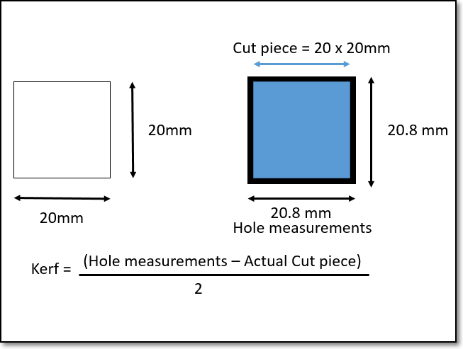

## Preparing for laser cutting

In this session, we will look at how to prepare our designs for laser cutting.  CAD helps use visualise our work in a 3D model, however, in order to laser cut our design, we need to lay out the design in a 2D form.  We also have to make certain considerations to our design before we laser cut.

### Laser cutting

*  Laser cutting is a process where material is placed in the X-Y plane and a [LASER (Light Amplification by Stimulated Emission of Radiation)](https://en.wikipedia.org/wiki/Laser) is moved across the profile to be cut out.  
*  A laser can be focused to a tight spot, which allows the beam to "cut" at the position.
*  The high intensity of the beam causes the material to be vaporised (cut away).  
*  Since the light can be focused, a very thin cut is made.  Electronics and machine control make the cut precise and repeatable.
*  The laser can be programmed to have a continous wave or pulsed repeatedly to produce the cut.
*  The process of laser cutting is controlled by
    *  The speed of the movement of the laser 
        * Slow speeds allow the laser more time over the material and cuts deeper and more intensely.
        * Slow speeds also cause charring of the material.
    *  The intensity of the laser
        *  Higher intensities of the laser can cut deeper
        *  Higher intensities are sometimes required as the material is more dense than others
    *  The number of pulses per second.
        *  Most lasers are pulsed.  The higher the number of pulses per second give higher intensities and prolonged exposure to the laser.
        *  Higher pulsing reates are required for dense material
    *  Most lasers settings come with recommendations from the manufacturer or the Technicians and are dependent upon
        -  The material (e.g. wood, acrylic, paper)
        -  The thickness of the material
        -  The color/coloration of the material.
    *  Please consult the Technician-in-charge before you cut your objects.  They have valuable advice and experience to share with you.
*  We will discuss more into Laser cutting at a later lesson.

### Preparing your Fusion 360 models for laser cutting

* When designing in Fusion 360, we have the ability
    * of modelling an object in 3 dimensions
    * to check for joints and obstructions
    * to check the aesthetics of the model.
+ However, when we decide to laser cut the object we need to obtain the profile of the object and export it in a format that the cutting software recognises.
+ This applies to other design software as well e.g. Illustrator, Rhino
+ The preferred file formats required for laser cutting are:
    * [AutoCAD DXF (Data eXchange Format)](https://en.wikipedia.org/wiki/AutoCAD_DXF)
    * [PDF (Portable Document Format)](https://en.wikipedia.org/wiki/PDF)
    * [SVG (Scalable Vector Graphics)](https://en.wikipedia.org/wiki/Scalable_Vector_Graphics)
+ For our laser cutters, the software used to check and finalise your cuts is the [CorelDraw](https://www.coreldraw.com/en/) Graphics Suite which is able to handle both Vector and Raster images suitable for cutting and engraving.  This is traditionally the recommended software though it is fast being replaced by Inkscape, RDWorks (for China Lasers) because of its costs.
+ The workflow is as follows:
    * Obtain the 2D profile of the object face
    * Export the profile as DXF
    * Import the DXF file into CorelDraw
    * Make necessary changes and adjustments
    * Send/print the profile to the lasercutter
* This workflow applies to all Lasercutters in the FabLab.

### Obtaining DXF profiles from Fusion 360

For this example, we will use the box profile in which I need to extract the side, front and base of the box.  We assume that the box has been designed as in the [Parametric Modelling](08_ParametricDesign.md) session.

Open your design
* Expand the bodies/component list 

Select the body which you want to extract the profile.
To help you, you can turn off the bodies which are not of interest
In this case only the FRONT component is selected

Make a new sketch on this FRONT plane
Create > Create Sketch
Select the face

Click again on the profile
The profile should turn BLUE with the sketch highlighted.

Click FINISH SKETCH
Your sketch should be located in the Object Browser > Sketches

Click on the Newly created Sketch
Rename the sketch to show that you are using it to prepare your DXF.  An appropriate name could be {profile}_DXF
I have renamed mine FRONT_DXF

Right-click on the Sketch FRONT_DXF
Select the **Save As DXF** Option
Enter an appropriate name for the file e.g. FRONT
Take note of the Folder where the document is to be saved

Repeat the above steps for each of the profiles that you want to cut
FRONT, SIDE, BASE
The Front and Sides are mirrored, and are similar, so only one profile need to be saved.

Autodesk Fusion 360: [Laser cutting - How to save as DXF in Fusion 360](https://youtu.be/U4s2p2epaeg)

BasementMaker: [Glowforge Laser Kerf & Snug Fitting Boxes](https://youtu.be/Q9CwhyDT41Y)

| |  |
|:-------------------|:--------------------|
| | Kerf is the material removed when lasercutting. Assume a profile 20x20mm is cut. After cutting the cut piece is measured (still 20x20mm) and the hole is measured (20.8x20.8mm). The hole is larger because material has to be removed in the cut.  The amount of material removed is called the Kerf. In this case, Kerf = (20.8 - 20)/2 = 0.4mm Hence to make tight joints, you have to compensate for this kerf. |

v1.0 kerf

