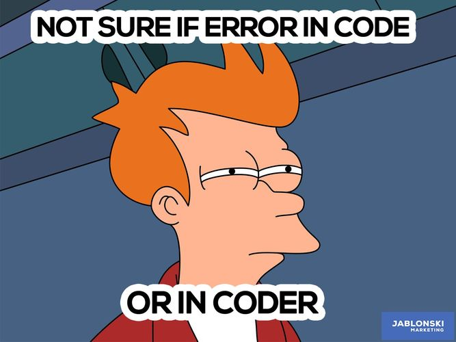

## A Short Introduction to Programming

### Programming Constructs

- A programming language is used to convey the Progammer's thoughts into instructions for the microprocessor to understand.
    - human's read/understand English/Chinese/Malay very well
    - microprocessors only understand binary code ('1's and '0's)
- Hence,the need to translate/convert english-like (human-like) instructions to machine code.  This is done by a compiler.
    - High level languages are computer languages that resemble English, easily understood by the programmer, but need to be converted to binary.
    - Low level languages are computer languages that resemble computer-like code using mnemonics (3~5 letters e.g. ADD, MUL, XFER) that are easily converted to binary, but difficult to read and program by humans (you need to be an EXPERT!)
    - Computer programming languages try to achieve a middle-ground where it can be understood by humans, but easily and **accurately** convertable.  Examples include:
        + Python - very simple and English-like, requires high processing power
        + C/C++ - simple, not very English-like, but easily convertable.
- In any programming language, the important point is to convey the instructions of the programmer **accurately**.
- It is important that the instructions of the programmer be conveyed accurately as the microprocess **ONLY** follows the instructions-to-the-letter.  If your code is wrong/has errors, the microprocessor reproduces these errors.



- 3 types of errors, are possible:
    + **Syntax Errors**
        +  not following the rules (syntax) of the programming language
        +  easily caught by the compiler
        +  most common of all errors made
    + **Logical Errors**
        * Errors made by the programmer in developing the logic of the program
        * Example:
            * incrementing instead of decrementing values
            * using imperial units instead of metric
        + Hardest to catch, only done by testing the code thoroughly
    - **Semantic errors**
        + improper use of "program statements"
        + Examples:
            * using a loop that cannot end
            * using an incorrect function or statement
        + Not easily identified, rare.

### Structued Programming

Structured programming can reduce the occurance of logical errors in any programming language.  It is a technique tha specifies the way/method of writing code, which is easy to understand and follow and produces good results.

Structure programming allows us to

- control the flow of execution
- documents our code, making it easier for us to check and understand

Structured programming is made up of **THREE** main structures

- **Sequence**
    + Do one task at a time, one after another
    + A task can be made up of many tasks, instructions or structures
    + Do it in the correct order and your execution flow will be correct
- **Selection**
    + Allows you to choose one of two options based on a test or question
    + If-a condition is met, then do Task A else/otherwise do Task B
- **Iteration**
    + Allow repetition of a task, instruction(s) or strucfure based on a condition.  It can be repeated none, once or many times.
    + Also known as conditional looping.


You can write almost 90% of all programs using structured programming!

### Documentation

One of the biggest problems in programming is good documentation.

- if you cannot understand/read what you have written, how can you get the execution flow correct?
- Remember that it is the **programmer** that writes the errorneous code.
- How to write good documentation
    + use comments to explain your work
    + use whitespace/tabs/indentation to indicate structures
    + use structured programming
    + beware of upper/lower case mistakes

&nbsp;


### The Arduino IDE

In this session, we will look at some of the specifics that we need to take note when writing code for out projects.  In essence, we need to learn a bit about the "syntax" of the programming language.

The Arduino IDE (Integrated Development Environment) is a cross-platform application (runs on Windows, MacOS and Linux) which allows you to enter the source code for your application programming.  The IDE includes
- a code editor featuring syntax highlighting and bracket matching
- one-click compliation and uploading of programs to the Ardunio boards
- supports C and C++ using special code structuring.

The Arduino IDE uses the GNU toolchain to convert the source code into machine-readable code and the program *avrdude* to convert the executable code into a text file that is loaded onto the Arduino board.

For our purposes, we will ignore the internal workings of the IDE and concentrate on how to write programs for our applications.  This involves understanding the syntax of code i.e. the grammatical structure/format in which words and phrases are arranged to create the instructions.  The syntax of Arduino code is very C/C++ like.

### Sketch

- A Sketch is a program written with the Arduino IDE.
- Sketches are saved on the development systems as **text files** with the extension **.ino**
- Each sketch is created in a folder of the same name on the development system.
- A minimal Arduino sketch in C/C++ consists of only **two** functions:
    - `setup()`
        - This function is called only once when the sketch starts after power-up or reset.
        - This function is used to initialize variables, I/O pin modes and other libraries that are used.
    - `loop()`
        - After the `setup()` function ends, the `loop()` function is called.
        - This function is executed repeatedly until the board is powered off.
- ***Blink*** example

```c++
#define LED_PIN 13                  // Pin number attached to LED.

void setup() {
    pinMode(LED_PIN, OUTPUT);       // Configure pin 13 to be a digital output.
}

void loop() {
    digitalWrite(LED_PIN, HIGH);    // Turn on the LED.
    delay(1000);                    // Wait 1 second (1000 milliseconds).
    digitalWrite(LED_PIN, LOW);     // Turn off the LED.
    delay(1000);                    // Wait 1 second.
}
```

**Notes:**

> \#define LED_PIN  13

- \#define is used to "define" or "declare" to the pre-processor that whenever you see the words LED_PIN, replace it by the number 13.
- the pre-processor is a program in the Arduino IDE that runs just before the compiler, instructions to the pre-processor are called "pre-processor" commands.
- Not a program statement (In C++, program statements end with a ";")

> void setup()

- any words that end with a "()" or "(...)" are know as functions.
- functions are blocks of code that after execution return a value.
- *void* in front of the *setup()* indicates that the function does not return any values.
- a c++ statement must end with a semi-colon ";"
- curly braces "{" "}" are used to group statements.  A goup of statements is called a *block*.
- whitespace is ignored, but used to make code readable

> // Pin number attached ...

- C/C++ statements are case-sensitive.
- this is a comment, also created using /* ... */
- comments are ignored by the compiler
- comments help the code become readable and understandable.
- use indentation to make the code readable, in terms of modularity and blocks.

&nbsp;

## Arduino Programming Language

- The Arduino programming language closely resembles the C/C++ syntax.
- The Arduino programming language is broken up into 3 parts
    + functions
    + variables, and
    + structure
- These words should be considered as "keywords" and not used to define variables, constants, structures or functions in your program.
- Reference: [Arduino Language Reference](https://www.arduino.cc/reference/en/)

### Data Types

- The Arduino language borrows from the data types in C/C++.
- A data type determines the amount of memory required to store the bit pattern and how the storage is interpreted.
- Common data types

|Data type |What it stores                 |# bytes |
|----------|-------------------------------|:------:|
|void | used only in function declarations to indicate that the function does not return any value |  |
|boolean | stores `true` or `false`                                  | 1 |
|char    | stores 1 character  e.g. 'A'                              | 1 |
|unsigned char | stores numbers from 0 to 255, no negatives          | 1 |
|byte    | equivalent to `unsigned char`                             | 1 |
|int     | whole numbers from -32766 to +32767 (depends on processor | 2 |
|unsigned int | whole numbers from 0 to +65535                       | 2 |
|word    | equivalent to `unsigned int`                              | 2 |
|long    | extended size whole number -2,147,483,648 to 2,147,483,647| 4 |
|short   | equivalent to `unsigned int`                              | 2 |
|float   | numbers with decimal point, ranging from -3.4028235E+38 to 3.4028235E+38 | 4 |
| double | equivalent to `float` | 4|

**Notes**

- `int` is dependent on the microcontroller used e.g. ATMega are 8-bit processors, which use 16-bits to define an `int`.

### Constants

- Sometimes you require a value that does not change through-out the program and you want to keep track of it using a identifier.  Declare a constant.
- a constant has an identifier as well as a value (which does not change)
- Constant identifiers are usually written in UPPERCASE.
- \#define does not declare a constant, it is a pre-processor command.

```c++
// floating point constant, note the following:
//   1. const keyword used
//   2. a data type is specified, storage space (2 bytes) is assigned
//   3. an identifier is used to indicate the address of the storage
//   4. you need to assign ('=') a value
//   5. end the statement with a semi-colon (;)
const float PI = 3.141516;

// pre-processor command
#define MYPI  2.141516
//   1. # indicates a pre-processor command, not an instruction
//   2. no data type is indicated
//   3. no storage space is used
//   4. whenever the pre-processor sees the word MYPI, 
//      it substitutes it with 3.141516, taking up code space
```


### Variables

- identified using an identifier (name)
- indicates/points to a storage address used to store data of a specific data type
- `int myValue`  points to an address location, identified by myValue` which has 2 bytes and is capable of storing an integer.
- variables exist only in the region in which they are declared, called a **scope**
- There are 3 types of variable scopes
    + Local variables
        * inside a function or a block
        * they are only used by the statements within the block
        ```c++
        void setup() {
                            // initialisation statements here
        }

        void loop(){
            int a, b;       // local within loop
            ...
            while (a > 5){
                int x, y;   // local within the while loop
                ...
            }
        }
        ```
    - Global variables
        + Defined outside the functions, usually at the top of the program.
        + variable is visible throughout the program.
        ```c++
        int age;            // global variable

        void setup(){
            age = 25;       // can be accessed in setup()
        }

        void loop() {
            ...
            age = age + 10;     // can also be accessed here
        }
        ```

### Operators

Operators are symbols that tells the compiler to perform a specific mathematical or logical operation with the operands.

- Arduino borrows from the C/C++ operator list
- Commonly used operators are
    + Arithmetic
        * = assignment, + add, - subtract, * multiply, / divide
        * with the exception of - negation, arithmetic operators require 2 operands
        * format: <op1> operator <op2>
        * gives a numerical result
    + Comparison
        * == equality, != no equal to, > greater than, < less than
        * gives a logical result (true or false)
    + Boolean operators
        * &amp;&amp; AND, || OR, ! logical NOT
        * gives a logical result
    + Bitwise operators
        * & and. | or, ! not/inverse, << shift left, >> shift right
        * changes the bit pattern of the operator

### Control statements

- Control statements provide a means of decision making.
- A condition is first tested.  If the result is `true`, then the code for Task A is executed, else the code for Task B.
- Control statements are provided using the if-then-else statement.
- The condition statement must return a boolean result
- if statements can be nested.

```c++
    ...
    swState = digitalRead(3);
    if (swState == Hi)
    {
        // true condition    }
        digitalWrite(13, HIGH);
        digitalWrite(12, LOW);
    }
    else {
        // false condition
        digitalWrite(13, LOW);
    }
    ...
```

### Loops

Loops provide a means of performing a task or executing a block of statements repeatedly.

- The following loops are provided and should be used according to the roles applied to them for structured programming
    + while()
        * repeats none, once or many times
        ```c++
            ...
            // loop exits if count is not a +ve number
            while (count > 0){
                state = digitalRead(2);
                if (state == LOW)
                    count = count - 1;
                delay(1000);
            }
        ```
    + do...while()
        * repeats once or many times
        ```c++
            ...
            do {
                digitalWrite(13, HIGH);
                delay(500);
                digitalWrite(13, LOW);
                delay(500);
                sw = digitalRead(2)
            } while (sw == HIGH);
        ```
    + for()
        * repeats exactly a specified number of times
        ```c++
            ...
            // flash LED 5 times
            for (int cnt = 0; cnt < 5; ++cnt){
                digitalWrite(LED, HIGH);
                delay(200);
                digitalWrite(LED, LOW);
                delay(200);
            }
        ```
- Using the correct loop structure helps in the understanding of the code and prevents future mis-understandings.
- the condition of the loop is controlled by a boolean expression.
- If the trigger to the expression is not changed within the loop body, you will end up with an endless repeating loop.

### Functions

- Functions are blocks of code that perform a specific task.
- Functions allow the code to be
    + modular, organizing a task of many small tasks into a larger idea.  This technique is called abstraction.
    + repeated in a program or re-used without writing.
- For example, we could take a number of tasks
    + add flour, sugar, yeast
    + mix well with a little water
    + let the dough rest
    + bake for 30 minutes,
- Into a single abstraction - bakeBread.  Each time we call the function bakeBread, we perform the tasks and out comes a loaf of bread.  Abstraction allows us to think of the bigger idea than looking into smaller sections of the tasks or sub-tasks.
- Breaking down a large task into many smaller tasks is called "Top-down design".
- Building from lines of code into tasks and grouping the tasks together is called "Bottom-up design"
- Good programming calls for a mixture of both techniques.  Good program design usually uses a "Top Down" methodology.
- Arduino implements functions using the C/C++ techniques except
    + the functions can be declared at the bottom of the program
    + the functions must return a value (note: void is a value!)
- Functions can take arguments, however, they are usually passed by value i.e. their value does not change after even though they are changed by the instructions of the function.
- Functions must return a result, which is the data type of the function declaration.
- Functions are declared outside any other functions, usually below the loop function.

![Arduino function]

```c++
void setup() {
    pinMode(13, OUTPUT);
    pinMode(2, INPUT);
    pinMode(3, INPUT);
}

void loop() {
    int x = digitalRead(2);
    int y = digitalRead(3);
    result = sum(x, y);             // call the function sum()
    if (result > 0)
        digitalWrite(13, HIGH);
    delay(1000);
}

// function sum
// only in Arduino can the functions be declared after they are called.
int sum( int a, int b){         // function declaration
    int ans;
    ans =  a + b;
    return ans;                 // return value
}
```

## Arduino IO Functions (Digital)

The Arduino Uno board has 14 pins which can be configured as digital I/O
- digital, giving/receiving logic levesl of HIGH (+5V) or LOW (0V)
- configured as inputs or outputs using software.

The procedure in using the digital pins are
1.  use `pinMode()` to configure the port to be input or output.  The port stays in this mode until another pinMode() is applied, reset occurs or powered off.
2.  use digitalRead() to read the input, or
3.  use digitalWrite() to output a value.

An extra mode INPUT_PULLUP can be applied on the digital I/O pins.  This creates a 20K pull-up resistor to be enabled in the input mode.

## Serial Communications

The Arduino IDE provides a very useful tool in debugging your programs and applications using the Serial Communications module.  The Uno board connects the Serial port of the ATMel processor to the USB bust to provide serial monitoring, and hence a way of obtaining output via the Serial Monitor on the IDE.

The Arduino using Asynchronous Serial communications to communicate with the IDE.  This means that data (usually 8bits) is sent one-bit-at-a-time through the serial interface using the RS-232 asynchronous protocol via the USB to your IDE.

The following program shows how you can use the Serial Communications interface to send messages to your IDE.

```c++
void setup(){
    Serial.begin(9600);     // setup Serial Library for 9600bps comms
    Serial.println("Hello world");      // send a start message
}

void loop(){
    // send the message "ok" every 5 seconds
    Serial.println("ok");       // send the message ok
    delay(5000);
}
```

1. Compile and upload the code to the Arduino board
2. On the IDE open the Serial monitor, you should see the welcome message and the 'ok' message appearing every 5 seconds.

You can use the Serial communcations functions to provide basic Serial output and input to you applications.

Reference: [Serial Communications](https://www.arduino.cc/reference/en/language/functions/communication/serial/)


&nbsp;

### References:

1.  TutorialsPoint: [Learn Arduino](https://www.tutorialspoint.com/arduino/) for beginners
2.  Electronics Hub: [Basic Arduino Tutorials for Beginners](https://www.electronicshub.org/arduino-tutorial/)
3.  Adafruit - Simon Monk [Arduino Getting Started](https://learn.adafruit.com/lesson-0-getting-started/boards-and-ports)
3.  [Arduino IDE Reference](https://www.arduino.cc/reference/en/)
4.  Great books from Simon Monk:
    - Programming Arduino (2nd Ed)
    - Programming Arduino: Getting Started with Sketches (2nd ed.)

&nbsp;

### Assignment 12

In this assignment, you will attempt to write simple programs with the Arduino IDE and Uno R3 board.  You can test the programs on the simulator first before wiring and implementing the actual circuits on the physical Arduino board.

I have provided approximate timings for you so that you do **NOT** spend all your time (doing something you like and neglecting other modules!)

| Time   | Task |
|--------|:------------------------------------------------|
|45 min  | Read the notes, follow up with the TutorialsPoint Site |
|30 min  | Simulate and test your circuit using TinkerCAD  |
|60 min  | Physically wire-up and test your circuits using the Uno R3 and breadboard ||

This may be a long assignment (for beginners).  If in doubt check the simulation on TinkerCAD first before implementing it on the breadboard..

Complete the following programming assignments:

### Programming assignments

1.  Simple LED control
    - connect a LED with a current limiting resistor (220 ohm) to port 6 of the Arduino Uno board.
    - write a program to blink the LED in a variety of patterns.

2.  Controlling 3 or more LEDs
    - using the same technique, connect 3 or more LEDs of different colors to the Arduino board using pins 6, 7, and 8.
    - write a program to produce running lights i.e. the LEDs are lit in sequence e.g. R -> G -> W -> R -> G -> W and so on.

3.  Adding a switch to the flashing lights
    - add a switch to the circuit in (2).  You should use a pull-up resistor of 10K if you are operating in INPUT mode.
    - when the switch is pressed, the LEDs will light up.  Pressing the switch again will turn the LEDs off.
    - write and test this program.

4.  Use the switch in (3) to control the type of light-up and flashing of the LEDs, for example,
    - initially, LEDs are all in the OFF state.
    - pressing the switch, turns on only the RED LED.
    - pressing the switch again, turns on only the GREEN LED
    - pressing the switch again, turns on only the WHITE LED
    - pressing the switch again, turns on all LEDs
    - pressing the switch again, turns off all LEDs returning to the first state.

5.  Modify your program in (4) to flash the LED(s) instead.

6.  Modify your program such that if you press the switch for longer than 3 seconds, the system switches off all LEDs and returns to the initial state.

### Documentation

Remember to document your work on the github site, you should write

- a howto on getting started and how to complete the programming assignments
- include relevant reference sites explaining how they have helped
- highlighted the problems you have faced, so that your peers can learn from your experiences

&nbsp;

**July 2020**