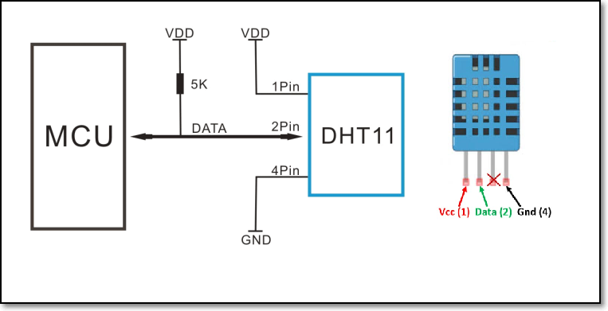
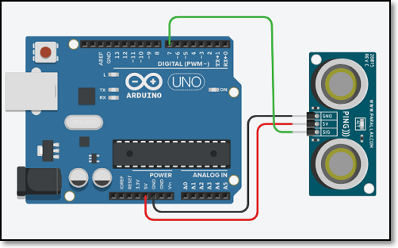
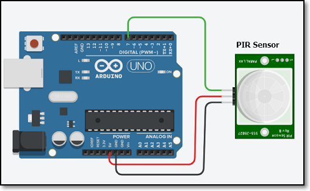
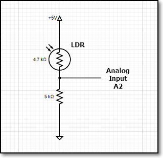

## Input Devices

Input devices are often called **Sensors**.  Output devices are often called **Actuators**.  The process of connecting a Sensor or Actuator to a computer processor system is called Interfacing.

### Sensors

- A sensor is a device, module, machine or subsystem whose purpose is to detect events or changes in its environment and send the information to other electronics, frequently a computer processor. (Ref: [Wikipedia: Sensor](https://en.wikipedia.org/wiki/Sensor))
- Used in everyday objects to read changes in the enviroment.
- Sensor readings are usually analog by nature.
- Changes are usually slower in availability (compared to computer processors) and require some processing techniques.

### Methods of reading sensors

- There are 3 basic methods of reading/obtaining information from a sensor.  These methods are dependent upon the availability of the information, as read by the sensor
    - Always available
        - Just read the data, data is always available
        - Changes to the reading occur very slowly.
        - E.g. temperature
    - Polling
        - Processor has to continually query/poll the sensor for information.
        - Sensor will usually indicate whether there is new information through another signal or have a drastic change in the reading to indicate that there is a new reading available.
        - When Processor "sees" this change, data is read.
        - E.g. switch
    - Triggering
        - A trigger is a signal(s) that is used to initiate the reading.
        - Sequence is as follows:
            + Processor sends a signal to the sensor for data
            + Sensor gathers information, and when ready
            + Sends reading back to the Processor.  The Sensor may also indicate that data is ready to be read by sending back an Acknowledge/Ready signal
        - E.g. Ultrasonic distance measurement
- Sensor data
    + Real environment data is analog by nature.  It may be some physical element e.g. temperature, distance
    + A sensor converts this data into an **equivalent** electrical signal/voltage that is sent to the computer processor.
    + The computer processor has to read this electrical signal and convert it into an understansable value.
    - Analog signals
        - most common type of sensor data
        - requires conversion to a digital value, usually with an ADC
        - usually it is a direct relationship e.g. V = K * environment-value
    - Digital signals
        - these sensors are configured as smart devices, with processing power
        - sensor itself converts the analog values into a digital signal (e.g. pulse or series of digits)
        - processor needs to decode to understand the value
- Arduino Libraries
    + The Arduino System is very popular because there is large number of libraries (of code) available for almost every Sensor that you can think of.
    + Add libraries to the Arduion IDE System (Ref: Arduino.cc [Installing Additional Arduino Libraries](https://www.arduino.cc/en/Guide/Libraries))
        * There are two types of libraries,
            - Searchable using the Arduino IDE sytem (Internal)
            - External libraries, available as compressed C++ code.
        * How to add a library using the Library Manager
            1.  `IDE > Sketch > Install Library > Manage Libraries`
            2.  Search for the library
            3.  Hightlight and click Install, when complete, it should state "Installed"
        * How to add an External library (.ZIP format)
            1.  Search for the library on the Internet
            2.  Download the library, usually in a compressed .ZIP file
            3.  `IDE > Sketch > Include Library > Add .Zip Library`
            4.  Close the IDE. Re-open.
        + How to manually add an External Library
            1.  Search for the library on the Internet
            2.  Download the library, usually in a compressed .ZIP file
            3.  Locate where your sketch folder is found on your computer using `IDE > File > Preferences > Sketchbook`
            4.  Extract the Library from the ZIP file (this is usually a folder)
            5.  Copy the extracted library folder to [Sketchbook folder] > Libraries folder
            6.  Close the IDE.  Re-open.
    - Check that the Library has been added using `IDE > Sketch > Include Library`.  You should see your installed library there.
    + To apply the library code to your application, add the header file a the top of your sketch using `IDE > Sketch > Include Libary > LibName`.  The header file has an extension of `.h`.

### Types of  Sensors

- Switches
    - An electrical component that can disconnect or connect the conducting pather of a circuit.
    - Provides a LOW or HIGH signal depending on the circuitry.
    - Use `digitalRead()` to determine value of a switch.
    - Be aware of debouncing techniques when mechanical switches are in use.
    - Types of switches
        + [Toggle](https://duckduckgo.com/?q=toggle+switch&t=canonical&iax=images&ia=images)
            * a mechanical switch that changes the state each time the switch is thrown/manipulated.
            * e.g. If in the ON position, throwing the switch will change it to an OFF position.
            * the state remains until the switch is thrown
        - [Pushbutton switch](https://duckduckgo.com/?q=pushbutton+switch&t=canonical&iar=images&iax=images&ia=images)
            + a spring-loaded mechanical switch that changes state when the switch is pressed.  When released (and because of the spring) the switch returns to the original state.
            + Two types of pushbutton switches
                * normally closed - push to open/break connection
                * normally open - push to close/make connection
        - [Slide switch](https://duckduckgo.com/?q=slide+switch&t=canonical&iar=images&iax=images&ia=images)
            + a switch which is closed or opened by a sliding mechanism.
            + when changed, the switch remains in the new state.
        - [Touch Capacitative switch](https://duckduckgo.com/?q=touch+capacitative+switch&t=canonical&iar=images&iax=images&ia=images)
            + switch works based on body capacitace.
            + when a person touches it, the body increases the capacitance of the switch and triggers the switch
&nbsp;
- Temperature, Humidity
    + the environment can be measured using a number of devices, the most common and cheapest is to use the DHT-11 temperature and humidity sensor.
        + temperature is a physical quantity that expresses hot or cold.
        + reference temperatures
            +  freezing point of water = 0 degrees Centigrade
            +  boiling point of water = 100 degrees Centigrade
            +  typical Singapore temperature = 28 - 32 degrees Centigrade
    *  humidity is the measure of the concentration of water vapour present in the air.  Singapore's humidity is between 70-90%.
    - the following devices can be used with the Arduino system
        - [DHT-11](https://components101.com/dht11-temperature-sensor)
            - operating voltage range 3.5~5.5V
            - temperature range 0-50C, humidity 20-90%
            - resolution 16-bit
            - accuracy +/- 1C, +/- 1%
        - [DHT-22](https://components101.com/sensors/dht22-pinout-specs-datasheet)
            - temperature range -40~80C, humidity 0~100%
            - resolution 16-bit
            - accuracy +/- 0.5C, +/- 1%
        - [LM35](https://components101.com/lm35-temperature-sensor) temperature sensor
            + operating voltage range -2~35V, typical 5V
            + temperature range -55C ~ 150C
            + accuracy +/- 0.5C
        - [DS18B20](https://components101.com/sensors/ds18b20-temperature-sensor) temperature probe
            + operating voltage range 3V ~ 5V
            + temperature range -55C ~ 125C
            + accuracy +/- 0.5C
    - Interfacing to the Arduino Uno

    

    - [Interfacing the DHT-11](https://create.arduino.cc/projecthub/Arca_Ege/using-dht11-b0f365)
        + requires the use of the DHT-11 library

&nbsp;

- Distance
    + This depends on the distance to be measured.  The devices can range from a limit switch to an ultrasonic sensor.
    - [Photoelectric InfraRed Avoidance detection/Proximity sensor](https://osoyoo.com/2018/12/21/arduino-lesson-ir-obstacle-avoidance-module/)
        + distance: 2cm ~ 40cm
        + can use **EN**able pulse or continuous measurement
        + avoidance distance is adjusted with potentiometer
        + does not measure distance, just detects it
    - [Ultrasonic HC-SR04](https://dronebotworkshop.com/hc-sr04-ultrasonic-distance-sensor-arduino/)
        + distance: 2cm ~ 4 m
        + uses SONAR, returns a pulse proportonal to the distance
        + ranging accuracy 3mm, measuring angle 15 degrees
        + distance is equivalent to [pulse measured](https://www.tutorialspoint.com/arduino/arduino_ultrasonic_sensor.htm)

    

&nbsp;

- Motion detection
    + Commonly used to detect the presence of humans or animals in a room/vicinity.
    - [HC-SR501 PIR Sensor](https://dronebotworkshop.com/techfile/passive-infrared-sensors-pir/)
        + PIR - Passive Infra Red Sensor
        + Detectable cover distance 120 degrees, 7 meters
        + has a repeatable and non-repeatable operating mode

    

    - [Microwave module Doplar detection RCWL-0516](https://dronebotworkshop.com/rcwl-0516-experiments/)
        + Stand-alone module using "Doplar Radar" to detect motion
        + Can be connected to a computer processor
        + Detectable cover distance 7 meters

&nbsp;

- [Light Measurement & Detection](https://www.electronicshub.org/light-sensors/)
    + Light intensity can be detected/measured using LDR (Light Dependent Resistors) or Light Sensor Modules (using Phototransistor circuits)
    - LDR 5516
        + Low cost measurement/detection of light using LDR
        + Variable analog voltage received as input\
        + Can be calibrated
        + Measured using Arduino analogRead() function
        + Use a 5K ~ 10K resistor for the Arduino Uno

    

    - [Using a Photocell](https://learn.adafruit.com/photocells/using-a-photocell)

&nbsp;

- Time
    + These are modules that allow you to keep track of the time.  A RTC uses a small battery, crystal and memory to maintain a on-going clock which can be read to provide the current date and time.
    - Real-time Clock Modules
        - [RTC DS3231 using I2C](https://create.arduino.cc/projecthub/MisterBotBreak/how-to-use-a-real-time-clock-module-ds3231-bc90fe)
        - [RTC DS1302 using single-wire](https://playground.arduino.cc/Main/DS1302/)

&nbsp;

- [Rotary Encoders](https://dronebotworkshop.com/rotary-encoders-arduino/)
    + a rotary encoder reads the positional value of a shaft by comparing 2 pulses as the shaft turns.
    + looks like a potentiomenter, but does not change resistance
    + rotary encoders are now used for volume controls, motor encoders etc
- Weight
    + A load cell provides a means of measuring the weight of an object.  This is done by the measuring the contraction of metals.  Usually a module is provided to read the data from a load cell and transfer the results to the computer processor.
    - [Load Cell Weight Sensor HX711 AD Converter](https://www.brainy-bits.com/load-cell-and-hx711-with-arduino/)
- Water
    - [Water level sensor](https://www.instructables.com/id/How-to-use-a-Water-Level-Sensor-Arduino-Tutorial/)

&nbsp;

- Arduino Sensor Kit
    + [37 in 1 kit](https://www.instructables.com/id/Arduino-37-in-1-Sensors-Kit-Explained/)

&nbsp;

### Assignment 14

In this assignment, you will attempt to interface two input devices to your arduino..

I have provided approximate timings for you so that you do **NOT** spend all your time (doing something you like and neglecting other modules!)

| Time   | Task |
|--------|:------------------------------------------------|
|30 min  | Interface the Ultrasonic sensor to your Uno board |
|30 min  | Interface the DHT-11 sensor to your Uno board ||
|60 min  | Plan what you want to do as your final project |

This assignment requires the wiring of the circuitry using the Arduino Uno board and breadboard with other components.  You may need to consult your lecturer during the breakout sessions regarding troubleshooting of the circuitry.

Complete the following programming assignments:

### Interfacing assignments

1.  Wire up and interface the
    - Ultrasonic sensor
    - DHT-11 temperature and humidity sensor
2.  Draw the circuit diagram (you can use the online app [Circuit Diagram](https://www.circuit-diagram.org/editor/)) to document your work.
3.  Write the program(s) to make the devices work.
    -  indicate whether you need to use libaries
    -  show your resuls using the Serial Monitor and/or Serial Plotter
4.  Take a hero shot (photo or video) of your interfacing achievements
5.  Write up your blog.

### Final Project Planning

1.  Go through the list of suggested projects in the Final Project section.
2.  Google/Search for completed ideas which you might want to use.
3.  Decide on a final project
    -  Indicate what changes you would like to make
    -  Do a sketch of what your final project would look like
    -  Write down the tasks that you need to complete, taking into consideration
        -  what you need to design in 2D/3D
        -  what you need to lasercut
        -  what you need to 3D print
        -  what sensors you require
        -  whether the program is available to you, what changes do you need to make
    *  Write down the Bill-of-materials (BOM)
    *  Complete the above and post it in the Final Project Section
        *  Label this Initial Plan
        *  Provide photos, sketches, evidence of your work

&nbsp;

**July 2020**

