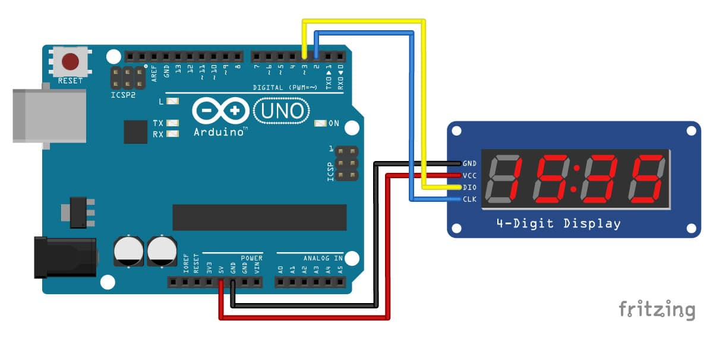
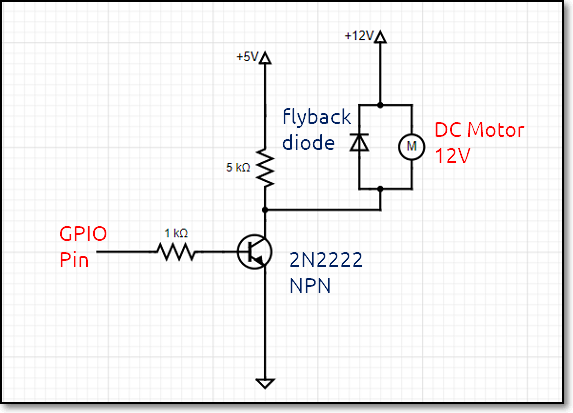
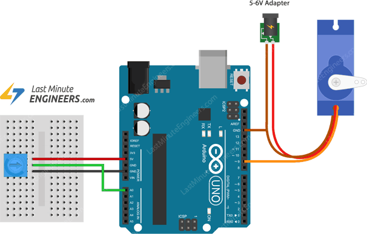
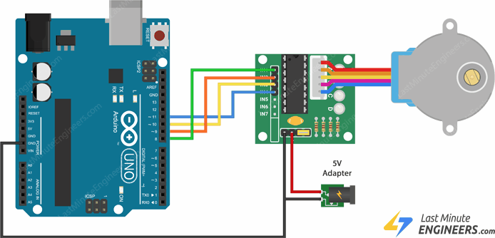
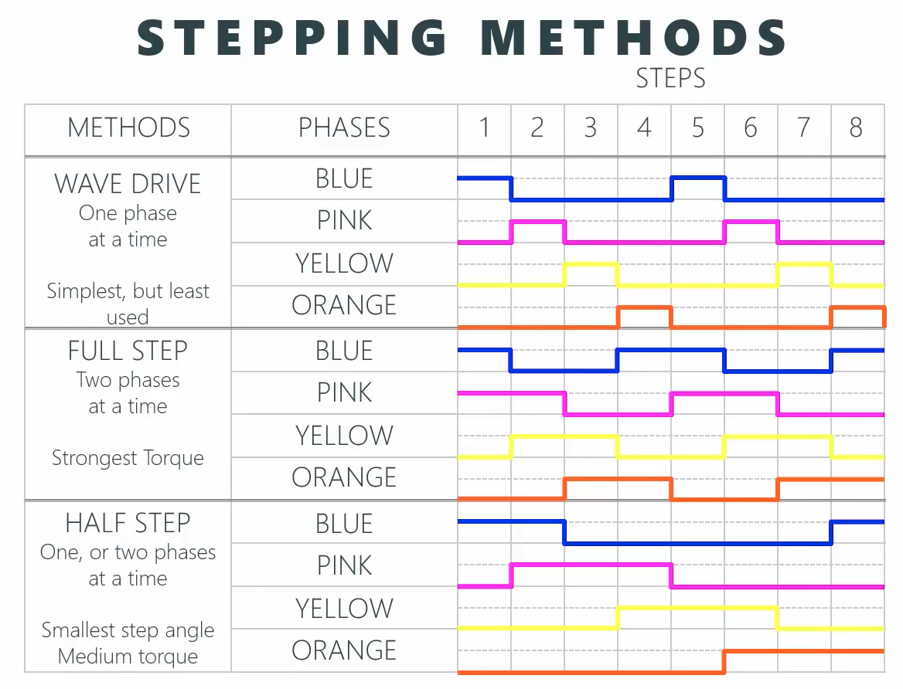
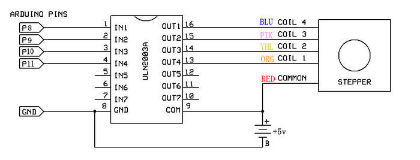

## Output Devices

Output devices are often called **Actuators**.  An Actuator is a component that moves or controls movement.  We use output devices to display information or move mechanisms.

### Actuators

- We use computer processors to control actuators so that we can obtain output (display, movement, motion) precisely.  This is a very efficient as we can get precise control over the devices.
- We can also use computer processors to control the amount of energy supplied giving rise to control of speed or motion.
- Output devices are usually
    + Displays
        * LED displays
        * LCD displays
        * Other light devices
    + Motors
        * DC motors, requiring speed control
        * Servo motors
        * Stepper motors
    + Control of high-powered devices
        * Transistor drivers
        * Relays

### Methods of control

-  Output devices are usually slower to react than the signals sent by the computer processor, hence we usually need to insert a delay for the reaction time
    +  Example: LED blinking
        *  If we were to have the following code
        ```
        while (true){}
            digitalWrite(LED, HIGH);
            digitalWrite(LED, LOW);
        }
        ```

    *  We will not be able to see the changes happening as our eyes only respond to changes greater than 1/30 second.  Hence, we would see that the LED is always lit up (known as Persistence of Vision)
-  These are the common methods of control for output devices
    +  continually send output information
    +  use a timer to send data, based on a preset delay
    +  query, wait for a signal from the output device before sending new data.

&nbsp;

### Output devices with the Arduino

#### LED displays
+ [Single LED](https://components101.com/diodes/5mm-round-led)
    * referenced by the diameter of the LED e,g, 3mm. 5mm, 10mm
    * use digitalWrite() to send HIGH/LOW
    * use a current limiting resistor
    * use a delay to see the results
+ [RGB LED](https://components101.com/rgb-led-pinout-configuration-circuit-datasheet)
    * similar to a single LED except that you have 3 LEDs fused into the housing (requires a current limiting resistor for EACH of the R, G, B)
    * either common cathode (connect to GND) or common anode (connect to Vcc)
    * placing a signal on each of the R, G, B pins lights up the respective color of the LED
    * in order to get different hues, shades use PWM (analogWrite()) to change the average voltage of each color pin.
    * Ref: Arduino Project Hub [Arduino RGB LED Tutorial](https://create.arduino.cc/projecthub/muhammad-aqib/arduino-rgb-led-tutorial-fc003e)
    
    ```c++
        // assume that HIGH powers up the LED
        // to get RED
        digitalWrite(RED, HIGH);

        // to get Yellow, turn ON the RED and GREEN LEDs
        digitalWrite(RED, HIGH);
        digitalWrite(GREEN, HIGH);

        // to get shades
        analogWrite(127, 0, 0);         // mid-Red
        analogWrite(255,255,0);         // bright Yellow
        ...

    // function to get different colors from an RGB using analogWrite()
    void RGB_lightup(int red, int green, int blue){
        analogWrite(RED, red);
        analogWrite(GREEN, green);
        analogWrite(BLUE, blue);
    }
    ```

&nbsp;

* [Seven Segment displays](https://components101.com/7-segment-display-pinout-working-datasheet)
    - has 7 segments of individual LEDs enclosed in a single housing to form a single digit.<br>
    Ref: [Arduino interfacing a 7-segment LED](https://lastminuteengineers.com/seven-segment-arduino-tutorial/)
    - available in 2 modes (no difference in operation)
        + Common cathode (CC)
        + Common anode (CA)
    - can be driven using
        + 7 digital output lines
        + bcd-to-7segment or hex-to-7segment converters (4 digital lines)
        + special multiplexing ICs e.g. TM1637 (4 digit 7-segment)
    - [TM1637 Grove 4-digit Display Module](https://components101.com/displays/tm1637-grove-4-digit-display-module)
        - a 4-digit 7-segment display used in many devices
        - requires the TM1637 library<br>
    Ref: [Arduino with TM1637](https://www.makerguides.com/tm1637-arduino-tutorial/)
        - uses any 2 GPIO pins, driver uses software control    <br>
    

&nbsp;

* [LCD Displays - 1602](https://components101.com/16x2-lcd-pinout-datasheet)
    - Liquid Crystal Display which is able to output 2 rows of 16 characters each. (different sizes are available e.g. 2x20, 4x20)
    - requires 8 data lines, 3 control lines, Vcc, GND
    - data is sent in parallel to the display, together with control lines to sequence the commands and data.
    - Ref: Last Minute Engineers [Interfacing the 16x2 Character LCD](https://lastminuteengineers.com/arduino-1602-character-lcd-tutorial/)
    - Fortunately, your LCD comes with an I2C interface which only requires 2 wires (SCL and SDA) besides power and ground
        +  Ref: Makerguides [How to control a character I2C LCD with Arduino](https://www.makerguides.com/character-i2c-lcd-arduino-tutorial/)
            *  Backlight control (Potentiometer at the back of panel)
            *  How to determine your I2C address of the device
            *  I2C library (Wire.h)
            *  LCD library with I2C (LiquidCrystal_I2C.h)
        +  Uses functions to display characters on the screen
    

&nbsp;

* Other displays
    -   [OLED (SSD1306)](https://components101.com/oled-display-ssd1306)
        +   these are newer monochrome displays
        +   small and inexpensive
        +   uses I2C interfaces
        +   easily driven with available libraries - [Adafruit (with examples)](https://learn.adafruit.com/monochrome-oled-breakouts/downloads)
    -   [TFTP](https://create.arduino.cc/projecthub/techarea98/graphics-test-ili9341-tft-lcd-spi-display-78e1c3)
        +   these are newer color displays, sometimes comes with touch screens
        +   small and becoming inexpensive
        +   uses SPI interface, depending on model
        +   specific libraries with each model/device


####[DC Motors](https://en.wikipedia.org/wiki/DC_motor)

+ Motors play an important role in the movement of mechanisms and objects.
+ There are many types of motors, classified simply as follows:
    * AC motors using alternating current power
    * [DC motors](https://www.elprocus.com/dc-motor-basics-types-application/) using direct current power
        - series DC motors
            + typical DC motor e.g. used in Tamiya cars
            + controlled using voltage
            + typically H-bridge controller using PWM
        - servo motors
            + two types
                * continuous rotation (control direction and stop)
                * positional (control angle)
            + control is done with PWM
        - stepper motors
            + can control movement of motor one-step at a time
            + usually with a motor controller
            + motion is turning ON/OFF coils in the motor
    * geared DC motors
        - motors with an internal gearing system
        - creates higher torque or faster rotations
        - applies to all types of motors
+ DC motors
    * Rotational speed is proportional to the applied voltage.
    * If we can control/change the voltage we can change the speed.
    * Pulse Width Modulation (PWM) provides a means for control
    * Most motors draw a lot of current
        - cannot be supplied by the GPIO pin of a computer processor
        - control methods - Ref: [Tutorialspoint](https://www.tutorialspoint.com/arduino/arduino_dc_motor.htm)
            + use a relay
                * Ref: [Instructables](https://www.instructables.com/id/DIY-Relay-switch-motor-controller-Arduino/)
                * processor controls relay input
                * relay allows the switching of higher currents
                * usually for direction of rotation, not speed
            + use a NPN transistor/MOSFET to supply the current.
                * Ref:
                    - Transistor NPN - [Instructables](https://www.instructables.com/id/12V-Motor-Control-With-5V-Arduino-and-NPN-Transist/)
                    - MOSFET - [Instructables](https://www.instructables.com/id/ArduinoMicrocontroller-MOSFET/)
                * processor controls the transistor
                * transistor acts as a switch (Ref: Ermicoblog [Using Transistor as a Switch](http://www.ermicro.com/blog/?p=423))
                * transistor is able to drive the current
                * using PWM we can control the speed of the motor
            
            + use a H-bridge (L298N) 
                + Ref:
                    +  [Dronebot Workshop](https://dronebotworkshop.com/dc-motors-l298n-h-bridge/)
                    +  [LastMinuteEngineers](https://lastminuteengineers.com/l298n-dc-stepper-driver-arduino-tutorial/)
                * allows control of direction as well as speed
                * standard method of control of DC motors
                * H-bridge (L298N) and DC motor available upon request
                * usual configuration for Robots, moving vehicles
+ Servo Motors
    * Ref:
        - LastMinuteEngieers: [How Servo Motors work * Interface it with Arduino](https://lastminuteengineers.com/servo-motor-arduino-tutorial/)
        - DroneBot Workshop: [Using Servo Motors with the Arduino](https://dronebotworkshop.com/servo-motors-with-arduino/)
    * You may need to provide extra electrical current from an external source to the servo motor.
    * Has an internal control circuit with geared motors
        - controlled using pulses (PWM)
        - pulses determine
            + position of the servo motor, or
            + direction of rotation of the servo motor
    * Two types of servo motor
        - [Positional (e.g FS90)](https://www.pololu.com/product/2818)
        - [Continuous Rotational (e.g. FS90R)](https://www.pololu.com/product/2820)
    * Positional Servo (FS90)
        - Works at 3.0~5.0V with 120 degree angle
        - Servo pulses between 900 uS to 2100 uS determines position
        - Used for maintaining control position e.g. drones, RC planes
    * Continuous Rotation (FS90R)
        - Works at 3.0~5.0V with 360 degree rotation
        - Servo pulses control direction of rotation or stoppage
        - Used for moving robots, small vehicles with movement control
    * Simple calibration circuit
        - Uses potentiometer to read in analog value
        - Controls with pulse width by mapping analog value (0-1023) to percentage (0-255)
    
        - Ref: [LastMinuteEngineers](https://lastminuteengineers.com/servo-motor-arduino-tutorial/)

&nbsp;

* Stepper Motors
    - Ref:
        + DroneBot Workshop [Stepper Motors with Arduino](https://dronebotworkshop.com/stepper-motors-with-arduino/)
        + LastMinuteEngineers [Control 28BYJ-48 Stepper Motor with ULN2003 Driver & Arduino](https://lastminuteengineers.com/28byj48-stepper-motor-arduino-tutorial/)
    - A stepper motor is a motor that is able to move in "steps".  Each step is a division (in degrees) of the full rotational movement done by activating the motor coils, in turn. [Ref: Wikipedia Stepper Motor](https://en.wikipedia.org/wiki/Stepper_motor)
    - Stepper motors are great for
        + exact positional control
        + moving forward/backward at specific speeds
        + used in robots, CNC machines (e.g. 3D printers, Laser cutters)
    - Stepper motors for applications and commercial use
        - Most commercial-grade stepper motors are bipolar motors (e.g. [NEMA 17](https://components101.com/motors/nema17-stepper-motor))
        - Most commercial applications use hardware control boards (e.g. Pololu [A4988 Stepper Motor controller](https://www.pololu.com/product/1182))
        - Control is done by the A4988 board, with the application supplying pulses for each step and directional control only
        - Arduino A4988 Control References:
            + LastMinuteEngineers [Control Stepper Motor with A4988 Driver Module & Arduino](https://lastminuteengineers.com/a4988-stepper-motor-driver-arduino-tutorial/)
    - Understanding Stepper Motor control
        + You have been provided with a
            * [28BYJ-48 Unipolar stepper motor](https://components101.com/motors/28byj-48-stepper-motor)
                - this is a geared motor
                - provides a full-step of 11.25 degrees, however with the gear reduction there are approximately 2038 steps.
                - consumes about 240 mA, even when not in motion, so it would be best to have an external supply
            * ULN2003 motor control board
                - uses transistors to drive the stepper motor
                - provides an external power supply, separate from the Arduino
                - has drives for each of the coils of the stepper motor
            
                - Ref: [LastMinuteEngineers](https://lastminuteengineers.com/28byj48-stepper-motor-arduino-tutorial/)
            - 28BYJ library is provided (Ref: [Arduino 28BYJ Stepper Motor Library](https://www.arduino.cc/en/reference/stepper))
            - Easy to drive the motor using the step-waveform table
            
            Ref: [Step Motor 28BYJ-48 Spec sheet](http://newsphonereview.xyz/step-motor-28byj-48-spec-sheet/)
            ]
            &nbsp;
            
            You can move the motor using the following sequence:
                1.  define an array holding the step sequences e.g. Full Step sequence { 1100, 0110, 0011, 1011, etc}
                2.  Loop
                    - output 1st value in array
                    - have a small delay (this determines the speed of rotation)
                    - increment the next step
                    - if you come to the end of the array, start over
&nbsp;

### Assignment 15

In this assignment, you will attempt to interface two output devices to your Arduino.

I have provided approximate timings for you so that you do **NOT** spend all your time (doing something you like and neglecting other modules!)

| Time   | Task |
|--------|:------------------------------------------------|
|45 min  | Interface the LCD panel using I2C |
|45 min  | Interface either the Servo motor or Stepper motor |
|30 min  | Sketch out your final project |


This assignment requires the wiring of the circuitry using the Arduino Uno board and breadboard with other components.  You may need to consult your lecturer during the breakout sessions regarding troubleshooting of the circuitry.

Complete the following programming assignments:

### Interfacing assignments

1.  Interface the I2C LCD Panel
    - wire up the LCD panel to the Uno board, you will need only Vcc, GND, SCL and SDA
    - install the LiquidCrystal_I2C library
    - try the example program provided.
    - write a program to 
        + display your name on the first line
        + display a running count starting from 0, updating once every second.
2.  Interface the Servo Motor or the Stepper Motor
    - Servo motor
        - test your connection using the example "Sweep" program provided 
        + add the 5K/10K Potentiometer as an analog input
        + write a program to use the potentiometer to control the position of the servo
    - Stepper motor
        + test your stepper motor using the example from the stepper motor library.
        + re-write the program using the waveform/step array as explained in the lecture
        + demonstrate by changing the speed and direction of the stepper motor using a switch
3.  Remember to update your website with the following
    - the write-ups for each of the assignments
    - use sketches/circuit diagrams to show how you connected the devices
    - include the code that you have written
    - a "hero" shot/video showing the working of the device

### Final Project Week 1

At this stage, you should have some idea of the final project you will be fabricating.  To document your project, in your website

1.  Create a folder to store all your project documentation, drawings, code etc.
2.  In this folder, start by creating
    - a landing pages which will give an overview of the project
    - detail a week-to-week account of your work
    - start by creating "Week 1" (this week's work) which should have
        1.  Give your project life by giving it a "name".
        2.  Produce sketches of what you are going to do.
        3.  Highlight on your sketches, what you will
            -  laser cut and/or engrave
            -  3D print
            -  use the Arduino to control
                - an input device (specify)
                - an output device (specify)
        4.  Write down and explain, in one or two paragraphs, what your project is going to do.
        5.  Start building your Bill-of-materials, so that you can inform your lecturer what components you need.

&nbsp;

**July 2020**


