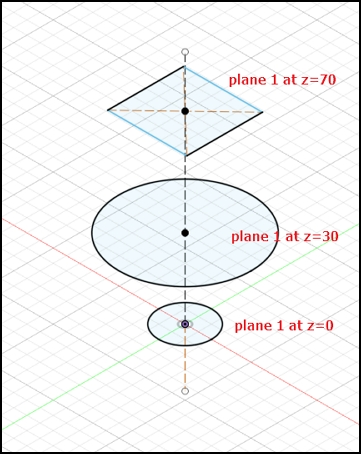
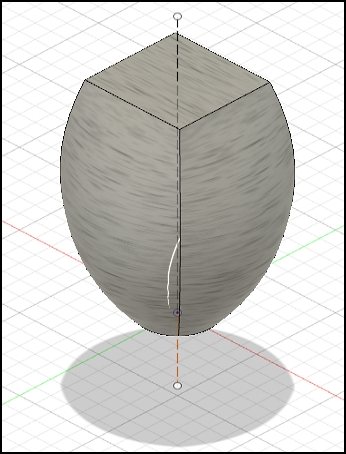
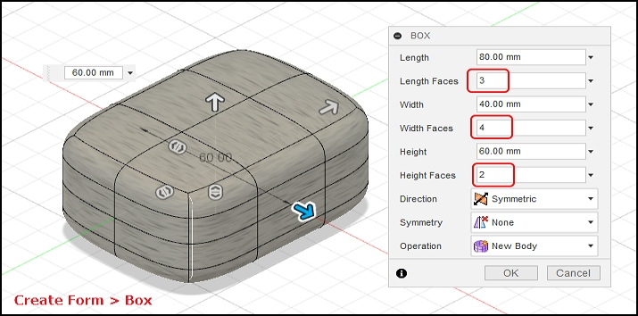
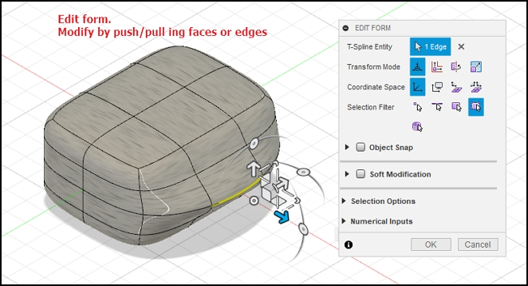

## 3D Modelling

### Recap of Fusion 360

By now, you should be familiar with the following in Fusion 360

[Fusion 360 interface](https://productdesignonline.com/fusion-360-tutorials/learn-the-fusion-360-user-interface/)

1. Application Bar
2. Data Panel
    * Houses all your design files, Allows creation of new preojects.
3. Profile & Help
    * Allows settings of Preferences
    * Ensure that you have the Z-axis pointing up
    * All measurements to be done in mm
4. Toolbar
    * Essential command set in each area that you are working on
5. Browser
    * Lists objects in your design
    * Creation of object: Object - Component - Sketch
    * Controls visibility
6. ViewCube
    * Home view
    * Orientation of object
7. Canvas & Marking menu
8. Navigation Bar & Display Settings
9. Timeline
    * Shows order of operations
    * Allows editing and manipulation of features

### Workflow

In the creation of any new design, a good workflow plan would be:

1.  Sketch, on paper, how your overall design would look like
    * decide on profiles
    * 2D and 3D layouts
2.  Obtain any dimensions that you may need to draw your object accurately
    * Measure and estimate
    * Obtain a canvas, to map the drawing
3.  Create the object
    * Create the component, components help to break down the object
    * Create sketch of the profile of the object
    * From sketch, create a 3D model
4.  Inpect and make corrections, adjustments.

&nbsp;

### Tips & Tricks

* [Origin, workplanes](https://youtu.be/Nlvy3rPCRwA) Start your sketch from the origin, it anchors the rest of your sketch to a specific point.  Start watching at 6:00 (he rambles on a lot!)
* [Constraints](https://youtu.be/_MpL9fPAUG4) - fix your sketchs so that they don't change accidentally
* [5 tips for getting started](https://youtu.be/ezKZIvzVGRM) - gets you started the proper way

### Creating 3D Models

1.  **Extrusion**
    * Extrusion is the easiest method of creating a 3D model
        * Create a 2D closed profile in one of the planes (e.g. XY)
        * Extrude the profile in the third axis (e.g. Z)
    + 3-types of extrusion are provided:
        * New Body - creates a new body
        * Join - joins extruded body with the existing body
        * Cut - uses the extrusion to remove unwanted parts
    + Can use Extrude or Press-Pull in Fusion 360
        * Desktop Makes: [Press Pull vs Extrusion in Fusion 360](https://youtu.be/elQ648fVpwA)
    * Only good if you have a profile(s) to work with.

    

2.  **Revolution**
    * [3D Objects using Revolution](worksheets/3D_Objects_using_Revolution.pdf)
    * Creates a 3D model based on a profile and an axis to revolve upon.
        - Draw a 2D closed profile on one of the planes (e.g. XY)
        - Revolve the object about the third axis (e.g. Z)
        - Revolution can be
            + Partial, based on angle, or limits
            + Full 360
        - Lars Christensen: [How to Model Anything Round](https://youtu.be/zYMf6qncgwc)
    * Good for creating globes, sectors, cylinders, profiles.

    
    

    * My lecture notes on [Creating Objects using Revolution](3D_Objects_using_Revolution.pdf)

&nbsp;

3.  Lofting
    * Create closed profiles in the plane outlining your shape
    * Need to understand - Planes and Offset planes
    * Use loft to create the 3D object by extrapolating the outlines from one profile to another.  The extrapolation can be
        - regular, formed from the contours of the profiles
            + Mufasa CAD [Fusion 360 How To Loft Object, Point And Rails](https://youtu.be/-Z9ioh2NfwY)
        - center-line rail, formed by a line/arc perpendicular to the profiles
            + [Example from AutoDesk](https://forums.autodesk.com/t5/fusion-360-design-validate/introduction-to-loft-using-rail-curves-in-fusion/td-p/7296238)
        - Good for creating ducts, continous 3D models

    |Loft|     |     |
    |:--------:|:----:|:----:|
    ||||
    |Create the profiles on different planes|Loft > Select the profiles| Results|

    &nbsp;

4.  Sculpting
    * Creating an object using a basic 3D shape, breaking up the shape into sections and then manipulating the shape to what you want.
    * Like playing with plastercine, ideal for the creative-minded.
    * Good tutorials on sculpting
        - Product Design Online: [How to Sculpt an Earbud in Fusion 360](https://youtu.be/dbJcnxWHneo)
        - Product Design Online: Sculpting for Plastic Parts in Fusion 360
            + [Part 1](https://youtu.be/Vrg6h5h_vWs)
            + [Part 2](https://youtu.be/FIbmiTTEo_8)
    * Good for creating objects without fixed profiles or need to be shaped
        - Can be very time-consuming
        - Has great effects

    |Sculpt|     |
    |:--------:|:----:|
    |||

    &nbsp;

### Preparation for 3D printing

Once we have an object that we have modelled (digitally) we can then send the object for 3D Printing, which is our next topic in our module.  3D printing offers a great way of prototyping your design fast (in terms of hours).  Once with the prototype, you can then view and make changes to the final design before sending for manufacture.

The digital 3D model, can be used to create molds, or to instruct NC (Numerically Controlled) machines to create the object.  3D printing was never intended for large-scale manufacturing mainly because of the time taken to create the object using additive-manufacturing techniques.

&nbsp;

### Assignment: 3D Modelling

In this assignment, you will complete a designs for a 3D object using the techniques (or combination of) in this topic. The objects created will later be used for 3D printing in the practicals.  After completing the designs, you will display your design on your webpage.

[Assignment: 3D Modeling](as_3D_modeling.md)

&nbsp;

**May 2020**
