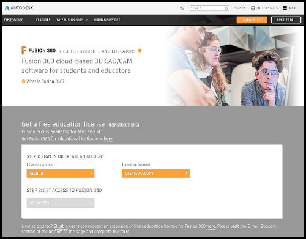

## Computer Aided Design

The use of computers to aid in the creation, design and analysis of a design.  CAD is one of the foremost tools in Engineering.  CAD allows the user to create, modify, analyze and simulate a design from the comfort of his/her PC.  The is th foremost tool in digital fabrication techniques.

### Computer Graphics

Computer graphics is sub-divided into two categories:

* Raster
    *  Raster images deal with pixels on the screen.  It is used mainly for rendering images (e.g. Photographs).  Images are represented by "dots" or "pixels" in a set resolution (number of dots/pixels per inch).
    *  Raster images are characterized by becoming fuzzy as you zoom/enlarge the image.  As the image is represented by dots, as you enlarge the image the dots become bigger.
    *  Raster images are mainly used for photographs and image representation.
    *  Important resolutions (measured as dpi (dots per inch)), the higher the amount of memory required to store the image.
        -  72 dpi Apple/Mac screen resolution
        -  96 dpi Windows screen resolution
        -  300 dpi min Printer resolution
    *  Software
        -  [GIMP](https://www.gimp.org/)
        -  [Adobe Photoshop](https://www.photoshop.com/en)
        -  [MS Paint](https://ms-paint.en.softonic.com/)
    *  Common raster file formats
        -  [jpg, jpeg](https://en.wikipedia.org/wiki/JPEG) Joint Photographic Experts Group
        -  [png](https://en.wikipedia.org/wiki/Portable_Network_Graphics) Portable Network Graphics
* Vector
    - Vector images use mathematical functions or algorithms to display images on the screen. e.g. a line is represented by two points and an equation to draw the line between points.
    - Vector images are characterized by clean lines/edges and the ability to zoom in/out as much as you want without distortion, as each image is "drawn" using an algorithm.
    - Vector images are great for logos, signs, fancy text and design files.
    - As such, you require specific software to handle each image type, and some are proprietary, though some standards exist.
    - Software
        + [Inkscape](https://inkscape.org/)
        + [Adobe Illustrator](https://www.adobe.com/products/illustrator.html)
    - Common vector file formats
        + [dxf](https://en.wikipedia.org/wiki/AutoCAD_DXF) AutoCAD Drawing Exchange Format
        + [svg](https://en.wikipedia.org/wiki/Scalable_Vector_Graphics) Scalable Vector Graphics
        + [STEP](https://en.wikipedia.org/wiki/ISO_10303-21) STEP. ISO 10303 for 3D Objects

### CAD (Computer Aided Design)

CAD or CADD (Computer Aided Design & Drafting) are a set of vector tools that allow you to create your design, simulate and analyze the results without actually building/fabricating the object.  Once tested, you can then send the digital data for computer cutting or 3D printing.  CAD tools are often used in

* Electronic Design Automation
* Architectural & Building services
* Product design and manufacturing

There are a number of Commercial packages in use in SP (depending on which school you are enrolled in), for example:

* [AutoDesk Fusion 360](https://www.autodesk.com/products/fusion-360/overview) (Engineering, Fablab)
* [AutoDesk AutoCAD](https://www.autodesk.com/products/autocad/overview) (Engineering, Building)
* [AutoDesk Inventor](https://www.autodesk.com/products/inventor/overview) (Mechanical)
* [Rhino](https://www.rhino3d.com/) (Architecture, Design)
* [SketchUp](https://www.sketchup.com/) (Architecture, Building, Design)
* [Solidworks](https://my.solidworks.com) (Engineering)

### Fusion 360

Fusion 360 is an Integrated CAD, CAM, and CAE software.  You can consolidate your product development process. Unify design, engineering, electronics, and manufacturing into a single platform.

As it is from the AutoDesk family, you will find the command structure similar to AutoCAD or Inventor.  With the rate of uptake and the direction provided by AutoDesk, Fusion 360 will slowly replace the other AutoDesk software.

Fusion 360 is provided free for educational use, provided you sign up (using your email) as a registered student of Singapore Polytechnic.  Fusion 360 is easy to learn and master with lots of online tutorials, Youtube videos and references even from Autodesk itself.  We will use Fusion 360 for most of our design work in this module.

### Getting started

Here are some good Tutorials you should watch to get you going:

*  AutoDesk [Getting Started with Fusion 360](https://help.autodesk.com/view/fusion360/ENU/courses/)
*  Kevin Kennedy - [Product Design Online](https://productdesignonline.com/fusion-360/)
    -  [Fusion 360 Interface](https://www.youtube.com/watch?v=sZwM87-nsYA)
    -  [Fusion 360 for Beginners](https://youtu.be/J39Iq4Kku1Q?list=PLrZ2zKOtC_-DR2ZkMaK3YthYLErPxCnT-)
*  Warwick University [Fusion 360 Tutorials](https://warwick.ac.uk/fac/sci/wmg/about/outreach/resources/fusion_tutorials/)

&nbsp;

### Assignment: CAD Introduction

In this assignment, you will 

- investigate raster and vector computer graphics packages
- use Fusion 360 to draw some simple 2D graphics
- post your results on your website.

[**Assignment CAD Introduction**](as_CAD_intro.md) 

&nbsp;

**May 2020**

