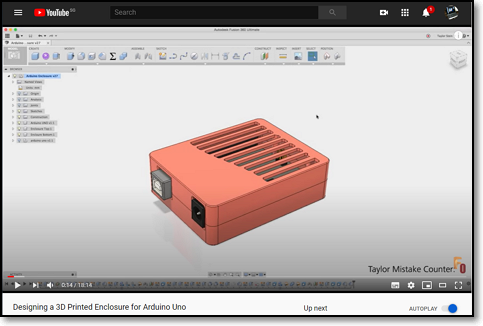
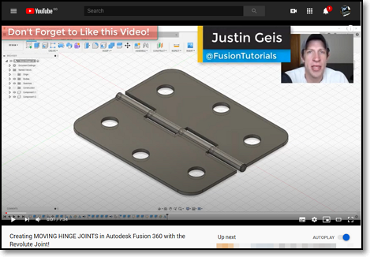
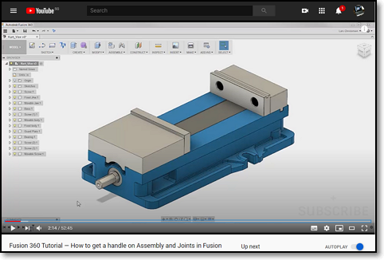

## Fusion 360 Features

In this session, we will look at some features of Fusion 360 which allow us to build complex models.  Most of these features are well documented in Video tutorials on YouTube and are essential to our work in developing actual models for fabrication.

### Creating 3D models

In our previous session, we used Extrusion, Revolution, Loft and Sculpting to create 3D models.  If our model is geometric (made up of a certain shape) we can directly create the object using Create> Box, Cylinder, Sphere, Torus, Coil and Pipe.  These models can be mathematically defined, hence, easy to create using Fusion 360.

We could use these and duplicate them to our purpose.  Fusion 360 provides commands for this action under

*   Create
    -   [Pattern](https://youtu.be/JaXVzWkVL_c)
        +   Circular - creating objects around an axis
        +   Rectangular - creating objects following a rectangular rule
    -   Mirror
        +   [Sketch](https://youtu.be/WUHB_JXOHwU) mirrors lines in 2D sketches
        +   [Create](https://youtu.be/kk3M9ew2Qg0) mirrors bodies and features for symmetrical objects
    -   [Thicken](https://youtu.be/EnCkQHMhemY) - Add thickness to object, creating models from surfaces
    -   [Boundary Fill](https://youtu.be/pYQLkqJVc4c) - fills in bound areas
    -   [Rib, Web](https://youtu.be/od8JAorsYCU) used to re-enforce objects

Note that these actions can apply to Faces, Bodies, Components or **Features** as well.

Once the object is created, we can then apply the **Modification** commands to change the composition of faces, bodies or components.

*   Modify
    -   [Press Pull](https://youtu.be/elQ648fVpwA) - very similar to the **Extrude** however, can apply to a single face or faces, producing different results
    -   [Fillet](https://youtu.be/kJ-IlkN7kZw) - smoothing out an edge, similar to filing or sanding down an edge
    -   [Chamfer](https://youtu.be/kJ-IlkN7kZw) - smoothing down a surface using a bevel 
    -   [Shell](https://youtu.be/NNPPcCx2Jqc) - hollowing out a body, leaving one of the sides intact
    -   [Draft](https://youtu.be/spQcAmSo05o) - tilting or shifting a face to a slanted position
    -   [Scale](https://youtu.be/4DBFj2kHCyY) - reduces/expands an object based on a ratio
    -   [Combine](https://youtu.be/N5parKTLVbY) - allows you to combine 2 components in different ways either by merging, cutting or removing.
        +   [Bodies vs Components](https://youtu.be/l9dcWtefQ7E) a good understanding is needed when you are creating a complex design.  What better than to listen to the CAD Guru - Lars Christensen!
    -   [Split](https://youtu.be/bNi7mpDbO2w) bodies and faces
    -   [Silhouette Split](https://youtu.be/uv7sHo1h0Ek) to split a body using a shape
    -   [Move/Copy](https://youtu.be/Sgu0t4xoH5Y) - move a 3D object
    -   [Align](https://youtu.be/1XwJHK8jpjw) move bodies to line up 
        +   [Align items in sketches](https://youtu.be/ZKHkKp7QbaM)
    -   [Change parameters](https://youtu.be/Uel_NmlwdoA) - allowing parametric modeling which allows you to change the dimensions using variables.

* [Parametric Modeling](https://youtu.be/gMNGQUAtC9o) 
    Fusion 360 uses parametric modeling.  This allows you to define your drawings/sketches using variables.  These variables are defined in the Modify > "Change Parameters" option.
    *  The workflow is as follows:
        -  Draw your sketch
        -  Use Modify > Change Parameters to define variables for the dimensions
        -  Apply the variables to the dimensions
        -  Should you change your parameters, the sketch/object changes.
    *  In the parameters box you define:
        -  the name of the parameter
        -  the type of the parameter e.g. mm
        -  a value (which can be changed)
        -  a comment to identify the parameter created
    *  We will use parametric modeling in **most** of our designs

* [Assembly Modeling](https://youtu.be/SesuUThyZsU) 
    You can combine bodies or components to form a new object.  This allows you to create smaller parts (components) and then assemble them to form another object or component for further assemblies.  Assembly modeling allows you to check your model before manufacture right on your PC.  This is the power of Fusion 360 and digital fabrication.
    * [Joints](https://youtu.be/Bw08O6XsfDI) allow you to constrain your components through a degree of freedom.  After specifying a joint you can check the model with the combination of components.
        - [How to start with joints](https://youtu.be/WRhM0815g4M)
            + Only components
            + Ground one of the components, others move with-respect-to this anchor point
            + One joint to rule them all, then select the movement

&nbsp;

## Essential Tutorial

The tutorial covers:

*  Parametric design
*  Sketching tips and exercises
*  Moving, copying, duplicating bodies and components
*  Modifying and combining components
*  Sketch planes, offset planes and sketching on a plane
*  Combining and modeling components to form a model
*  Preparing your work for laser cutting manufacture

I recommend this tutorial to **ALL** students.  It is a very well explained tutorial to design a Laptop Stand.  You must watch & follow: Taylor Stein - Autodesk Fusion 360 [Designing a Lasercut Laptop Stand with Fusion 360](https://youtu.be/7riGolu7BpA)

Animate your Fusion 360 Design - Justin Geis: The Fusion Essentials [Creating an EXPLODED VIEW ANIMATION in Fusion 360](https://youtu.be/0mW8Lpr6Ph8).  After watching this tutorial, try animating the Laptop Stand you designed earlier.

Sometimes you might want a mechanical drawing of your design so that others may see the dimensions you have used.  This is a good and simple video tutorial - Mechanical Advantage ([Fusion 360 - Getting Started with Drawings](https://youtu.be/kb39wIIMH2U))

**Optional Topics**

* Another good tutorial: Taylor Stein - Autodesk Fusion 360 [Designing a 3D Printed Enclosure for Arduino Uno](https://youtu.be/E0bhdr84FNU) - only watch if you have time.

* Assemblies and Joints: Justin Geis - The Fusion Essentials [Creating MOVING HINGE JOINTS in Autodesk Fusion 360 with the Revolute Joint](https://youtu.be/gGgmA1WZESs) - a simple tutorial to make and simulate a door hinge.

* [How to get a handle on Assembly and Joints in Fusion](https://youtu.be/KQNgIfjMr84) if you get a little crazy over assembly and joints.  All parts are provided, all you have to do is to assemble them.  Follow Lars Christensen on an afternoon of fun and amazement!
* The parts are downloaded from the following locations:
    - Vise <http://a360.co/2e3GCBJ>
    - Chuck <http://a360.co/2e3I333>
    - Table Assembly <http://a360.co/2e3Jheu>
    - Table <http://a360.co/2e3Hnea>
    - Clamping set <http://a360.co/2e3GTV5>

&nbsp;

### Assignment: Fusion 360 Features

In this assignment you will follow a video tutorial to model a laptop stand in Fusion 360.

[Assignment: Fusion 360 Features](as_F360_features.md)

**Nov 2020**