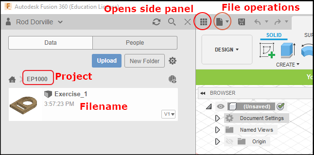
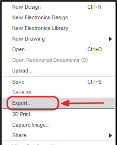
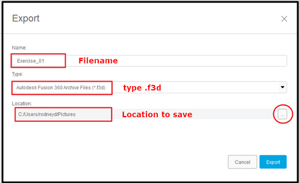
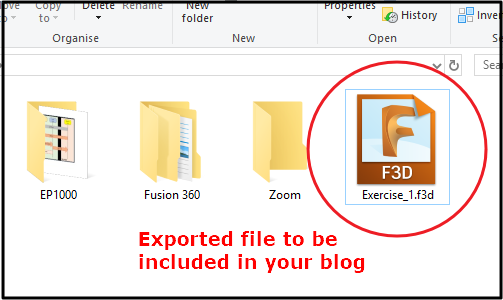

## Assignment Computer Aided Design Introduction

&nbsp;

### Content

In this assignment, you will install GIMP/Photoshop and Fusion 360.  You will use these packages, with the aid of online tutorials, to create preliminary designs.  You will then document your work in the blog.

I have provided approximate timings for you so that you do **NOT** spend all your time (doing something you like and neglecting other modules!)

| Time   | Task |
|--------|:------------------------------------------------|
|10 min  | Install GIMP/Photoshop, Fusion 360 |
|20 min  | Watch *one* tutorial Youtube video on GIMP/Photoshop |
|20 min  | Use GIMP to modify a photo by removing the background |
|20 min  | Go through one tutorial on Fusion 360 interface |
|20 min  | Work through one tutorial using Fusion 360 |
|30 min  | Complete the design projects below |

**Guides on doing each part**

1.  GIMP
    - recommended tutorials (choose one)
        + Tech Gumbo [How To Use GIMP](https://youtu.be/Q8C0LJPpr64)
        + Chris Tutorials [Learn Gimp In 30 Minutes](https://youtu.be/IeABb8cwdUg)
    - try using GIM to resize a photograph to a height of 500 pixels.
    - To remove the background from a photo:
        + Search Youtube for "gimp remove background from image" and choose one tutorial and follow it
        + Choose one of your photos, remove the background and replace it with a seaside view of your choice.
    - Document your work as a "How-to" for GIMP 
    &nbsp;
2.  Fusion 360
    - Work through Autodesk Fusion 360 tutorials until "Create a project"
    - Go through Kevin Kennedy's - [Fusion 360 Interface](https://www.youtube.com/watch?v=sZwM87-nsYA)
    - Try the "Initials Keyring" exercise from [WarWick University](https://warwick.ac.uk/fac/sci/wmg/about/outreach/resources/fusion_tutorials/) 
    &nbsp;
3.  Complete the following exercises.  Treat each exercise as a new drawing and component.
    * [Exercise 1](images/04_Exercise_1.png)
    * [Exercise 2](images/04_Exercise_2.png) - [Worked Example](https://youtu.be/A9DpjtKvEVo)
    * [Exercise 3](images/04_Exercise_3.png) - you may need to use the "Extrude" command

When you have completed the exercise, use the following steps to export your work to a Fusion360 (.f3d) file and attach it to your blog.  The way to do it is

|||
|:----------------:|---------------|
| |While in Fusion 360, create a new Project to keep all your files.  Save your Fusion 360 exercise, use an appropriate name e.g. Exercise_01|
| | After you have saved your file, click on the File icon at the top and select "Export" |
| | Enter filename, check **.f3d** format, select folder store exported file |
| | Copy the file into your folder, link it in your blog and then upload to the repository. |

&nbsp;

**May 2020**
