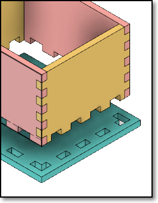
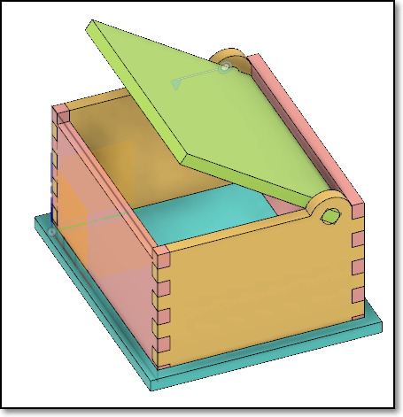

### Assignment: A Box using Parameters

In this assignment, you will complete a simple parametric box with a cover.  You will also demonstrate the effects of using parameters in a design by showing a change in the parameters, changes the design without redrawing the object.

I have provided approximate timings for you so that you do **NOT** spend all your time (doing something you like and neglecting other modules!)

| Time   | Task |
|--------|:------------------------------------------------|
|30 min  | Watch a tutorial on a parametric box design |
|60 min  | Design a simple box following the video tutorial  |
|60 min  | Create your own box design with parameters |

Here is a quick guide:

1.  Watch and follow the parametric box video tutorial that I have prepared for you - [Fusion 360 Parametric Box for Laser Cutting](https://youtu.be/sHCU5l3nqhc)
2.  Try designing your own box with **ONE** (or more) the following changes:
    - Change the type of base from slot-joint at the sides to slot-joints on the base.
    - Add handles/label holders so that you can carry your box
    - Add a cover that fits exactly (see: [How To Design A Laser Cut Finger Joint Box Accurately](https://youtu.be/FBSQGHBpBWg) start at 6:51.  Note that he is not using Fusion 360
    - How about a hinged cover, here is an example

    |  |  |
    |:--------------------------:|:--------------------------:|
    |  |  |
    | Inset slot in base | Simple box lid |

3. After you have created your box, demonstrate that the parameters work with the design by showing the finished box with
    -  wood thickness of 3mm and 5mm
    -  original box vs one which length, width and height are changed.
4.  Document your work with the following points in mind.
    -  Write a how-to "make a box" in point form, summarizing your work
    -  Show images of the differences when parameters are changed
    -  Export and attach your Fusion 360 file in your work.

&nbsp;

### Note

It is **important** that you complete this assignment as you will be using fabricating the box using the Laser cutter system in the coming weeks.

&nbsp;

### Grading

This assignment and its writeup will be graded and contributes to your final score for this module.

&nbsp;

**November 2020**