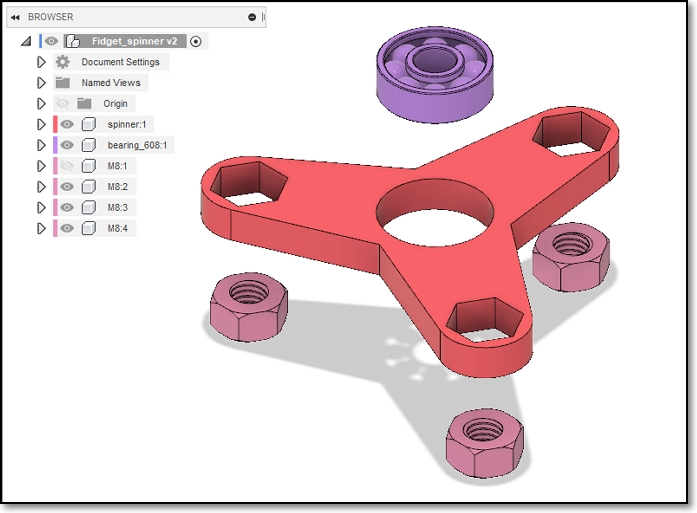
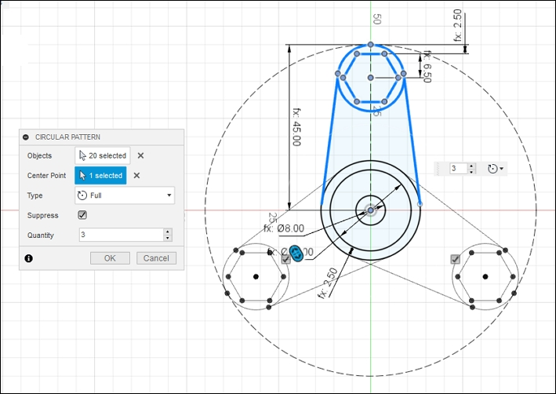

## Fusion 360 - Fidget Spinner

Difficulty level: Intermediate

**Specifications:**

1. You are provided with a [ABEC 608 Bearing](https://www.skf.com/us/products/rolling-bearings/ball-bearings/deep-groove-ball-bearings/productid-608-Z) dimensions 8 x 22 x 7 mm for the rotation device and [M8 Stainless Steel hex nuts](https://www.westfieldfasteners.co.uk/Metric-Nuts/Hex-Nut-M8-A2-Stainless.html) as counter-weights.
2. The radius of your fidget spinner should not exceed 50mm (40mm if you have small hands!) otherwise you will not be able to spin it.
3. Make the maximum thickness of your fidget spinner 8 mm to accommodate the bearing and the M8 nuts.
4. Go wild and imaginative with your design!

**Guide**

1.  Create a new design file, save it.
2.  Create a new component and begin sketching on the X-Y plane.
3.  Start at the ORIGIN, draw the circles for the bearing.
4.  Draw a larger circle for the maximum reach of each arm of the spinner
5.  Add the counter-balance hex nuts.  You need to look at the data sheet for the sizing.
6.  Add an offset of at least 2 mm around the hex nuts and bearing to hold it in place.
7.  Design and draw one arm of the fidget spinner.
8.  Use the circular copy to repeat for the number of arms that you want.
9.  Extrude the required areas.
10.  Render the fidget spinner in the material and colors of your choice.
11.  Save and export the keytag design.

**Extra Credit** (see Figure at top-of-page)

1.  Model the M8 nuts as a separate component and add it to your drawing
2.  Model the bearing as a separate component and add it to your drawing
3.  Create an assembly of your fidget spinner in Fusion 360
4.  Simulate the operation of your fidget spinner

&nbsp;

**May 2020**
