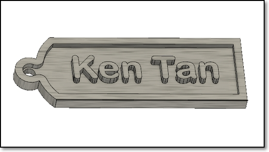

## Fusion 360 - Personalised Keytag

Difficulty level: Beginner

**Specifications:**

1.  The entire keytag should not exceed 30mm X 70mm, otherwise it will not fit into your pocket.
2.  The key ring hole must have a diameter of at least 2.5 mm with neck width of at least 3.5 mm for strength, otherwise it will break when the metal keyring is inserted.
3.  Do not make the keytag thicker than 4 mm

**Guide**

1.  Create a new design file, save it.
2.  Create a new component and begin sketching on the X-Y plane.
3.  Start at the ORIGIN, draw the outline of the keytag using a rectangle.
4.  Draw 2 circles to round off the rectangle.
5.  Add the ring for the keyring on one of the ends.
6.  Add an offset of 2 mm for the rim of the keytag
7.  Add your name, initials or identifying marks
8.  Extrude the keytag to different thicknesses, you may want to experiment with this to get a good effect.
9.  Render/color your keytag
10.  Save and export the keytag design.

&nbsp;

**May 2020**
