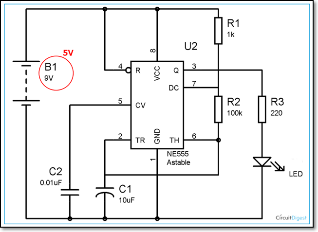

## Assignment: [Electronics](as_electronics.md)

In this assignment, you will attempt to learn some basic electronics.  You have a fantastic online tool to help you with your work and you should learn how to be familiar with it.

The practical session of this assignment is to 
-  read an article on how to create a LED flasher with a 555 integrated circuit
-  test your circuit using a breadboard
-  solder your circuit onto a veroboard/stripboard

The skills you will learn are:
-  understanding an electronic circuit
-  how to test your circuit using a breadboard
-  soldering skills

Assignment: [Electronics](as_electronics.md)

I have provided approximate timings for you so that you do **NOT** spend all your time (doing something you like and neglecting other modules!)

| Time   | Task |
|--------|:------------------------------------------------|
|30 min  | Watch the Youtube tutorials on TinkerCAD circuits |
|60 min  | Participate and learn basic electronics with OpenLearn |
|15 min  | Read an article on how to create a LED flasher |
|60 min  | Wire up your circuit on a breadboard, and test it|
|60 min  | Solder your circuit on a veroboard/stripboard |

This is a rather longer assignment, however, you have the term break holidays to work though this assignment.  Come to the Fablab for advice and help.

Here is a quick guide:

**On the laptop:**

1.  Watch the YouTube videos above to get an idea of how TinkerCAD Circuit works and how to use it.
2.  Familiarize yourself with the common electrical components and try out designing some circuits.
3.  Go through the OpenLearn course on Basic Electronics.

**Practical Session:**

This practical assignment walks you through the creation of a simple circuit, simulation using TinkerCAD, verifying your circuit using a breadboard and finally, implementing your circuit using a veroboard/stripboard.

Do **NOT** attempt to do all parts at once, space them out over the holiday break.  The components for this assignment can be obtained in T1442 Fablab EA, upon request.

1.  Understand how to use Tinkercad
    - simple LED, Resistor circuit
    - measurements: Voltage, Current
    - using a Frequency Generator to flash the LED
    - the sample circuit below shows how Voltage and current readings can be obtained using TinkerCAD.
    - implement the circuit using TinkerCAD
    - observe the readings by changing the value of R1
    - the circuit can be used to verify Ohm's law
    - a voltmeter is used to measure voltage, and must be placed parallel to the component of which the voltage is to be taken
     - an ammeter is used to measure current, and must be placed in series with the circuit.

    

     - what value of R must I insert to allow only approximately 5mA of current to flow through the circuit? 
&nbsp;
2.  Learn how to use a Breadboard
    - Watch Youtube [How To Use a Breadboard](https://youtu.be/6WReFkfrUIk)
    - or read SparkFun [How to use a Breadboard](https://learn.sparkfun.com/tutorials/how-to-use-a-breadboard/all)
    - Go to T1442 Fablab EA, transfer your circuit to an actual breadboard (without the meters), verify that it works. 
&nbsp;
     
&nbsp;
    - Alternatively, you could try it on TinkerCAD first! 
&nbsp;
3.  Wire up a 555 Timer circuit
    - Read the operation of a [Astable 555 Timer](https://circuitdigest.com/electronic-circuits/555-timer-astable-multivibrator-circuit-diagram) 
    We will be using this circuit, with the exception that
        - Voltage is 5V

     
&nbsp;
4.  Test the circuit using TinkerCAD and observe the waveform by using an oscilloscope.  You should be able to obtain a square wave showing the flashing of the LED on simulation.

     
&nbsp;
    - Note:  If you change the value of C1, you can change the rate at which the LED flashes. 
&nbsp;
4.  Try implementing the circuit using an actual breadboard.  You can obtain the components from T1442. 
If you are stuck, here is a [Step-by-step Guide](stepbystep_breadboarding.md)
5.  Wire up an actual circuit using Veroboard/Stripboard
    - Read this article: [Soldering 555 timer on stripboard](http://www.bestsoldering.com/how-to-use-veroboard/) 
    It shows how to implement a 555 Astable circuit on a veroboard.  Follow the following steps to complete your assignment
    - **Soldering**
        - If you are new to soldering, watch the following site/videos first
            - Sparkfun [How to Solder](https://learn.sparkfun.com/tutorials/how-to-solder-through-hole-soldering)
            - Instructables [How to solder](https://www.instructables.com/How-to-solder/)
            - Youtube  [How to Solder](https://youtu.be/oqV2xU1fee8)
        - No matter how good you are at soldering, you **NEED** to watch this [10 STUPID ERRORS To AVOID in Soldering and TIPS](https://youtu.be/Fp37DPZVdRI)
    - **Veroboard**
        - SECTE [Veroboard basics](https://www.youtube.com/watch?v=F08epD9tvJc)
        - SECTE [How to solder a basic circuit on Veroboard](https://www.youtube.com/watch?v=bv2nZJtvrT0)
    - **Implementing your circuit**
        - Fritzing [Tutorial Stripboard](https://www.youtube.com/watch?v=MoDhyi4eNYo)
        - Dronebot Workshop [Breadboarding & Prototyping for Electronics, Arduino & Raspberry Pi](https://www.youtube.com/watch?v=Y3Kx2RlLXsY)
6.  Implement your 555 circuit on a piece of veroboard.  You need to show
    - your design/sketch of the Veroboard plan
    - your "hero" shots of the completed circuit
    - optional: a 15 second video (placed on YouTube) of how your working Astable circuit implementation.
7.  Write up your process in your blog under the title "Electronics Implementation".  You should have
    - step-by-step use of TinkerCAD
    - implementation of a 555 Timer on breadboard (either virtual/actual)
    - 555 Timer soldered on a Veroboard/Stripboard

&nbsp;

### Graded

This assignment is graded.

For the grade, you have to 

- Document your work, showing how to have mastered the breadboard circuit and the stripboard for simple circuit construction
- Write a how-to on creating the stripboard circuit
- Document your errors and success stories
- Have proper photos and "hero-shots" 

&nbsp;

**November 2020**
