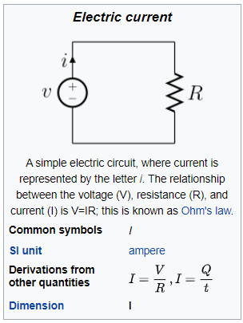
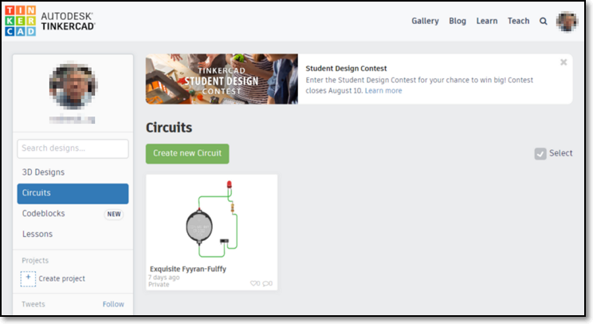

## Electronics

This is a fast and brief introduction to Electronics.  We do not attempt to make you electronics engineers or experts, but you should have enough knowledge to connect up a simple circuit successfully as well as use the circuit to measure or output a result.

### Basics

Electricity is the flow of electronics in a closed circuit.

- Voltage is the difference in electrical potential between two points, measured in **Volts**.
- Current is the rate of flow of electrical charge past a point.  Current is measured in **Amps**.
- Electrical resistance (or Resistance) of an object is a measure of the opposition to the flow of electric current.  Resistance is measured in **Ohms**
- In order for current to flow, the circuit must be **closed**.

There are two types of electric currents

- AC (Alternating current) where the voltage moves from positive to negative values, *alternating* in time,
    + Home electricity is AC - 230V, 13~15 Amp
    + A bicycle dynamo is AC - 5-9V, 0.1~0.5 Amp (depending on how fast you peddle!)
- DC (Direct current) where the voltage potential is at a fixed value (either positive or negative).
    + AA battery source is DC, 1.5V, 500mA Ref: [Energizer E91](https://data.energizer.com/PDFs/E91.pdf)
    + 18650 LiON battery (used in most laptops, mobile battery packs) is DC 3.7V, 1~2A (You can discharge more, but the batteries catch fire!)
- We will mainly work with DC currents and voltages.

### Two important Electrical Laws

**Ohm's Law**

Ohm's law states that **Voltage = Current * Resistance**, or written as

- Voltage = Current x Resistance
- Current = Voltage / Resistance
- Resistance = Voltage / Current

Calculating resistance in a circuit

- Resistors in series, R = R1 + R2
- Resistors in parallel, R = 1/R1 + 1/R2

[**Kirchoff's Laws**](https://en.wikipedia.org/wiki/Kirchhoff%27s_circuit_laws)

Kirchoff's first law (the current law)

- At any junction, or node, in an electrical circuit, the sum of the currents flowing into the node is the sum of the currents flowing out of a node.

Kirchoff's second law (the loop/mesh law)

- When the direction is taken into account, the sum of the potential differences in any closed circuit is zero.

### Electrical Components

Electrical components are broken down into 3 types

- Insulators - prevents current from following
- Conductors - allows current to flow
- Semiconductors - allows current to flow only if some electrical conditions are met.

**Common Electrical components**

- Wires
    - Wires are conductors, usually with very, very low resistance.  Usually made up of copper with an insulator on the outside.
    - Wires are used for connections and creation of closed circuits.
    - The thickness of the wire is measured using [AWG (American Wire Gauge)](https://www.rapidtables.com/calc/wire/wire-gauge-chart.html).  The larger the number, the smaller the diameter.
- [Switches](https://en.wikipedia.org/wiki/Switch)
    + An electrical component that **breaks** a circuit when manually operated.  Usually made up of two contacts separated by a conductor.  When the conductor is closed, the circuit is completed.
    + Common types of switches
        * SPST - Single Pole Single Throw
        * Push-to-make
        * Push-to-break
        * Normally-closed, throw switch to break circuit
- [Resistors](https://learn.sparkfun.com/tutorials/resistors/all)
    + an electrical component which has made to have a fixed resistance to current.
    + resistors are [color coded(https://www.digikey.com/en/resources/conversion-calculators/conversion-calculator-resistor-color-code-4-band) so that you can identify them
    + besides, resistance values, resistors come in different [power ratings](https://www.electronics-tutorials.ws/resistor/res_7.html) to handle the amount of current that can safely flow through.
- [Capacitors](https://learn.sparkfun.com/tutorials/capacitors/all)
    + electronic components that can store charge.
    + made up of two sheets/plate of conductors separated by an insulator/dielectric, charge is accumulated on each plate
    + used as filters
    + not essential to our fabrication course
- [Diodes](https://learn.sparkfun.com/tutorials/diodes)
    + semi-conductors that allow current to flow ONLY in one direction.
    + used for filtering AC
    + [LED (Light Emmi ting Diodes)](https://learn.sparkfun.com/tutorials/light-emitting-diodes-leds) are special diodes which give off light when the current flows in the correct direction.
- [Transistors & MOSFETs](https://learn.sparkfun.com/tutorials/transistors)
    + semi-conductors that allow current to flow provided an electrical condition is met on one of the pins.
    + can be used as amplifiers (non-saturation) or switches (saturation)
    + we shall use transistors mainly as electrical switches.
- [Integrated circuits](https://learn.sparkfun.com/tutorials/integrated-circuits)
    + devices which are miniaturized electrical circuits.  Each IC can contain thousands of other electrical components configured in a particular circuit(c)
    + our modern day building blocks

**Measurements**

It is common for electrical components to have a prefix (e.g. Kilo) placed in front of the value.  The following table shows the significance of each of the terms as applied to resistance, voltages, currents and other electrical values.

| Prefix   | Symbol   |  Base 10 |Decimal                             |
|----------|:--------:|----------|------------------------------------|
|mega      | M        |  10^6    | 1 000 000      |
|kilo      | K        |  10^3    |     1 000      |
|          |          |  10^0    |         1      |
|mili      | m        | 10^-3    |         0.001  |
|micro     | μ        | 10^-6    |         0.0000001 |
|nano      | n        | 10^-9    |         0.000000001 |
|pico      | p        | 10^-12   |         0.000000000001 |

&nbsp;

### Learning Electronics

Watch this [Simple Guide to Electronic Components](https://youtu.be/6Maq5IyHSuc) to help you identify the physical electrical components that you may encounter.

A good and simple introduction to electronics can be found at the Open University site [OpenLearn](https://www.open.edu/openlearn/) - [An Introduction to Electronics](https://www.open.edu/openlearn/science-maths-technology/introduction-electronics/content-section-0?active-tab=content-tab).  After finishing this very short course you may also print out a certificate of attendance!

However, most students like the harder and more practical method of learning by doing, as such you have the site [TinkerCAD by Autodesk](https://www.tinkercad.com/).  You can sign in with your Autodesk account.

Under TinkerCAD, you have [Circuits](https://www.tinkercad.com/dashboard?type=circuits) which allows you to design, tinker and test your circuits before you implement them physically.  This tool greatly enhances the learning experience in Electronics.

&nbsp;

### References:

1.  OpenUniversity OpenLearn [An Introduction to Electronics](https://www.open.edu/openlearn/science-maths-technology/introduction-electronics/content-section-0?active-tab=content-tab)
2.  [Sparkfun tutorials](https://learn.sparkfun.com/)
3.  [TinkerCAD](https://www.tinkercad.com)
4.  EngCS Youtube Videos:
    - [Introduction to TinkerCAD Circuits](https://youtu.be/38ur1kyFYxc)
    - [Introduction to TinkerCAD Digital](https://youtu.be/LHfqgct69bs)
    - [Introduction to Function Generator & Oscilloscope](https://youtu.be/wfvYz1L0Qkk)
5.  Dennis Humphrey [Making series and parallel circuits using Tinkercad](https://youtu.be/upuGkCdGEKA)

&nbsp;

### Assignment: [Electronics](as_electronics.md)

In this assignment, you will attempt to learn some basic electronics.  You have a fantastic online tool to help you with your work and you should learn how to be familiar with it.

The practical session of this assignment is to 
-  read an article on how to create a LED flasher with a 555 integrated circuit
-  test your circuit using a breadboard
-  solder your circuit onto a veroboard/stripboard

The skills you will learn are:
-  understanding an electronic circuit
-  how to test your circuit using a breadboard
-  soldering skills

Assignment: [Electronics](as_electronics.md)

&nbsp;

**November 2020**
