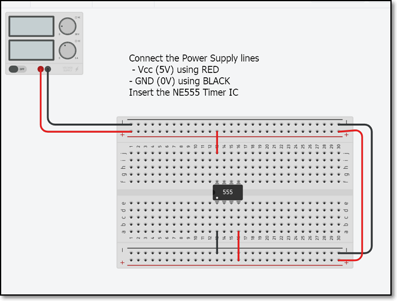
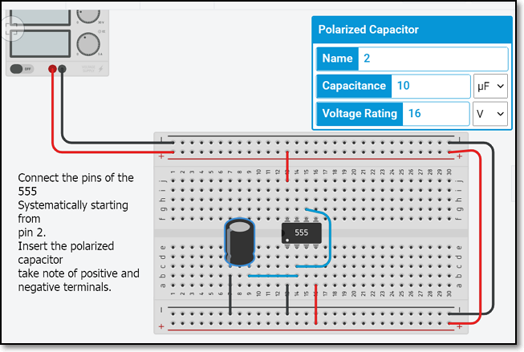
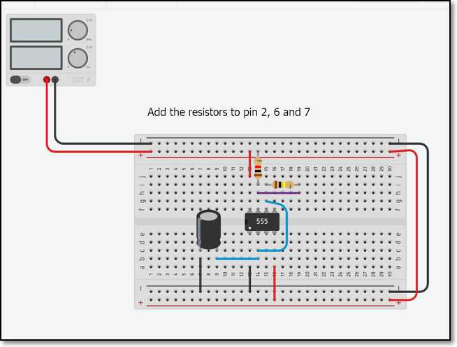
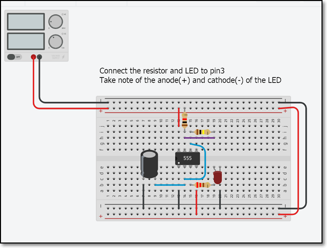
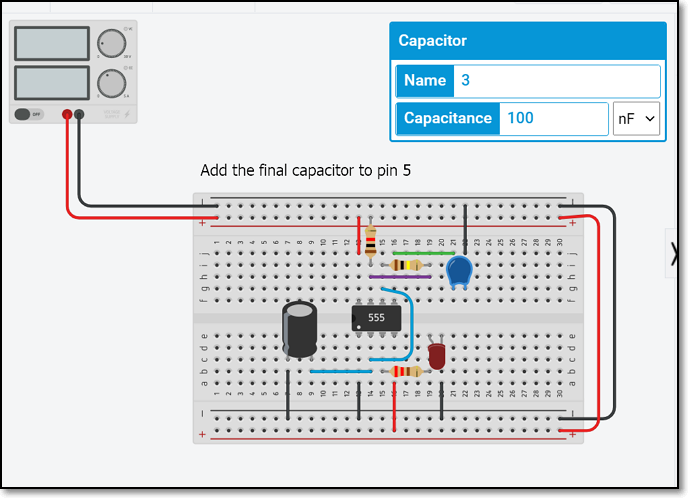

## Breadboarding the AStable - A Step-by-Step guide

This is a step-by-step guide to connecting and simulating an astable circuit using TinkderCAD.  At the end of the exercise, you should be able to simulate the operations of a Astable Multivibrator using TinkerCAD

**Requirements**

1.  TinkerCAD/AutoDesk Account
2.  Online [TinkerCAD circuits](https://www.tinkercad.com) program

**Circuit Diagram**

You can read about the operations of the Astable Multivibrator from the article by Circuit Digest : [555 Timer Astable Multivibrator Circuit](https://circuitdigest.com/electronic-circuits/555-timer-astable-multivibrator-circuit-diagram).

The circuit that we are going to wire up is shown below, with the exception that the battery supply is changed from 9V to **5V**.

&nbsp;

### Step 1 Breadboard and Power supply lines

1.  In TinkerCAD, select and place the mini-Breadboard
2.  Insert a Power Supply Unit, setting the voltage to 5V/2A
3.  Connect the Power lines (5V and GND) to the breadboard.  Use wires to ensure that both rails (top and bottom) have Vcc and Gnd.  This makes your connections easier.
4.  Use colour wires to help identify the circuits

    a)  RED for +5V (Vcc)
    b)  BLACK for 0V (Ground)

5.  Insert the Integrated Circuit (IC) NE555 and connect the power and ground lines.

    a)  Pin 1 is identified with a white dot
    b)  Pin 1 connects to GND
    c)  Pin 8 connects to Vcc
    d)  Connect also any other pins that need Vcc or GND e.g. pin 4.

&nbsp;

### Step 2 Work systematically on each pin of the IC

1.  Connect the Polarized (Electrolytic) Capacitor C1 to pin 2
2.  A Polarized (Electrolytic) capacitor needs its pins connected as
    a) positive to +Voltage
    b) negative to -Voltage (or Ground),br>
if you reverse the pins, the capacitor may explode (with a loud pop!)

&nbsp;

### Step 3 Connect the resistors to Pin 2

1.  Finish the connections to pin 2 of the NE555 by connecting the resistors and link to pin 6 and 7 as well.
2.  The bands on the resistor will tell you the value of the resistor.

&nbsp;

### Step 4 Connect the LED to pin 3

1.  Connect the current limiting resistor (220 Ohm) and the LED to pin 3.
2.  The LED has a anode (+ve) and cathode (-ve) leads, check that they are correctly connected.

&nbsp;

### Step 5 Complete the circuit

1.  Connect the ceramic capacitor to pin 5.  You need not worry about which lead to use for ceramic capacitors

&nbsp;

### Simulate the circuit and run measurements

1.  Perform a last check, then click the "Start Simulation" button.
2.  If all connections are correct, you should see the LED blinking.
3.  Use the Oscilloscope module or the Multimeter module to make measurements of the voltages and signals running through the ciruit.
4.  You can change the values of the Capacitor C1, Resistors R1 and R2 to observe the effects.  Remember to "Stop Simulation" before you make the changes.

&nbsp;

Updated **January 2021**
