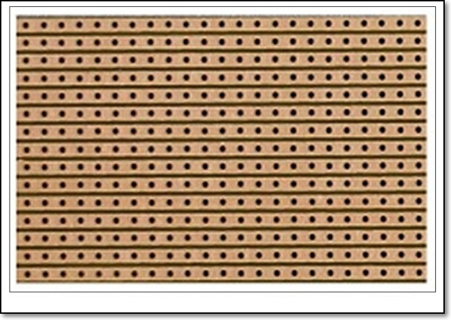

## Veroboards / Stripboards

A Veroboard is a brand of stripboard, which is a pre-formed circuit board material of copper strips on an insulating bonded paper board.  The stripboard was designed in the 1980s to provide a fast way of prototyping electronic circuits. Ref: [Wikipedia Veroboards](https://en.wikipedia.org/wiki/Veroboard)

The alternative to stripboards is to use electronic breadboards, however, these suffer from stray capacitance and loose connections.

A stripboard allows you to securely solder your components and circuit for testing and measurment.  The stripboard, however, has the following problems

- gets complex when circuits become bigger
- difficult to troubleshoot with complex wiring
- requires soldering (may have short circuits)

### Designing stripboard layouts

Sometimes the best way of designing stripboard is by hand. The technique is as follows:

1. Print out a stripboard template
2. Use pencil and eraser and design your layour
3. Ink your design and verify it
4. Implement it on a stripboard.

You can find a number of printable templates by using Google.  Here are a few quick locations:

- [Electronics in Mechano](https://www.eleinmec.com/downloads/sbps.pdf)
- [Rick Murray Tempalte](https://heyrick.eu/software/verodes/verotemplate.pdf)

There are software / methods of designing the layout using a computer and simple software, here are 2 common methods

- [Using Microsoft Paint](http://www.zen22142.zen.co.uk/Prac/vero/vero.html)
- [Using a Spreadsheet Excel/OpenOffice Calc](http://www.zen22142.zen.co.uk/ronj/veroxl.html) this is my preferred choice for simple circuits

You can always choose the sophisticated method by using special software

- [Fritzing](https://fritzing.org/download/0.9.3b/) which checks your schematic design against the circuit layout
- [A list of Stripboard design software](http://www.bestsoldering.com/veroboard-circuit-layout-design-software-2/)

A good reference for circuit prototyping can be found on the [Best Soldering](http://www.bestsoldering.com/) site.

Updated: **January 2021**