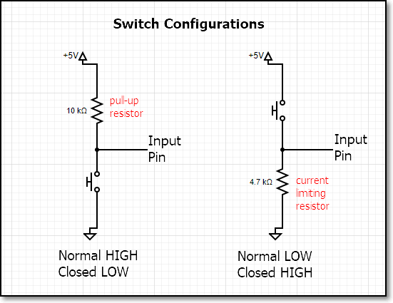
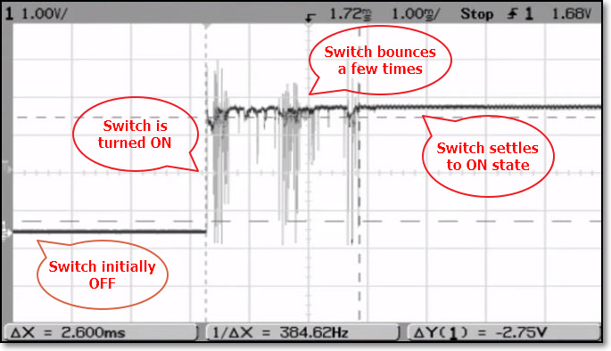
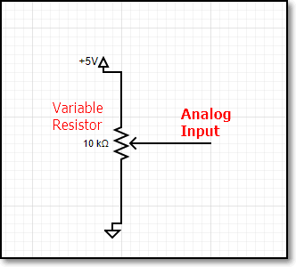
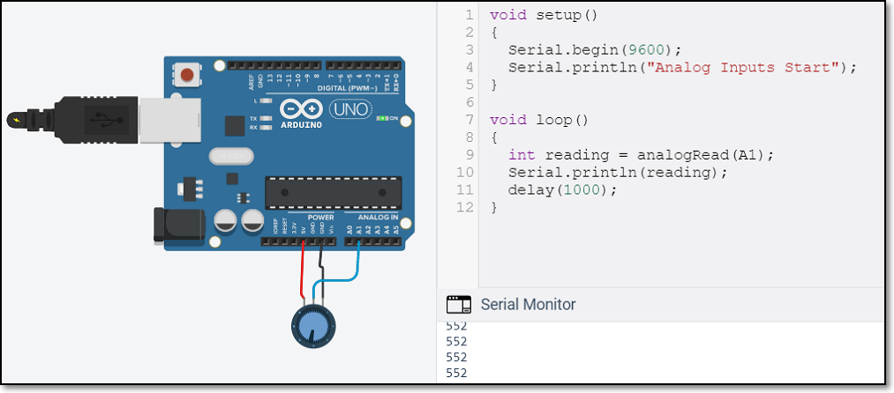
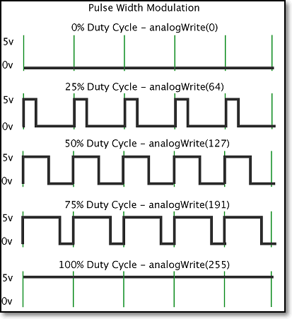
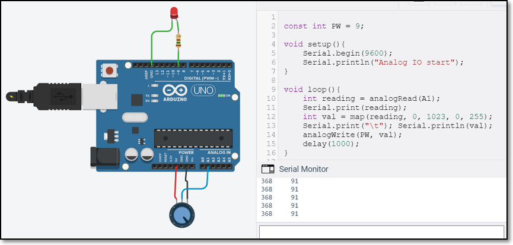
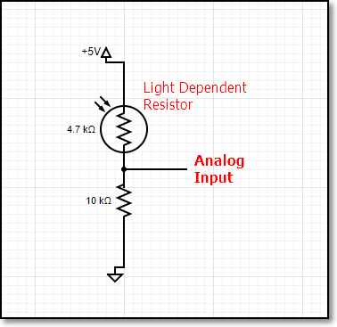

## Analog Inputs & Outputs

In this session, we will improve our skills in Arduino Programming and the understanding of the Arduino Uno capabilities.  We will cover

- Review of Switch Configurations
- The switch() control structure
- Analog inputs 
- Analog output using Pulse Width Modulation

## Review of switch configurations



There are two common methods of connecting a switch to a microcontroller

- Normal LOW, Closed HIGH
- Normal HIGH, Closed LOW
- requires the use of a pull-up/current limiting resistor so that when the switch is closed, there is no short circuit.

If we use the internal pull-up resistor, we don't need an external resistor, however, we are limited to a Normal HIGH, Closed LOW configuration.

### Debouncing a switch

Switches are mechanical devices.  When a switch is closed, the mechanical components sometimes do not close perfectly and causes the switch signal to switch from the OFF to ON states multiple times until the switch closes completely.  If we were to examine the signal through an oscilloscope, this might be the signals we get



We can reduce the effects of switch bouncing using a hardware circuit or software.  We will show how you can use a simple delay routine to reduce the bouncing effects of the switch.

Task:

Read a switch and make it toggle the LED.
- Intiially LED is ON.
- When the switch is pressed, the LED turns OFF.
- When the switch is pressed again, the LED turns ON.
- Switch toggles the state of the LED

If we examine this problem, we find that we have 2 states

- State 0 when the LED is ON, and
- State 1 when the LED is OFF

The switch toggles the states.

Here are 3 solutions

1.  simple reading of the switch without debouncing
2.  debouncing the switch using the delay() function
3.  debouncing the switch using the millis() function.

Deboucing should be done whenever you read a mechanical switch to minimize the errors.  If the program requires the use of interrupts (an advanced topic), then the millis() function should be used, otherwise the delay() function would do.

For further discussion and reference, see Brainy Bits [How to debounce switchs on the Arduino](https://www.brainy-bits.com/arduino-switch-debounce/), which has a nice follow-up video explanation.

The code can be found here:

1. [Toggling an LED with a switch without debuncing](code/toggle_nodebounce.ino)
2. [Toggling an LED with a switch with debouncing using the delay()](code/toggle_debounce_delay.ino)
3. [Toggling an LED with a switch with debouncing using the millis()](code/toggle_debounce_millis.ino)

Ref: **Debouncing a switch**

Great videos:

1. Brainy Bits [How to debounce switchs on the Arduino](https://www.brainy-bits.com/arduino-switch-debounce/)
2. Electronics lab [Arduino button debouncing](https://www.electronics-lab.com/project/arduino-button-debounce-tutorial/)

Explanations 

1. Arduino Reference [Debounce](https://www.arduino.cc/en/Tutorial/Debounce)
2. Arduino Getting Started [Button Debounce](https://arduinogetstarted.com/tutorials/arduino-button-debounce)
3. Programming Electronics Academy [Debouncing a Switch](https://www.programmingelectronics.com/tutorial-19-debouncing-a-button-with-arduino-old-version/)


### State Diagrams

In the previous session, we looked at a problem using a switch as an input.  By pressing the switch we changed the display of the LEDs on the board.  With each press of the switch a different "state", If we name the states, we can get a better picture of what is happening.

Ref: Wikipedia [Finite State Machines](https://en.wikipedia.org/wiki/Finite-state_machine)

| State  | Effect | Next State |
|:------:|--------|:----------:|
| 0  | All LEDs OFF, this is the start state | 1 |
| 1  | RED LED on, others off | 2 |
| 2  | YELLOW LED on, others off | 3 |
| 3  | GREEN LED on, others off | 4 |
| 4  | All LED ons | 0 |

Looking at the above table we have altogther 5 states.  Pressing the switch moves from one state to another.  So let's write down what we need to do:

1.  Initialise LED and Switch ports
2.  Start with state 0, all LEDs are off.
3.  If the switch is pressed
    1. we change the state
    2. apply the changes to the LEDs
    3. have some delay so that we don't read the switch so quickly
    4. go back to checking the switch (3.1)

We will use an `int` variable to indicate  the state which we are in, and use the condition statement to test for the state.  In C/C++ there is a statement which best suits our purpose - the `switch()`.  The syntax of the `switch()` is as follows:

```c++
    switch( intValue ){
        case N : <statement 1>;
                 <statement 2>;
                 ...
                 break;
        case M : <statement 1>;
                 <statement 2>;
                 ...
                 break;
    }
```

The `switch()` statement uses a parameter which must be an int or char, and will execute if it matches one of the case conditions.  It is easier than using nested if statements.

The final program for the Arduino Uno can be found here: [Uno with Sw and 3LEDs](uno_sw_3led.ino)


Ref: 

1. [Tutorials Point C++ switch statement](https://www.tutorialspoint.com/cplusplus/cpp_switch_statement.htm)
2. [W3schools C++ switch](https://www.w3schools.com/cpp/cpp_switch.asp)
3. [Arduino Switch..case](https://www.arduino.cc/reference/en/language/structure/control-structure/switchcase/)

&nbsp;

## Analog signal conversion

- Electrical Signals are divided into two types
    + Analog, which are continously varying
    + Digital, which are discrete and have specific values
- Most of the signals from digital circuits (includeing microcontrollers) are descrete and binary, having two values - LOW (0V) and HIGH (3.3V or 5V).
- Digital signals
    + can be processed very quickly
    + can be used to represent signals of different values (e.g. encoding)
    + however,
        * takes a lot of effort to represent different values
        * cannot produce smooth signals since they are discrete
- Analog signals
    + are naturally occuring
    + do not have discrete voltages 
    + difficult to process.
- In order to process Analog signals, we need to process them
    + Analog-to-digital converters convert analog signals into digital values so that they can be processed.
        - e.g. sound to CD recordings, images to bitmaps
        - expensive to encode and may need special ICs
        - digital encodings are only a representation of the signal
        - process is called "Sampling"
    * Digital-to-analog convertes convert digital values into equivalent analog values
        - e.g. from CD to music/sound
        - easy to decode, but result may only be a representation.
+ Analog-to-digital conversion
    * the process is done with ADC (Analog-to-digital Converters)
    * requires a Reference voltage (Vref) and a n-bit ADC (where n is the number of bits that are used by the converter for conversion).
        - the Input voltage is sampled (at least 2X frequency)
        - the digital equivalent is found using (Vin / Vref) * 2^n-bits
        - e.g. Vref = 5V, n = 10bits
            + then 2V = 2/5 * 2^10 = 409.6 = 410
            + then 3.8V = 3.8/5 * 2^10 = 778.2 = 778
        - the ADC with return these values after conversion
        - the accuracy of the ADC is 1/2^10 * 5 V = 0.00488 V or 5 mV
    * high accuracies are obtained with
        - a very stable and accurate Vref
        - high n-bit ADCs
        - a higher sampling rate

### Analog input with the Arduino Uno

The Arduino Uno board (ATMel ATMega328) has 6 analog inputs (A0-A5).  Each input is connected to a 10-bit Analog-to-digital converter with a Vref of 5V.  You can use the analog inputs to read and convert analog voltages (of up to 5V) using these inputs.

To read an analog input,
    - use the `analogRead()` function
    - enter the port A0-A5 as the parameter to the function
    - the function returns an integer (0~1023) depending on the value of the analog input.

A variable resistor or potentiometer has the ability of changing the value of the resistor though a knob or screw.  The variable resistor has three legs, the whole resistance is available across two of the legs, however, if the resistance is taken over the middle and one of the other legs, we get a fraction of the total resistance.  This provides us a voltage divider if we connect the variable resistor as follows:




In the following example we use a variable resistor (Vr) to provide an analog voltage of between 0~5V.  Based on the analog input voltage (Vin), we use the analog input to display on the Serial monitor the equivalent digital value.  If we change the value of Vin, we can see that the Serial monitor displays a corresponding change in the output value.



&nbsp;

### Analog Output with the Arduino Uno

Usually in order to obtain analog voltages from a digital system, a DAC (Digital-to-Analog Converter) is used.  The DAC works in a similar way as the ADC execpt that it takes a digital value and converts it back to an Analog voltage.  Unfortunately, the Arduino Uno does not have an in-built DAC.  Instead it uses Pulse Width Modulation to produce an equivalent analog voltage.

Ref:

1. [Arduino PWM](https://www.arduino.cc/en/Tutorial/PWM)
2. [Sparkfun Pulse Width Modulation](https://learn.sparkfun.com/tutorials/pulse-width-modulation/all)
3. [Electronics Coach Pulse Width Modulation](https://learn.sparkfun.com/tutorials/pulse-width-modulation/all) - a more comprehensive electronics explanation

Pulse Width Modulation is a term used for describing a digital signal (OFF/ON) which has different widths.  By changing the widths of the pulse (the amount of time ON vs the amount of time OFF, we can change the "average" amount of voltage supplied.

Changing the pulse width is similar to changing the **Duty Cycle** of a square wave signal.  The Duty cycle is defined as a percentage of how long a pulse is in the "ON" state vs the "OFF" state.



Ref: Arduino Reference PWM

The proportion of "ON" time gives the equivalent voltage being output if averaged over a period of time.  Hence, we are able to produce "analog" voltages dependent on the duty-cycle of the square wave signal.

The Arduino Uno has 6 PWM output ports.  They are digital ports (3, 5, 6, 9, 10 and 11).  On the Uno board they are indicated with a "~" in front of the port number.

When set into PWM mode using the function analogWrite(), the ports output a square wave of frequency 490 HZ (pins 5 and 6 at 980Hz).

To obtain a PWM signal we use

- analogWrite( portno, value ), where
    + portno is pin 3, 5, 6, 9, 10 or 11, and
    + value is an integer between 0 and 255 which represents the duty-cylce.  Hence, 127 is a 50% duty cycle and will produce around 2.5V.
- you do not need to initialise the port if you use analogWrite.

The following example shows how an analog input voltage (produced by the variable resistor) is used to light up an LED with varying brightness using PWM.



The **map** function is used to map the value of the variable `reading` (ranges from 0~1023) to the PWM duty-cycle value of 0~255.  This value is stored in the variable `val` and output through the PWM port.

In this way, as you turn the variable resistor, you are changing the input analog voltage.  The Uno reads this analog voltage and converts it to a PWM duty-cycle value to be output.  This changes the brightness of the LED.

&nbsp;

### Assignment 13

In this assignment, you will attempt to replicate the tasks above as well as look into the use of the Light Dependent Resistor to determine light levels.

I have provided approximate timings for you so that you do **NOT** spend all your time (doing something you like and neglecting other modules!)

| Time   | Task |
|--------|:------------------------------------------------|
|30 min  | Read/watch the deboucing tutorial on Brainy Bits [How to debounce switchs on the Arduino](https://www.brainy-bits.com/arduino-switch-debounce/)|
|30 min  | Wire up and test the variable resistor and led using analog inputs and outputs  |
|30 min  | Investigate the reading the LDR using analogRead() |
|30 min  | Investigate the use of the RGB Led using digitalWrite() |

This assignment may require the wiring of the circuitry using the Arduino Uno board and breadboard with other components.  You may need to consult your lecturer during the breakout sessions regarding troubleshooting of the circuitry.

Complete the following programming assignments:

### Programming assignments

1.  Wire up a variable resistor/potentiometer on the analog input and an LED.  Write a program to use the Uno to read the variable resistor to control the brightness of the LED using PWM.
2.  You are provided with a LDR (Light Dependent Resistor).
    - Wire up the LDR as in the circuit diagram below.
    - Use the serial comms to display the values read
    - Can you think of an application that can use the LDR ?

    

3.  Can you use the Variable Resistor to control the colors that are generated by the RGB LED?  You will need to do some research on this matter
    - How do you connect the RGB LED?
    - What colors do you want to display?  How do you store them?
    - Write a program to demonstrate your application.

Remember to document your work in your blog.

&nbsp;

**July 2020**
