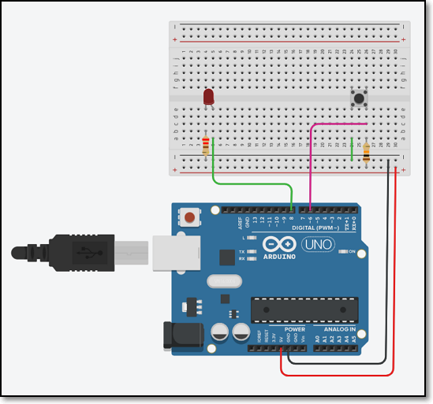
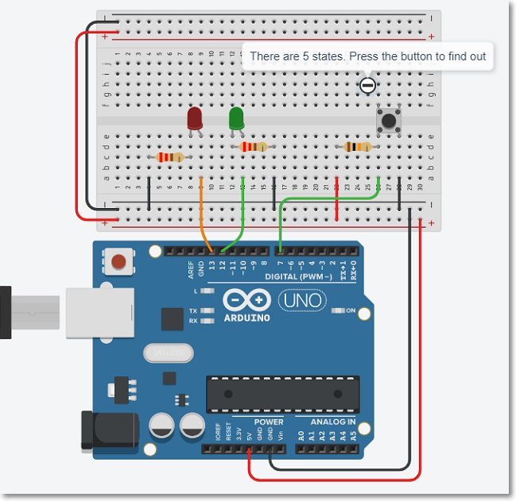

## Assignment 12 Introduction to Arduino Programming

In this assignment, you will attempt to write simple programs with the Arduino IDE and Uno R3 board.  You can test the programs on the simulator first before wiring and implementing the actual circuits on the physical Arduino board.

You should try using the Arduino Simulator in [TinkerCAD](https://www.tinkercad.com/login) before attempting to wire up the board if you do not have any exprience in microcontrollers or electronics

I have provided approximate timings for you so that you do **NOT** spend all your time (doing something you like and neglecting other modules!)

| Time   | Task |
|--------|:------------------------------------------------|
|45 min  | Read the notes, follow up with the TutorialsPoint Site |
|30 min  | Simulate and test your circuit using TinkerCAD  |
|60 min  | Physically wire-up and test your circuits using the Uno R3 and breadboard ||

This may be a long assignment (for beginners).  If in doubt check the simulation on [TinkerCAD](https://www.tinkercad.com/login) first before implementing it on the breadboard..

Complete the following programming assignments:

### Programming assignments

1.  Simple LED control
    - connect a LED with a current limiting resistor (220 ohm) to port 6 of the Arduino Uno board.
    - write a program to blink the LED in a variety of patterns.

2.  Controlling 3 or more LEDs
    - using the same technique, connect 3 or more LEDs of different colors to the Arduino board using pins 6, 7, and 8.
    - write a program to produce running lights i.e. the LEDs are lit in sequence e.g. R -> G -> W -> R -> G -> W and so on.

3.  Adding a switch to the flashing lights
    - add a switch to the circuit in (2).  You should use a pull-up resistor of 10K if you are operating in INPUT mode.
    - when the switch is pressed, the LEDs will light up.  Pressing the switch again will turn the LEDs off.
    - write and test this program.

4.  Use the switch in (3) to control the type of light-up and flashing of the LEDs, for example,
    - initially, LEDs are all in the OFF state.
    - pressing the switch, turns on only the RED LED.
    - pressing the switch again, turns on only the GREEN LED
    - pressing the switch again, turns on only the WHITE LED
    - pressing the switch again, turns on all LEDs
    - pressing the switch again, turns off all LEDs returning to the first state.

5.  Modify your program in (4) to flash the LED(s) instead.

6.  Modify your program such that if you press the switch for longer than 3 seconds, the system switches off all LEDs and returns to the initial state.

### Documentation

Remember to document your work on the github site, you should write

- a howto on getting started and how to complete the programming assignments
- include relevant reference sites explaining how they have helped
- highlighted the problems you have faced, so that your peers can learn from your experiences

&nbsp;

### Hints

You can examine a simulation of this assignment in TinkerCAD ([One Switch Many States](http://bit.ly/3o5k5nx)).

Use this simulation as a start to your assignment.

&nbsp;

**Jan 2021**
