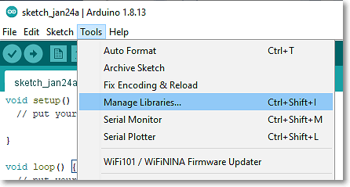
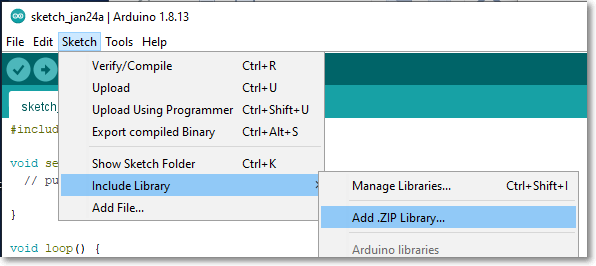

## Libraries

The power and convience of the Arduino system is the extensive availability of libraries for almost every sensor and acutator availble.  To use a device, one only needs to interface the device to the Arduino system (following the many tutorials available on the Internet), locate the library (code to interact with the device), load the library into the IDE, write and compile your application.

This makes the Arduino a very versatile system which is easy to implement and available to hobbists to expert.

The library consists of

- a **.cpp** file which holds the code (writtend in c++/Processing).  This code "talks" to the device and instructs the device or reads data from the device.
- a **.h** or **.hpp** header file which holds the functions available to interface the device and instructions on how to use them.  This file must be included in your code.

## Loading the library

To use the library we need to "load" the library into the Arduino system.  There are 3 methods to do this:

- Use the Arduino IDE Library Management system
- Download the compressed (.zip) library and use the Arduino IDE to load it into the User library location
- Download the compressed (.zip) library, de-compress the library into the .h and .cpp files, copy the files into the Arduino Library folder and restart the Arduino IDE.

First, let us note down the folders where the libaries may be located:

| Library | Folder location |
|---------|-----------------|
| Arduino IDE System Libraries | C:\Program Files (x86)\Arduino\libraries |
| User libraries | D:\Users\<username>\Documents\Arduino\libraries |

You can locate the User library folder by using the **IDE > File > Preferences** to locate the Sketchbook location where the user library location can be found.

### Arduino IDE Managed Libraries

The simplest method of loading a library is to use the Library Management tool in the IDE.  This is located using **IDE > Tools > Manage Libraries** 

Type in the name of the library you want to load and click **OK**.  The Arduino IDE will handle the reat.  The library and the example file(s) will be automatically downloaded and installed.  The library will be automatically installed in the User Library Folder.

This is the simplest way of loading a library.  The library may now be included using the **IDE > Sketch > Include Library**. You will be able to file the new library in the list.  clicking on the library will inert the "#include <library.h>" line in your code.

**Problems:**  Sometimes the library you require is not in the System Library list because the device is new or rarely used, you may have re-written the library or is only available for a particular version of the device.

### Compressed Libraries

The second method requires you to

1.  Manually download the library from the device site as a compress (.zip) file.
2.  Use **IDE > Sketch > Include Library > Add ZIP Library** to point to the downloaded file.
3.  The Arduino IDE will do the rest and install the library in the User Library folder.

This method of loading the library allows you to select a particular library for your code.  Hence, you can include your own libraries or a particular library the works only with your board.

**Problems:**  There are so many libraries out there.  You need to know specifially which one you would like to use and once you ahve checked that it is working, put a note in your code where you have obtained your code for future reference.

### Manually installed library

This is the most manual method of installing a libary where the user have full control.  Note however, that this method is not recommended as you can make mistakes or located your files in wrong folders etc.  This method requires you to

1.  Manually download the library from the device site.  This is usually a compress (.zip) file.
2.  Extract the files from the ZIP folder, which usually creates a folder with the name of the libary.
3.  Check that the folder has the **.h** and **.cpp** files (you may decided to exclude the example files/folders)
4.  Copy the folder (with the .h and .cpp file) to either the Arduino System Library Folder or the User Library folder.
5.  Restart the Arduino IDE

The library will be displayed and included the normal way as in the above 2 cases.  This allows you to even include libraries that you have written yourself.

**Problems:**  Errors may occur that will halt your IDE, which may give rise to other problems in troubleshooting.

### References:

1.  [Adafruit: All About Arduino Libraries](https://learn.adafruit.com/adafruit-all-about-arduino-libraries-install-use/how-to-install-a-library)
2.  [Sparkfun: Installing an Arduino Library](https://learn.sparkfun.com/tutorials/installing-an-arduino-library/all)
3.  [Youtube: Arduino Libraries! How to Install them properly! Tutorial showing you 3 different ways](https://www.youtube.com/watch?v=M6PZOqNHKxM)

&nbsp;

### Tested Libraries

**Input Devices**

|Device Name       | Library                        | Comment                         |
|--------------    |--------------------------------|---------------------------------|
| DHT-11, DHT-22   | DHT Sensor Library (Adafruit)  | Requires Adafruit Unified Sensor Library |
| Ultrasonic HC-04 | New Ping Library (Tim Eckel)   | A more responsive library |
| LM35 temperature | Nil                            | Analog Input * 500 degC  [TutorialsPoint](https://www.tutorialspoint.com/arduino/arduino_temperature_sensor.htm) |
| PIR Sensor       | Nil               | Ref: [TutorialsPoint](https://www.tutorialspoint.com/arduino/arduino_pir_sensor.htm) |
| DS18B20 temperature | Dallas Temperature (Miles Bolton) | [Project Hub](https://create.arduino.cc/projecthub/TheGadgetBoy/ds18b20-digital-temperature-sensor-and-arduino-9cc806) |
| Keypad            | Nil   | Ref: [arduinogettingstarted.com](https://arduinogetstarted.com/tutorials/arduino-keypad) |
| Touch Sensor  | Nil | Ref: [arduinogettingstarted.com](https://arduinogetstarted.com/tutorials/arduino-touch-sensor) |
| Microphone | Nil | Ref: [aranacorp](https://www.aranacorp.com/en/using-a-microphone-with-arduino/)|
| RTC DS3231 | Wire.H | Ref: [Project Hub](https://create.arduino.cc/projecthub/MisterBotBreak/how-to-use-a-real-time-clock-module-ds3231-bc90fe) |
| MPU6050 Accelerometer | Adafruit MPU6050 | Requires Wire.h [Ref](https://learn.adafruit.com/mpu6050-6-dof-accelerometer-and-gyro/arduino)|

&nbsp;

Updated **January 2021**