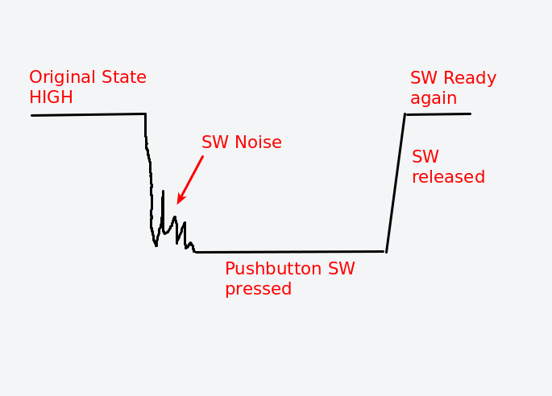
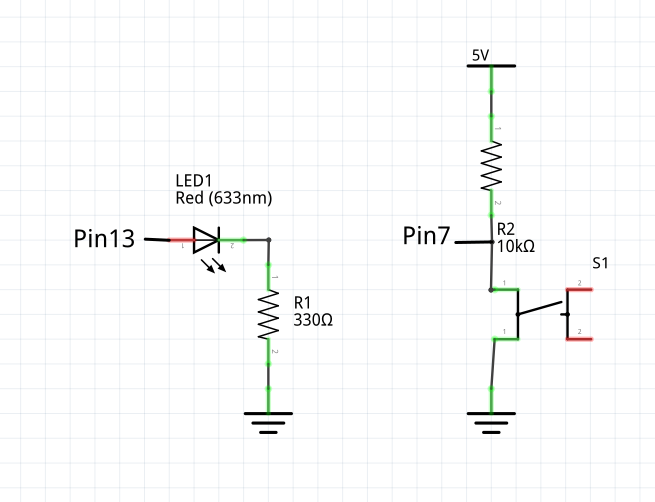
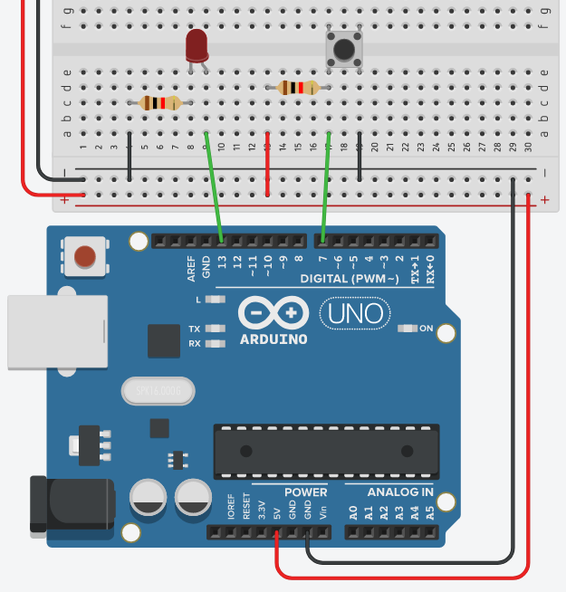

## Interfacing switches

Here are some tips on using a switch with the Arduino system (or any microcontroller system for that matter)

- Use a pull-up resistor for the switch.  An active-HIGH switch is better than an active-LOW as current is being supplied to the uC instead of the uC supplying the current.
- Debounce your switches.  The easiest method is to use a delay(), except for interrupt systems where millis() or micros() should be used.
- In the case of Pushbutton switches, check for the change in state before allowing another change (see below)

### Toggle switch

In this scenario, we will use a push button switch to change the state of an LED.  However, we will **TOGGLE** the state of the LED by pressing the push button.

We will also **ONLY** change the state of the LED after each push.  Hence, we will need to check the following states of the switch:

- HIGH before the pushbutton is pressed
- LOW when the pushbutton is pressed, discount any bouncing
- HIGH when the switch returns to the original state.  we should ignore any states between the LOW to HIGH transition (e.g. if the user keeps pressing the switch)



### Circuit diagram

- The pushbutton switch is configured as an Active-HIGH (normally HIGH) switch with the help of a pullup resistor (10K).  Alternatively, you can use the internal pull-up resistor.
- Configuration:

	- Pin 13 (Output) to LED
	- Pin 7 (Input) from Pushbutton Switch

	

- We can always simulate the circuit on TinkerCAD or wire-up the circuit as follows:

  

### Code

- The following code checks the pushbutton switch for changes using the following logic:

```
lastSWState set to HIGH
Loop
	read switch
	if switch is pressed (LOW)
		debounce switch
		if switch is pressed (LOW)
			if lastSWState is HIGH
				process the switch
				toggle the LED
				lastSWState set to LOW to prevent further processing
			end-if
		else
			do-nothing
		end-if
	else
		lastSWState set to HIGH (gone back to original state)
	end-if
end-loop
```

We can implement the above logic using Arduino code:

```C++
const int SW = 7;
const int LED = 13;

int ledState = LOW;
int lastSWState = HIGH;

void setup(){
  pinMode(SW, INPUT);
  pinMode(LED, OUTPUT);
  digitalWrite(LED, ledState);
}


void loop() {
  int reading = digitalRead(SW);

  if (reading == LOW){
    // debounce SW
    delay(50);
    reading = digitalRead(SW);
    if (reading == LOW){
      // yes still low
      // check whether it went high yet
      if (lastSWState == HIGH){
      	  // toggle LED
          ledState = !ledState;
          digitalWrite(LED, ledState);
          // prevent any processing until SW returns to normal
          lastSWState = LOW;
      }
    }
  }
  else{
  	// SW returns to normal state
    lastSWState = HIGH;
  }
}

```

Updated: **January 2021**