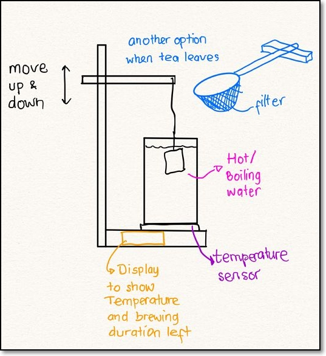

## Final Project - Frequently Asked Questions

#### What is a "Hero" Shot?
> When you have completed your assignment, and it works.  A "hero" shot shows the working assignment e.g. screen shot or a video demonstrating that your solution works.  You're the "hero" in doing that!
> 
> [Definition: Hero Shot](https://unbounce.com/conversion-glossary/definition/hero-shot/)

#### Are there any rubrics ?
> Yes there are rubrics to this project:
> 
> - in what is required for the project (see Final Project Specification), and
> - in the marking (to be released soon)

#### Can I use already projects/codes from projects found on the Internet?
> Yes, provided you
> 
> - produce all the CAD files
> - make changes to adapt the original code/ideas
> - must not be a 100% copy/clone

#### Are we allowed to work in Groups?
> For this period (Sem 1 Session 2020) - **No**

#### If the lab doesn't quite have the module that we want. Can we find and use our own components on our project?
> Yes you can use your own components at your own expense but clear with your lecturer first.

#### Is there a list that shows the available input/output modules?
> Yes, the list is currently being updated [here](finalProject/component_list.md)

#### I have wired up a game module using an OLED screen and two pushbuttons, if I build a case for the game is that enough? 
> Yes, provided you have
> 
>  1. Documented all your work
>  2. Drawn all CAD files for 2D and 3D work
>  3. Created the case/fittings using Laser cutting and 3D printing
>  4. Used 
>      - an Arduino Uno or micro controller
>      - Interfaced an output device
>      - Interfaced an input device
>      - made changes to your code to reflect your own design parameters

#### You've asked us to produce initial sketches of our ideas.  Where do we submit these ideas? 
>  You should scan/take photos of your sketches and place them into your project folder.  This provides useful information towards your thought process and design.
>  You could create the following structure on you website
>  root
>  -  HTML files on each week's work and assignments
>  -  images folder
>  -  project folder
>     -  sketches, photos, video
>     -  plans and designs for the final project
>     -  documentation

#### I have posted my required component list to the Telegram group, what's next 
>  The list of materials used in the project (called the Bill-of-Materials (BOM)) should be included in your Project Site as part of the requirements of the project documentation.
>  You will not get any credit if you post it to the Telegram group.
>  Once, you have posted the BOM, discuss with your lecturer whether the parts are available, and the expected arrival date.
>  Do not wait for the parts to come, there are other design aspects to be done.

#### Can I just buy an enclosure and stuff my electronics, sensors into it?  I have found a box that suits my purpose 
>  Unfortunately, the only modules that can be used pre-built are the microcontroller and the electronic modules, the others you will need to design from scratch.
>  You will also need to show your design files for the 2D and 3D work on the enclosures and housing.

#### What sort of sketches should I be doing for the planning of the project 
>  Any sketch would be ok, as long as it shows what you intend to do.
>  Here is an example: 
>  
> (Thanks, Noel K!)

#### How do I create a Bill-of-Materials, how does it look like, which should I have one? 
>  A BOM indicates what you need to complete your project, approximately how much you are going to spend/purchase/aquire.  It allows you to plan the arrival of the components and to give enough time to aquire them.
>  A BOM will also show whether it is realistic to continue with your project. 

>  (Thanks, Ting KE)