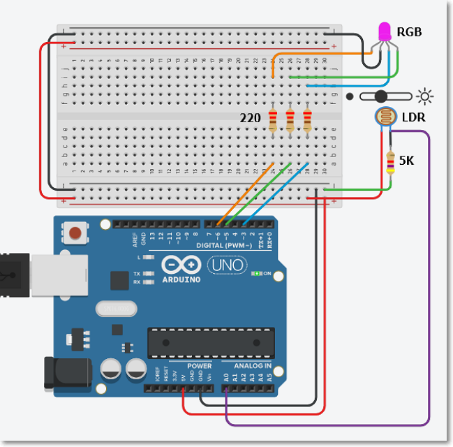

## Assignment 13 Interfacing a LDR with an RGB LED

In this assignment, you will attempt to interface an input analog device to your Arduino and produce equivalent output on a RGB LED.

I have provided approximate timings for you so that you do **NOT** spend all your time (doing something you like and neglecting other modules!)

| Time   | Task |
|--------|:------------------------------------------------|
|15 min  | Understand and examine the LDR/RGB circuit on TinkerCAD |
|30 min  | Wire up the LDR and RGB LED on a breadboard with an Uno board, verify the program |
|60 min  | Convert the output using PWM to produce a more effective mood lamp |

You will be asked to examine a similar circuit on TinkerCAD using an LDR and RGB LED.  You will then
wire up of the circuitry using the Arduino Uno board and breadboard with other components and verify the program.  You may need to consult your lecturer during the breakout sessions regarding troubleshooting of the circuitry.

Finally, you will be asked to convert the output to PWM to produce a more effective mood lamp.

Complete the following:

1. Using TinkerCAD:
    1.  Examine the circuit below, which is in TinkerCAD.  The URL for the circuit is http://bit.ly/3iyn5aO.
    2.  Run the simulation and observe what happens when you click on the LDR to change the readings.
    3.  The Serial monitor has been enabled for this circuit, observe the outputs obtained. 
    &nbsp;
2.  Practical work with the Uno and breadboard:
    1.  Wire up a similar circuit using a breadboard, Uno, LDR and RGB LED.
    2.  Write the code to use the RGB LED using digital outputs.
    3.  Verify that you can change the color of the LED using the LDR
3.  Modifications to make it a nice **Mood** lamp
    1.  In the previous experiment, you can only get 8 colors by lighting up the LED using digital outputs from the UNO.
    2.  Note that the RGB is driven by Pins 3, 5 and 6.  These pins are capable of producing PWM outputs.  Using this feature, modify your code to generate a more effective "mood" lamp that can produce a multitude of colors!

### Interfacing assignments

1.  Wire up and interface the
    - Ultrasonic sensor
    - DHT-11 temperature and humidity sensor
2.  Draw the circuit diagram (you can use the on line app [Circuit Diagram](https://www.circuit-diagram.org/editor/)) to document your work.
3.  Write the program(s) to make the devices work.
    -  indicate whether you need to use libraries
    -  show your results using the Serial Monitor and/or Serial Plotter
4.  Take a hero shot (photo or video) of your interfacing achievements
5.  Write up your website page.

&nbsp;

### Useful sites for Arduino Interfacing

Here are some of the more "reputable/trust-worthy" sites for Arduino modules

- [Last Minute Engineers](https://lastminuteengineers.com/)
- [Dronebot Workshop](https://dronebotworkshop.com/)
- [Adafruit](https://www.adafruit.com/category/17)
- [Instructables](https://www.instructables.com/id/Arduino-Projects/)
- [Arduino Project Hub](https://create.arduino.cc/projecthub/projects/tags/arduino)

&nbsp;

Updated **January 2021**