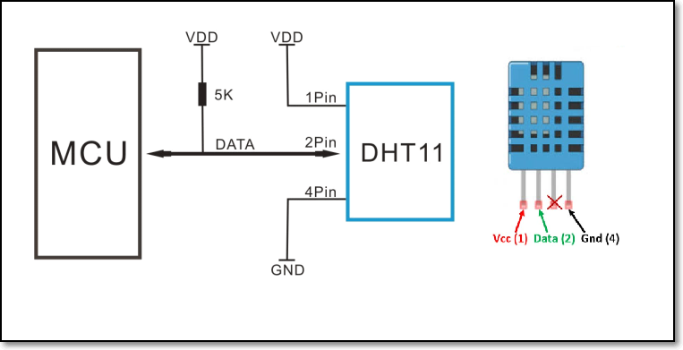
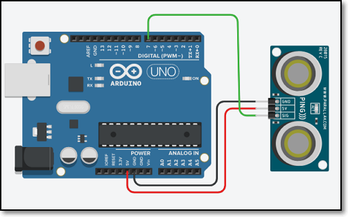
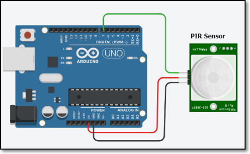
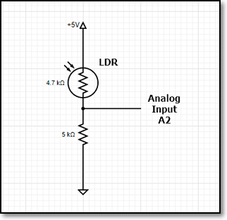
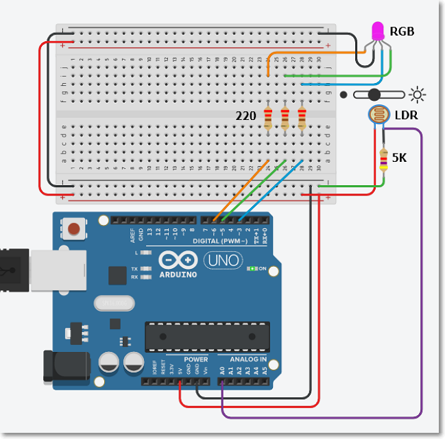

## Input Devices

Input devices are often called **Sensors**.  Output devices are often called **Actuators**.  The process of connecting a Sensor or Actuator to a computer processor system is called Interfacing.

### Sensors

- A sensor is a device, module, machine or subsystem whose purpose is to detect events or changes in its environment and send the information to other electronics, frequently a computer processor. (Ref: [Wikipedia: Sensor](https://en.wikipedia.org/wiki/Sensor))
- Used in everyday objects to read changes in the environment.
- Sensor readings are usually analog by nature.
- Changes are usually slower in availability (compared to computer processors) and require some processing techniques.

### Methods of reading sensors

- There are 3 basic methods of reading/obtaining information from a sensor.  These methods are dependent upon the availability of the information, as read by the sensor
    - Always available
        - Just read the data, data is always available
        - Changes to the reading occur very slowly.
        - E.g. temperature
    - Polling
        - Processor has to continually query/poll the sensor for information.
        - Sensor will usually indicate whether there is new information through another signal or have a drastic change in the reading to indicate that there is a new reading available.
        - When Processor "sees" this change, data is read.
        - E.g. switch
    - Triggering
        - A trigger is a signal(s) that is used to initiate the reading.
        - Sequence is as follows:
            + Processor sends a signal to the sensor for data
            + Sensor gathers information, and when ready
            + Sends reading back to the Processor.  The Sensor may also indicate that data is ready to be read by sending back an Acknowledge/Ready signal
        - E.g. Ultrasonic distance measurement
- Sensor data
    + Real environment data is analog by nature.  It may be some physical element e.g. temperature, distance
    + A sensor converts this data into an **equivalent** electrical signal/voltage that is sent to the computer processor.
    + The computer processor has to read this electrical signal and convert it into an understandable value.
    - Analog signals
        - most common type of sensor data
        - requires conversion to a digital value, usually with an ADC
        - usually it is a direct relationship e.g. V = K * environment-value
    - Digital signals
        - these sensors are configured as smart devices, with processing power
        - sensor itself converts the analog values into a digital signal (e.g. pulse or series of digits)
        - processor needs to decode to understand the value
- Arduino Libraries
    + The Arduino System is very popular because there is large number of libraries (of code) available for almost every Sensor that you can think of.
    + Add libraries to the Arduino IDE System (Ref: Arduino.cc [Installing Additional Arduino Libraries](https://www.arduino.cc/en/Guide/Libraries))
        * There are two types of libraries,
            - Search able using the Arduino IDE system (Internal)
            - External libraries, available as compressed C++ code.
        * How to add a library using the Library Manager
            1.  `IDE > Sketch > Install Library > Manage Libraries`
            2.  Search for the library
            3.  Highlight and click Install, when complete, it should state "Installed"
        * How to add an External library (.ZIP format)
            1.  Search for the library on the Internet
            2.  Download the library, usually in a compressed .ZIP file
            3.  `IDE > Sketch > Include Library > Add .Zip Library`
            4.  Close the IDE. Re-open.
        + How to manually add an External Library
            1.  Search for the library on the Internet
            2.  Download the library, usually in a compressed .ZIP file
            3.  Locate where your sketch folder is found on your computer using `IDE > File > Preferences > Sketchbook`
            4.  Extract the Library from the ZIP file (this is usually a folder)
            5.  Copy the extracted library folder to [Sketchbook folder] > Libraries folder
            6.  Close the IDE.  Re-open.
    - Check that the Library has been added using `IDE > Sketch > Include Library`.  You should see your installed library there.
    + To apply the library code to your application, add the header file a the top of your sketch using `IDE > Sketch > Include Library > LibName`.  The header file has an extension of `.h`.

### Types of  Sensors

- Switches
    - An electrical component that can disconnect or connect the conducting path of a circuit.
    - Provides a LOW or HIGH signal depending on the circuitry.
    - Use `digitalRead()` to determine value of a switch.
    - Be aware of debouncing techniques when mechanical switches are in use.
    - Types of switches
        + [Toggle](https://duckduckgo.com/?q=toggle+switch&t=canonical&iax=images&ia=images)
            * a mechanical switch that changes the state each time the switch is thrown/manipulated.
            * e.g. If in the ON position, throwing the switch will change it to an OFF position.
            * the state remains until the switch is thrown
        - [Pushbutton switch](https://duckduckgo.com/?q=pushbutton+switch&t=canonical&iar=images&iax=images&ia=images)
            + a spring-loaded mechanical switch that changes state when the switch is pressed.  When released (and because of the spring) the switch returns to the original state.
            + Two types of pushbutton switches
                * normally closed - push to open/break connection
                * normally open - push to close/make connection
        - [Slide switch](https://duckduckgo.com/?q=slide+switch&t=canonical&iar=images&iax=images&ia=images)
            + a switch which is closed or opened by a sliding mechanism.
            + when changed, the switch remains in the new state.
        - [Touch Capacitative switch](https://duckduckgo.com/?q=touch+capacitative+switch&t=canonical&iar=images&iax=images&ia=images)
            + switch works based on body capacitance.
            + when a person touches it, the body increases the capacitance of the switch and triggers the switch
&nbsp;
- Temperature, Humidity
    + the environment can be measured using a number of devices, the most common and cheapest is to use the DHT-11 temperature and humidity sensor.
        + temperature is a physical quantity that expresses hot or cold.
        + reference temperatures
            +  freezing point of water = 0 degrees Centigrade
            +  boiling point of water = 100 degrees Centigrade
            +  typical Singapore temperature = 28 - 32 degrees Centigrade
    *  humidity is the measure of the concentration of water vapor present in the air.  Singapore's humidity is between 70-90%.
    - the following devices can be used with the Arduino system
        - [DHT-11](https://components101.com/dht11-temperature-sensor)
            - operating voltage range 3.5~5.5V
            - temperature range 0-50C, humidity 20-90%
            - resolution 16-bit
            - accuracy +/- 1C, +/- 1%
        - [DHT-22](https://components101.com/sensors/dht22-pinout-specs-datasheet)
            - temperature range -40~80C, humidity 0~100%
            - resolution 16-bit
            - accuracy +/- 0.5C, +/- 1%
        - [LM35](https://components101.com/lm35-temperature-sensor) temperature sensor
            + operating voltage range -2~35V, typical 5V
            + temperature range -55C ~ 150C
            + accuracy +/- 0.5C
        - [DS18B20](https://components101.com/sensors/ds18b20-temperature-sensor) temperature probe
            + operating voltage range 3V ~ 5V
            + temperature range -55C ~ 125C
            + accuracy +/- 0.5C
    - Interfacing to the Arduino Uno

    

    - [Interfacing the DHT-11](https://create.arduino.cc/projecthub/Arca_Ege/using-dht11-b0f365)
        + requires the use of the DHT-11 library

&nbsp;

- Distance
    + This depends on the distance to be measured.  The devices can range from a limit switch to an ultrasonic sensor.
    - [Photoelectric InfraRed Avoidance detection/Proximity sensor](https://osoyoo.com/2018/12/21/arduino-lesson-ir-obstacle-avoidance-module/)
        + distance: 2cm ~ 40cm
        + can use **EN**able pulse or continuous measurement
        + avoidance distance is adjusted with potentiometer
        + does not measure distance, just detects it
    - [Ultrasonic HC-SR04](https://dronebotworkshop.com/hc-sr04-ultrasonic-distance-sensor-arduino/)
        + distance: 2cm ~ 4 m
        + uses SONAR, returns a pulse proportional to the distance
        + ranging accuracy 3mm, measuring angle 15 degrees
        + distance is equivalent to [pulse measured](https://www.tutorialspoint.com/arduino/arduino_ultrasonic_sensor.htm)

    

&nbsp;

- Motion detection
    + Commonly used to detect the presence of humans or animals in a room/vicinity.
    - [HC-SR501 PIR Sensor](https://dronebotworkshop.com/techfile/passive-infrared-sensors-pir/)
        + PIR - Passive Infra Red Sensor
        + Detectable cover distance 120 degrees, 7 meters
        + has a repeatable and non-repeatable operating mode

    

    - [Microwave module Doplar detection RCWL-0516](https://dronebotworkshop.com/rcwl-0516-experiments/)
        + Stand-alone module using "Doplar Radar" to detect motion
        + Can be connected to a computer processor
        + Detectable cover distance 7 meters

&nbsp;

- [Light Measurement & Detection](https://www.electronicshub.org/light-sensors/)
    + Light intensity can be detected/measured using LDR (Light Dependent Resistors) or Light Sensor Modules (using Photo transistor circuits)
    - LDR 5516
        + Low cost measurement/detection of light using LDR
        + Variable analog voltage received as input\
        + Can be calibrated
        + Measured using Arduino analogRead() function
        + Use a 5K ~ 10K resistor for the Arduino Uno

    

    - [Using a Photocell](https://learn.adafruit.com/photocells/using-a-photocell)

&nbsp;

- Time
    + These are modules that allow you to keep track of the time.  A RTC uses a small battery, crystal and memory to maintain a on-going clock which can be read to provide the current date and time.
    - Real-time Clock Modules
        - [RTC DS3231 using I2C](https://create.arduino.cc/projecthub/MisterBotBreak/how-to-use-a-real-time-clock-module-ds3231-bc90fe)
        - [RTC DS1302 using single-wire](https://playground.arduino.cc/Main/DS1302/)

&nbsp;

- [Rotary Encoders](https://dronebotworkshop.com/rotary-encoders-arduino/)
    + a rotary encoder reads the positional value of a shaft by comparing 2 pulses as the shaft turns.
    + looks like a potentiometer, but does not change resistance
    + rotary encoders are now used for volume controls, motor encoders etc
- Weight
    + A load cell provides a means of measuring the weight of an object.  This is done by the measuring the contraction of metals.  Usually a module is provided to read the data from a load cell and transfer the results to the computer processor.
    - [Load Cell Weight Sensor HX711 AD Converter](https://www.brainy-bits.com/load-cell-and-hx711-with-arduino/)
- Water
    - [Water level sensor](https://www.instructables.com/id/How-to-use-a-Water-Level-Sensor-Arduino-Tutorial/)

&nbsp;

- Arduino Sensor Kit
    + [37 in 1 kit](https://www.instructables.com/id/Arduino-37-in-1-Sensors-Kit-Explained/)

&nbsp;

## [Assignment 13 Interfacing a LDR with an RGB LED](as_inputldr.md)

In this assignment, you will attempt to interface an input analog device to your Arduino and produce equivalent output on a RGB LED.

You can view the assignment [here](as_inputldr.md)

**July 2020**

