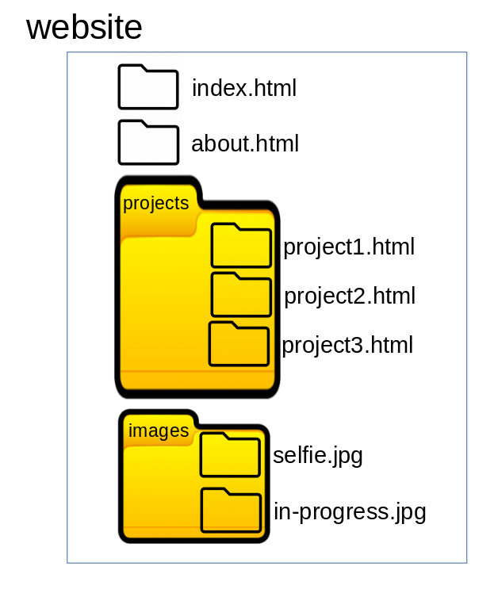

## Website Navigation & Folders

It is sometimes useful to organise our website into folders; placing files, images and pages into a single folder so that we can differentiate its purpose and use. For example, if you develop a number of projects it is often useful to place all the files that are used within the project in a single folder so that you can reference them easily.

This exercise shows how to have such a system and to use links to navigate within the folder. Consider the following folder structure:



| File | Content |
| --- | --- |
| index.html | Our main/home page |
| about.html | About me (with image selfie.jpg) |
| project1.html | Project 1 information (with image project1.jpg) |
| project2.html | Project 2 information (with image in-progress.jpg) |
| project3.html | Project 2 information (with image in-progress.jpg) |
| selfie.jpg | Selfie photo |
| in-progress.jpg | Work-in-progress photo |
| project1.jpg | Project 1 photo (located in projects folder) |

Create a navigation system using the above structure such that you are able to navigate between the pages as well as return to the home page from any page in the system. A sample is shown the code below:

```
<div>
    <h3>Navigation:</h3>
    <ul>
        <li>Home Page</li>
        <li>Project 1</li>
        <li>Project 2</li>
        <li>Project 3</li>
        <li>About Me</li>
    </ul>
</div>
```

You can test the navigation system by clicking on the link [here](website/index.html).  A copy of the file structure can be downloaded as a [zip file](navigation_website.zip).

&nbsp;

[](index.md) [Home](index.md)<br>
October 2021
