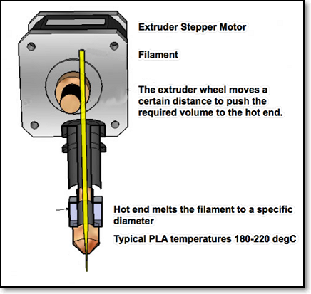

<link rel="stylesheet" type="text/css" href="imagestyle.css" />

## Sandbox

A place for you to test and try your work before adding it to the site.  It is only accessible using \<repo\>/sandbox.html

With a image of 200px

<section class="info"><a href="images/0907_extruder.png">
 <figure class="infoimg">
 
 <figcaption>Extruder Module</figcaption>
 </figure></a>

 
<b>Instructions</b>

 This is another list item
 * Item 1
 * Item 2
 * Item 3
 

 

</section> <!--End of Section.info-->

&nbsp;

---------
blank2.png is 2000x2px transparent

| |  |
|:-------------------|:--------------------|
| | ExplanationText |

---------

### Temp storage -------------------------------------------------------

### Final Project Instructions

Please note that your final presentations will be held on Friday 21st August 2020 and Monday 24th August 2020.

Please read the following: [Final Project Presentation Instructions](finalProject/finalInstructions.md)

### Class Discussions & Assignments (Old)

Here are the summaries for each of the class sessions that we have conducted.  Please refer to these summaries to help you with your work and assignments.  As always if there are any questions, queries or corrections please do not hesitate to contact me for clarification.

|Week  |**Date**    | **Discussion & Assignment**       |
|:---|:---------- |:----------------------------------|
|01  |Mon 20 Apr  |[Safety & Tools](01_project_management.md) |
|    |Fri 24-Apr  |[Software Tools & HTML](01_project_management.md)|
|02  |Mon 27 Apr  |[Webpage development](02_documentation_techniques.md)|
|    |Fri 01 May  |*Labor Day Holiday*|
|03  |Mon 04 May  |[Website hosting, Github](025_website_development.md)|
|    |Fri 08 May  |[Project Management using git](03_version_control.md)|
|04  |Mon 11 May  |[Computer Aided Design](04_CAD.md)|
|    |Fri 15 May  |[Drawing 3D objects using extrusion](05_Fusion360.md)|
|05  |Mon 18 May  |[Modelling 3D Objects](06_3dmodelling.md)|
|    |Fri 22 May  |[Fusion 360 Features](07_F360Features.md)|
|06  |Mon 25 May  |*Hari Raya Holiday*|
|    |Fri 29 May  |[Parametric Modelling](08_ParametricDesign.md)|
|07  |Mon 01 June |[3D Printing](09_3DPrinting.md)|
|    |Fri 04 June |[Preparation for Laser Cutting](10_PrepLaserCutting.md)|
|    |Mon 08 June |**Mid term break**|
|08  |Mon 22 June |[Introduction to Electronics](11_Electronics.md) |
|    |Fri 26 June |Practical Sessions - Safety, 3D Printingin, Lasercutting Collect [EP1000 Class Kit](ep1000_class_kit.md)|
|09  |Mon 29 June |[Introduction to Arduino System & Microcontrollers](Embedded_Programming_with_Arduino.pdf)|
|    |Fri 03 July |[Simple Input & Output Interfacing](12_arduinoprogramming.md) |
|10  |Mon 06 July |[Analog I/O & Input devices](13_AnalogIO.md)|
|    |Fri 10 July |*Public Holiday - Polling Day*|
|11  |Mon 13 July |[Input devices](14_InputDevices.md)|
|    |Fri 17 July |[Output devices](15_OutputDevices.md)|
|12  |Mon 20 July |Final Project - Design |
|    |Fri 24 July |  |
|13  |Mon 27 July |Practical work at Fablab |
|    |Fri 31 July |*Public Holiday - Hari Raya Haji* |
|14  |Mon 03 Aug  |Final Project - Implementation |
|    |Fri 07 Aug  |  |
|15  |Mon 10 Aug  |*Public Holiday - National Day Holiday*|
|    |Fri 14 Aug  |Final Project - Implementation |
|16  |Mon 17 Aug  |Final Project - Presentations |
|    |Fri 21 Aug  |Deadline 2359 hrs - All material to be submitted |

&nbsp;

### Final project

1.  [Specifications & Requirements](finalProject/Final Project.md)    
    Version: 1.0 - 9th July 2020
2.  [Frequently Asked Questions](finalProject/faq.md) for Final Project    
    Updated: 20th July 2020
3.  [Available components](finalProject/component_list.md)    
    Updated: 13th July 2020
4.  [Final Presentation Requirements](finalProject/final_presentation_requirements.md)    
    You will be required to present your final project in the week starting 17th August (Mon & Fri).  Please read the following document to find out what you have to prepare for the presentation - [Final Presentation Requirements](finalProject/final_presentation_requirements.md)
5.  [Notes, tips, tricks](finalProject/notes_tt01.md)    
    Here are some notes, tips and tricks on how to complete your project.  This section will be updated as I get more material in, keep coming back for more information.    
    Updated 10th August 2020
6.  [Final Instructions](finalProject/finalInstructions.md)    
    Updated 14th August 2020

Note:

For ESP publication - [docx](finalProject/Final Project.docx). [pdf](finalProject/Final Project.pdf)

&nbsp;

### Other Information

1.  [2020 Sem 1 Class Websites](2020S1_students.md)
2.  [EP1000 Class Kit](ep1000classkit.md) components list.

&nbsp;

### [Student websites](2020S1_students.md)

These are the [student websites](2020S1_students.md) which show-off their work and progress through the module.

If you have changed/updated the URL for your website, please record it here on the shared [Google Spreadsheet](https://drive.google.com/file/d/1X9X7FhpFlZU25ybGc4Znd4XozB-3NqZJ/view?usp=sharing) and I will make the necessary link changes.

&nbsp;

Adding Color to Markdown

some **This is Red Bold.** text

:house: [**Home**](index.md)

October 2020

