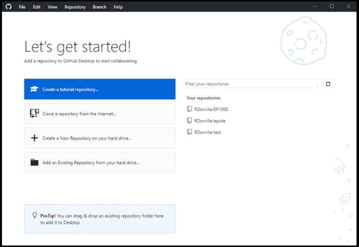
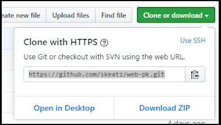
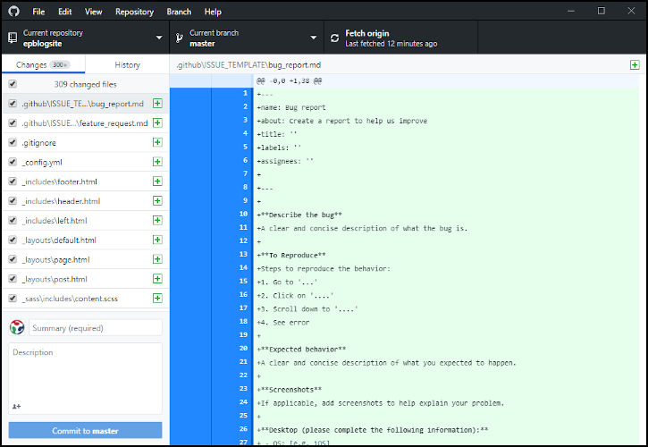
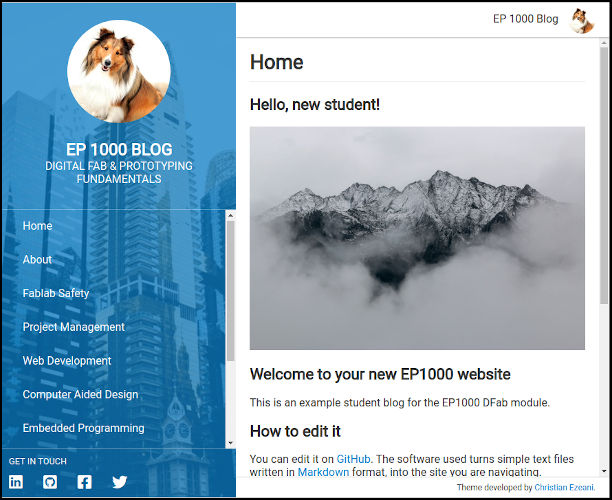

## web-pk Jekyll template

Mr. Steven Chew has kindly created a web template which you can use to create a professionally looking website.  This site is created using a [static site generator](https://www.staticgen.com/) - Jekyll, which converts markdown using the instructions from a configuration file to HTML.  Github provides [Jekyll](https://jekyllrb.com/) as a transparent application which automatically runs when any changes are detected on the site files.

In order to use/build this website properly, you need to use git and a Github repository.  In our case, we shall use the Github Desktop application and link directly into our repository.

## Install [Github Desktop](https://desktop.github.com/)

* GUI interaction using git and github sites
* Download and install for Windows from https://desktop.github.com/
* Sign in to github
    * provide email address and password
    * configure git giving Name, email

## Creating a website using web-pk

1.  Make a folder e.g. MyGithub on your local pc.  We will put all our github repositories here.
2.  Clone the web-pk repository
    * Use a browser to locate the Github repository - https://github.com/skeatz/web-pk
        * Clone or download > Clone with HTTPS
        * Copy the link provided i.e. https://github.com/skeatz/web-pk.git
    * Github Desktop > Select "Clone a repository from the internet"
        * Select URL, paste what you copied (i.e. https://github.com/skeatz/web-pk.git)
        * Enter the Local path > ...\MyGithub\web-pk   
        Note that the repo name is automatically appended to your selected folder destination.
        * Click Clone 
    
    * the files from the repo will be downloaded and a new folder with the repository name "web-pk" will be created.
    * You have **successfully** cloned/copied the files required for web-pk to your local pc.
3.  Create your own version of web-pk (e.g. EPBlogsite) using Github Desktop
    * File > New Repository
        * Name: EPBlogsite
        * Description: My EP1000 Blog
        * Local path: ...\MyGithub\epblogsite
        * Initialise with a README
    + Publish your repository to GitHub
        * Confirm the repository name and description
        * Un-check "Keep this code private", as you are using the free site
    + Open the repository page on Github on your browser
        * Check that it is created sucessfully, there should be a README.md file
        * Enable github pages for this site
            * Settings > Github Pages > Source > Master Branch
            * Click on URL to check the site
4.  Copy the web-pk template to your site
    *  Copy the web-pk folders and files to your epblogsite folder
    
    *  Note the changes in GitHub Desktop
        -  Shows the files that were added 
        -  These files are in your local folder
5.  Add these files to the staging area
    * Summary > Added web-pk site
    * Click "Commit to master", your local repository on the pc is now updated
6.  Update the Github Repository
    * Click "Push Origin" - Push commit to the origin remote
    * Use your browser to examine the Github repository
7.  Configure the new epblogsite (on your local pc)
    * Edit _configure.yaml
        *  Change: "title: Your Name Website" to "title: EP1000 blog"
        *  Change: "baseurl: "/web-pk"" to "baseurl: "/epblogsite" to indicate where your site is located
    + Save
8.  Update your github site to reflact the local pc
    * Github desktop shows the changes you have made to the _config.yml file.
    * Enter a Summary e.g. updated _config.yml
    * Commit to master
    * Push Origin
    * Check your site with the browser
    

## Tips to configure your web-pk site

*  Change your avatar on your Github site to insert it into your blog site
*  _config.yml
    *  shows the navigation bar, add/remove menu items there.  The pages are linked in the docs folder.
    *  you can also use social media to point to your feeds
*  These files are found on the root
    -  index.md - the home page
    -  about.md - information about this blog or yourself
    -  contact.md - how to contact youe
    -  code-of-conduct.md - information on use/blogging of this site
*  These files are found on the docs folder
    -  safety.md, web.md, proj-mgmt.md, 3dprint.md etc    
        enter information of your project/blog here.
    -  place your images in the images folder and link them there.
*  The assets folder 
    -  allows you to change the images on the left pane.

## Git process

This is a brief outline of the git process done by the Github Desktop (GHD).  git uses (traditionally) commands entered on the CLI (command-line interface).  Github Desktop specifially uses a GUI to convert actions to this commands.

*  **git config --global user.name "John Doe"**    
    **git config --global user.email johndoe@example.com**
    - GHD > File > Options > Accounts
    - Sets up accounts for syncing with the Github repository
    - [First-Time Git Setup](https://git-scm.com/book/en/v2/Getting-Started-First-Time-Git-Setup)    
    &nbsp;

*  **git init** initialises a git repository
    - GHD > File > New Repository
    - Initialises a new repository for git operations.
    - [Getting a Git Repository](https://git-scm.com/book/en/v2/Git-Basics-Getting-a-Git-Repository)    
    &nbsp;

*  **git clone** https://github.com/user/repository.git
    - GHD > File > Clone Repository
    - Clones a repository from github.  The repository name is usually used as the folder name, unless change.
    - [Getting a Git Repository](https://git-scm.com/book/en/v2/Git-Basics-Getting-a-Git-Repository)    
    &nbsp;

*  **git add**  files 
    **git status** - shows new/changed files
    -  GHD > Files that are highlighted have changed and to be added
    -  [Recording Changes to the Repository](https://git-scm.com/book/en/v2/Git-Basics-Recording-Changes-to-the-Repository)    
    &nbsp;

*   **git commit -m** "information about change"
    -  GHD > Summary "information about change"    
        Click "Commit to master"
    -  Adds files to the staging area, ready to be uploaded to the remote repository
    -  [Recording Changes to the Repository](https://git-scm.com/book/en/v2/Git-Basics-Recording-Changes-to-the-Repository)    
    &nbsp;

*   **git push**
    -  GHD > Push to repository
    -  Transfers the files from the staging area to the remote repository on Github
    -  [Working with Remotes](https://git-scm.com/book/en/v2/Git-Basics-Working-with-Remotes)   
    &nbsp;

**May 2020**